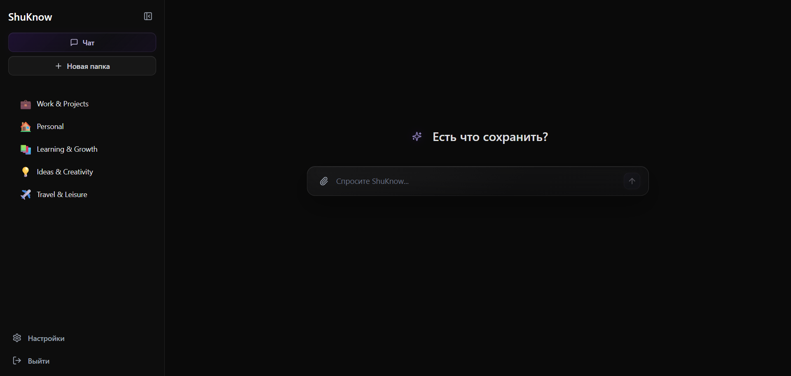
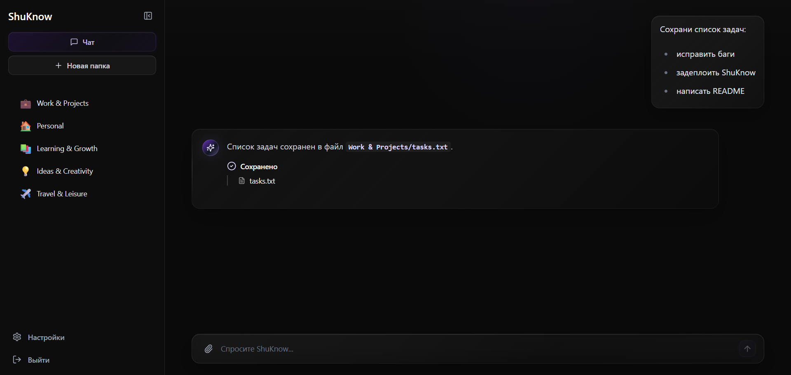
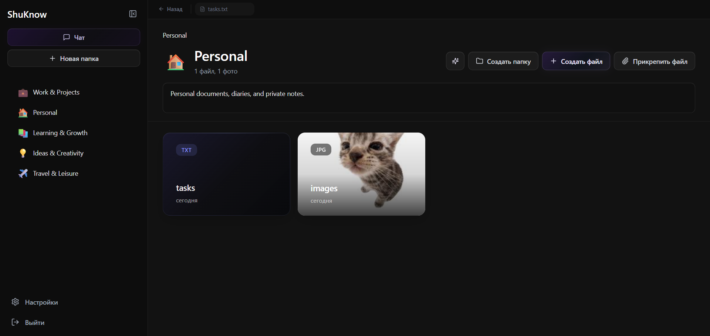
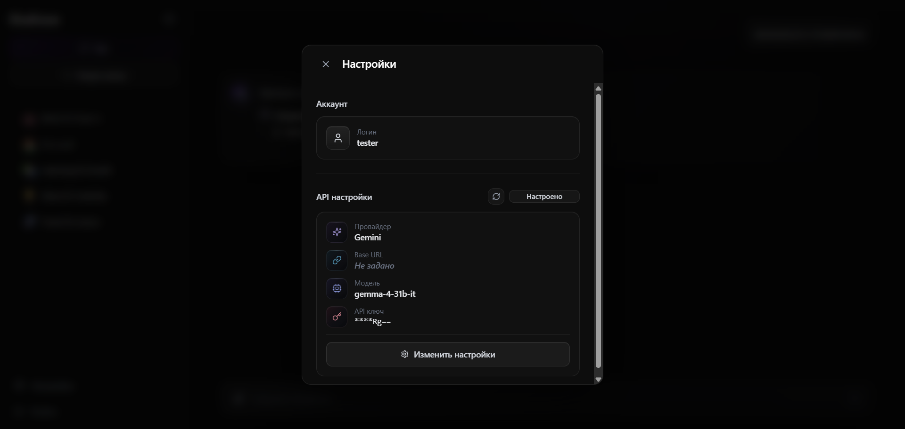

# ✨ ShuKnow

> **ИИ-агент для автоматической организации файлов и заметок.**
> Отправьте текст, картинку или документ в чат — агент сам разложит всё по нужным папкам.

---

## 📋 Оглавление

- [О проекте](#-о-проекте)
- [Основные возможности](#-основные-возможности)
- [Интерфейс](#-интерфейс)
- [Технологический стек](#-технологический-стек)
- [Архитектура](#-архитектура)
- [Быстрый старт](#-быстрый-старт)
- [Запуск в Docker](#-запуск-в-docker)
- [Переменные окружения](#-переменные-окружения)
- [Тестирование](#-тестирование)
- [CI/CD](#-cicd)

---

## 🎯 О проекте

**ShuKnow** — это веб-приложение с чат-интерфейсом для умной организации информации. Пользователь создаёт структуру папок с описаниями, а встроенный ИИ-агент автоматически распределяет отправленные файлы, заметки и изображения по нужным категориям.

Ключевая идея — **минимум ручной работы**: вы просто отправляете данные в чат, как сообщение другу, а агент занимается сортировкой.

---

## 🚀 Основные возможности

- **Чат с ИИ-агентом** — общение через SignalR в реальном времени, стриминг ответов
- **Автосортировка файлов** — агент анализирует содержимое и перемещает файлы в подходящие папки
- **Файловый менеджер** — создание, редактирование, перемещение и удаление файлов и папок с drag & drop
- **Встроенный редактор** — просмотр и редактирование текстовых файлов, изображений и PDF прямо в браузере (CodeMirror, подсветка синтаксиса)
- **Подключение своей LLM** — поддержка OpenAI, Anthropic, Gemini, OpenRouter и других провайдеров через пользовательские настройки
- **Аутентификация** — регистрация и вход по логину/паролю с JWT-токенами в httpOnly-куках
- **Мониторинг** — Prometheus-метрики, дашборды Grafana, кастомные бизнес-метрики (Redis)
- **Хранение файлов** — файловая система или S3-совместимое хранилище (RustFS)

---

## 🖼 Интерфейс

ShuKnow строится вокруг чата: пользователь отправляет заметку, список дел, изображение или документ, а агент сохраняет данные в подходящей папке.

| Чат с агентом | Сохранение информации |
|---|---|
|  |  |

| Просмотр папки | Настройки LLM-провайдера |
|---|---|
|  |  |

---

## 🛠 Технологический стек

### Backend

| Компонент | Технология |
|---|---|
| Платформа | .NET 8, ASP.NET Core |
| ORM | Entity Framework Core 8 |
| База данных | PostgreSQL 16 |
| Кэш и метрики | Redis |
| Аутентификация | JWT + httpOnly Cookie |
| Валидация | FluentValidation |
| Реалтайм | SignalR |
| Хранилище файлов | FileSystem / S3 (RustFS) |
| ИИ-интеграция | LlmTornado |
| Наблюдаемость | OpenTelemetry → Prometheus → Grafana |
| API | Swagger (Swashbuckle), AsyncAPI (Saunter) |

### Frontend

| Компонент | Технология |
|---|---|
| Фреймворк | React 18 |
| Сборщик | Vite |
| Стилизация | TailwindCSS 4 |
| UI-компоненты | Radix UI, MUI |
| Состояние | Jotai |
| Роутинг | React Router 7 |
| Анимации | Motion (Framer Motion) |
| Реалтайм | @microsoft/signalr |
| Редактор кода | CodeMirror |
| Тестирование | Vitest, Testing Library, MSW |

### Инфраструктура

| Компонент | Технология |
|---|---|
| Контейнеризация | Docker, Docker Compose |
| Reverse proxy | Nginx |
| CI/CD | GitHub Actions |
| Реестр образов | GitHub Container Registry (GHCR) |

---

## 🏗 Архитектура

Бэкенд построен по принципу **слоёной архитектуры** с чётким разделением ответственности:

```
┌───────────────────────────────────────┐
│           ShuKnow.Host                │  ← Точка входа, Composition Root
├───────────────────────────────────────┤
│          ShuKnow.WebAPI               │  ← Контроллеры, DTO, SignalR-хабы, валидация
├──────────────┬────────────────────────┤
│ ShuKnow.App  │   ShuKnow.Metrics     │  ← Бизнес-логика и метрики
├──────────────┴────────────────────────┤
│          ShuKnow.Domain               │  ← Сущности, интерфейсы репозиториев
├───────────────────────────────────────┤
│       ShuKnow.Infrastructure          │  ← EF Core, PostgreSQL, S3, JWT, ИИ-сервисы
└───────────────────────────────────────┘
```

**API-контроллеры:** Auth, Files, Folders, Chat, Settings, Actions.

---

## ⚡ Быстрый старт

### Предварительные требования

- [.NET SDK 8.0+](https://dotnet.microsoft.com/download)
- [Node.js 20+](https://nodejs.org/)
- [Docker](https://www.docker.com/) (для БД и зависимостей)

### 1. Запустите инфраструктуру

```bash
docker compose -f compose.dev.yaml up -d postgres redis rustfs
```

### 2. Backend

```bash
# Восстановление зависимостей
dotnet restore backend/ShuKnow.sln

# Запуск (миграции применятся автоматически в Development)
dotnet run --project backend/ShuKnow.Host --launch-profile http
```

Backend запустится на `http://localhost:5209`. Swagger UI доступен по адресу `http://localhost:5209/swagger`.

### 3. Frontend

```bash
cd frontend

# Установка зависимостей
npm ci

# Запуск (с мок-данными по умолчанию)
npm run dev

# Запуск с реальным бэкендом
npm run dev:real
```

Frontend доступен на `http://localhost:5173`.

---

## 🐳 Запуск в Docker

### Режим разработки

Поднимает бэкенд, PostgreSQL, Redis, RustFS, Prometheus, Grafana и Nginx:

```bash
docker compose -f compose.dev.yaml up -d
```

| Сервис | URL |
|---|---|
| Backend API | http://localhost:5209 |
| PostgreSQL | localhost:5432 |
| Redis | localhost:6379 |
| RustFS (S3) | http://localhost:9000 |
| Prometheus | http://localhost:9090 |
| Grafana | http://localhost:3000 |

Серверные инструкции вынесены в [deploy/README.md](deploy/README.md).

---

## 🔐 Переменные окружения

### Backend

Локальный backend читает настройки из окружения и `.env` через `dotenv.net`. Для разработки обычно достаточно значений по умолчанию из compose-файла и launch profile.

### Frontend

| Переменная | Описание |
|---|---|
| `VITE_USE_MOCKS` | `true` — мок-режим (MSW), `false` — реальный бэкенд |

---

## 🧪 Тестирование

### Backend

```bash
# Все тесты
dotnet test backend/ShuKnow.sln

# Только unit-тесты приложения
dotnet test backend/ShuKnow.Application.Tests/ShuKnow.Application.Tests.csproj

# Запуск конкретного класса тестов
dotnet test backend/ShuKnow.Application.Tests/ShuKnow.Application.Tests.csproj --filter FileServiceTests
```

Используемые библиотеки: **NUnit**, **NSubstitute**, **AwesomeAssertions**.

### Frontend

```bash
cd frontend

# Запуск тестов
npm test

# С UI
npm run test:ui

# С покрытием
npm run test:coverage
```

Используемые библиотеки: **Vitest**, **Testing Library**, **MSW**.

---

## 🔄 CI/CD

Проект использует **GitHub Actions** с двумя пайплайнами:

| Пайплайн | Триггер | Действие |
|---|---|---|
| **Tests On Push** | Любой push | Сборка и запуск всех тестов бэкенда |
| **Publish Docker** | Push тега `v*.*.*` | Сборка мультиплатформенных Docker-образов (amd64 + arm64) и публикация в GHCR |