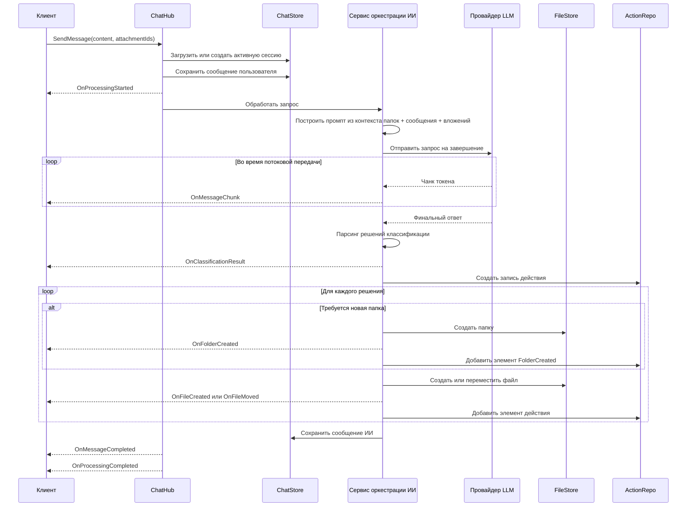
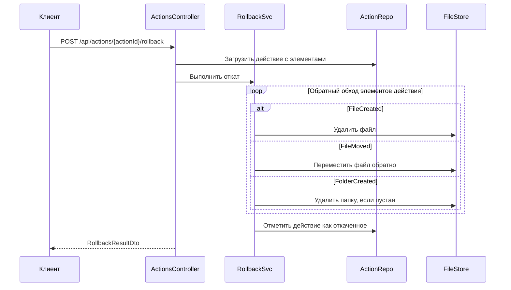
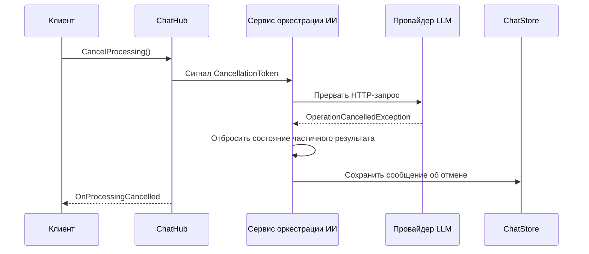
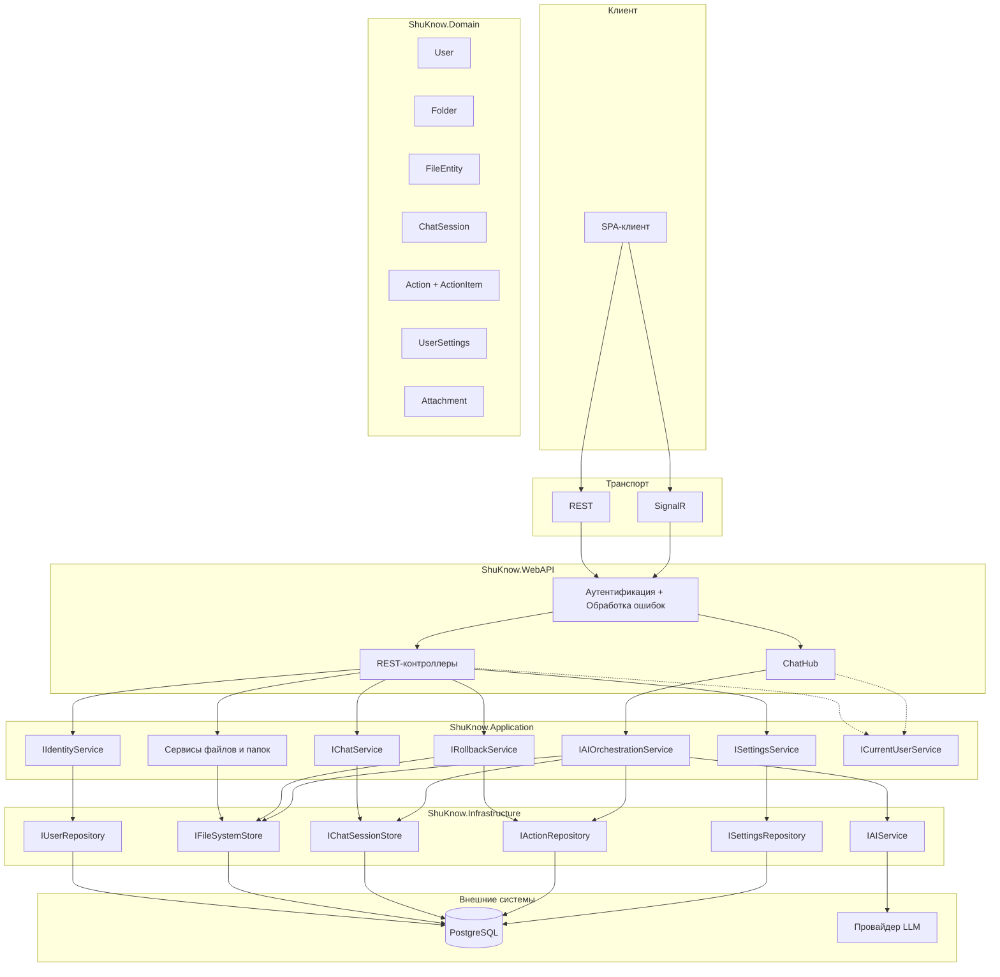

# Обзор архитектуры API

## Назначение

Этот документ объясняет, как структурирован API и почему он спроектирован именно так.

- [docs/openapi.yaml](../openapi.yaml) является источником истины для REST-контрактов.
- [docs/asyncapi.yaml](../asyncapi.yaml) является источником истины для событий SignalR и структуры сообщений.
- Этот документ сосредоточен на поведении во время выполнения, границах компонентов и архитектурных решениях.

## Обзор системы

ShuKnow предоставляет два стиля коммуникации:

- REST для операций запрос-ответ, таких как аутентификация, CRUD папок и файлов, чтение сессий чата, загрузка вложений, управление настройками и операции отката.
- SignalR для долгоиграющих рабочих процессов с ИИ, таких как отправка сообщений, потоковая передача токенов, уведомления о прогрессе и отмена.

Аутентификация является общей для обоих транспортов:

- HTTP-эндпоинты принимают JWT либо из заголовка `Authorization: Bearer`, либо из HTTP-only cookie.
- SignalR-соединения используют параметр запроса `access_token` и проходят через тот же пайплайн валидации JWT.

Система имеет слоистую архитектуру:

- `ShuKnow.WebAPI` предоставляет контроллеры и чат-хаб.
- `ShuKnow.Application` координирует варианты использования и оркестрацию.
- `ShuKnow.Domain` содержит базовые сущности и бизнес-правила.
- `ShuKnow.Infrastructure` сохраняет данные и интегрируется с провайдером LLM.

## Потоки выполнения

### Поток классификации с ИИ

Это основной сквозной рабочий процесс в продукте.

### Поток отката

Откат моделируется как детерминированная отмена записанного действия ИИ, а не как построение разницы файловой системы по принципу максимального усилия.

### Поток отмены

Отмена прерывает выполняющуюся работу с ИИ и предотвращает обработку частичных результатов как полного вывода.

## Карта компонентов

## Ключевые архитектурные решения

### Вложения загружаются через REST

SignalR не является хорошим транспортом для бинарных данных практического размера. Загрузка вложений остается на REST, потому что `multipart/form-data` надежен, удобен для браузера и легче в валидации и ограничении.

### Отправка чата использует SignalR вместо REST

Обработка ИИ занимает длительное время и выигрывает от постепенной обратной связи. SignalR обеспечивает потоковую передачу токенов, события прогресса, уведомления об изменении файлов и отмену без превращения одного HTTP-запроса в хрупкий рабочий процесс с опросом.

### История сообщений чата использует курсорную пагинацию

Сообщения добавляются только в конец и часто читаются от новых к старым. Курсорная пагинация избегает нестабильных страниц при появлении новых сообщений во время просмотра.

### Откат использует явный агрегат Action

Каждый запуск ИИ записывает, что изменилось. Откат затем отменяет эту запись в предсказуемом порядке. Это более поддается аудиту и безопаснее, чем восстановление изменений из временных меток или снимков.

### Дерево папок загружается как дерево, файлы пагинируются отдельно

Дерево папок поддерживает навигацию и построение контекста для ИИ, поэтому загрузка его как единой структуры сохраняет простоту клиентской модели. Файлы могут расти гораздо быстрее папок, поэтому списки файлов остаются пагинированными.

### Валидация настроек ИИ является отдельной операцией

Тестирование подключения к провайдеру перед первым реальным запросом к ИИ дает более быструю обратную связь и избегает смешивания сбоев конфигурации с бизнес-процессами.

## Пробелы в домене, требуемые проектом API

Текущий контракт подразумевает несколько возможностей домена и персистентности, которые должны существовать для полноты архитектуры.

| Область | Требуемое дополнение | Зачем оно существует |
|---|---|---|
| Упорядочивание контента | `Folder.SortOrder` и `FileEntity.SortOrder` | Папки и файлы разделяют общее пространство порядка внутри родителя, обеспечивая смешанное перетаскивание. |
| Конфигурация ИИ пользователя | `UserSettings` с зашифрованным API-ключом, enum `AiProvider` и `ModelId` | Требуется для конфигурации LLM для каждого пользователя, включая выбор провайдера и модели. |
| Журнал отката | Агрегат `Action` с дочерними `ActionItem` | Требуется для детерминированного отката. |
| Временные вложения | Сущность временного хранения `Attachment` | Требуется, потому что вложения загружаются до `SendMessage`. |
| История перемещения файлов | Отслеживание исходного местоположения внутри элементов действий | Требуется, чтобы откат мог восстановить перемещенные файлы. |

## Ключевые детали контрактов

Полные схемы DTO описаны в [openapi.yaml](../openapi.yaml). Этот раздел выделяет поля и эндпоинты, имеющие архитектурное значение.

**UserDto** включает как `id` (Guid), так и `login` (string), чтобы клиент мог отображать имя пользователя без дополнительного запроса профиля.

**FolderDto / FolderTreeNodeDto** включают поле `emoji` (string?, макс. 8 символов), позволяющее пользователю назначить иконку папке.

**FileDto** включает `sortOrder` (int), который разделяет общее пространство порядка с соседними папками, обеспечивая смешанное перетаскивание файлов и папок внутри родителя. Также включает `createdAt` (DateTimeOffset) для отображения и сортировки по времени создания.

**AiSettingsDto** включает `provider` (enum AiProvider: OpenAI, OpenRouter, Gemini) и `modelId` (string?) наряду с существующими base URL и API key, позволяя пользователям выбирать конкретных LLM-провайдеров и модели.

**`PATCH /api/files/{fileId}/content`** — облегчённый эндпоинт с JSON-телом для обновления текстового содержимого текстовых файлов. В отличие от multipart-бинарного `PUT` на `/api/files/{fileId}/content`, принимает JSON-payload с новым текстом, избегая накладных расходов multipart для простых правок.

**`PATCH /api/files/{fileId}/reorder`** — переупорядочивает файл внутри родительской папки, по тому же паттерну, что и переупорядочивание папок (`PATCH /api/folders/{folderId}/reorder`).

## Границы и ответственность

- OpenAPI и AsyncAPI определяют внешние контракты.
- Этот документ определяет предполагаемое поведение вокруг этих контрактов.
- Если контракты изменяются, сначала обновите YAML-файлы, а затем корректируйте этот документ только когда также меняется модель выполнения или архитектурное обоснование.
