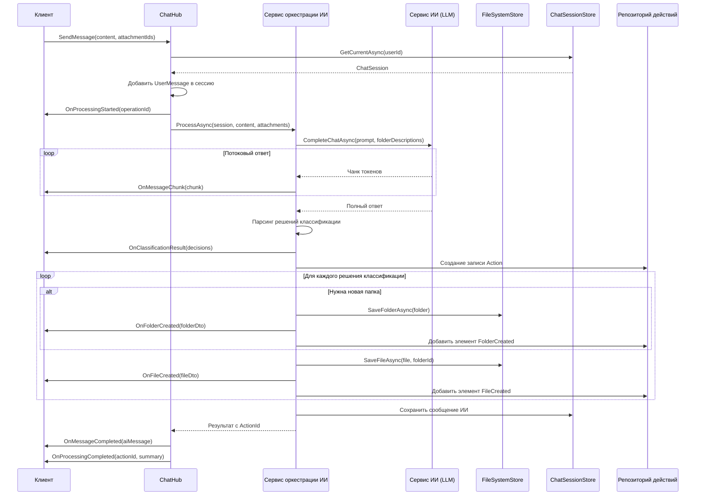
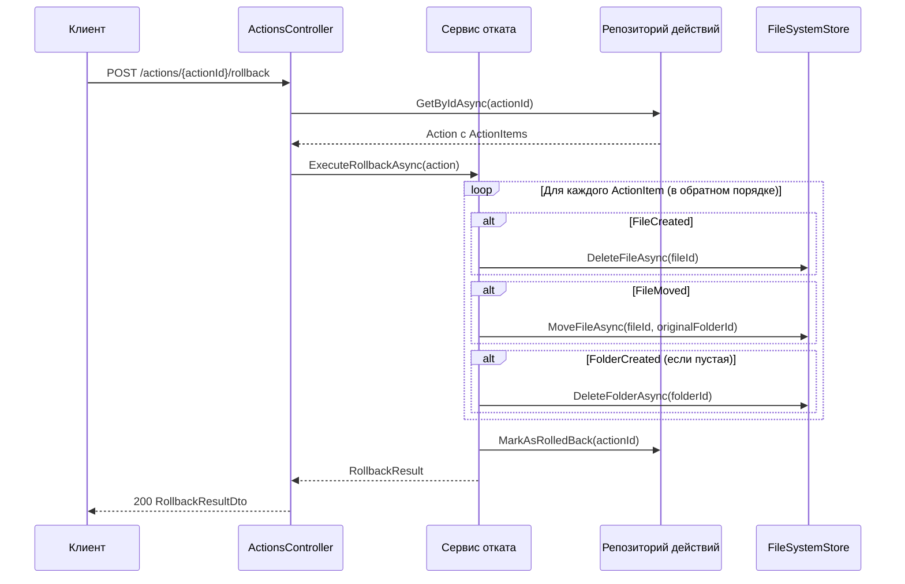
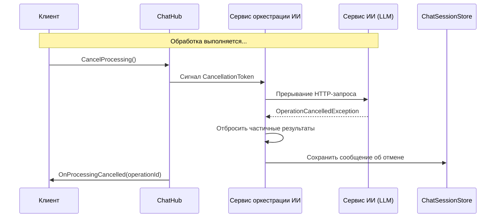

# Проектирование архитектуры API

---

## 1. Обзор архитектуры

### 1.1 Паттерны взаимодействия

| Паттерн | Область применения |
|---------|-------------------|
| **REST API** | CRUD-операции над папками, файлами, настройками; управление сессиями чата; загрузка вложений; история действий и откат |
| **SignalR WebSocket** | Обработка сообщений ИИ, стриминг ответов LLM, уведомления об изменениях файлов/папок в реальном времени, отмена обработки |

### 1.2 Аутентификация

Все эндпоинты (кроме регистрации и входа) требуют JWT-аутентификации. Токен считывается либо из заголовка `Authorization: Bearer`, либо из HTTP-only cookie (`SameSite=None; Secure`). SignalR аутентифицируется через query-параметр `access_token` при подключении, который middleware направляет в тот же JWT-пайплайн.

---

## 2. REST API эндпоинты

### 2.1 Аутентификация — `AuthController`

Базовый маршрут: `/api/auth`

| Метод | Маршрут | Тело запроса | Ответ | Аутентификация |
|-------|---------|-------------|-------|----------------|
| `POST` | `/api/auth/register` | `RegisterRequest` | `string` (JWT) | Нет |
| `POST` | `/api/auth/login` | `LoginRequest` | `string` (JWT) | Нет |
| `GET` | `/api/auth/me` | — | `UserDto` | Да |

При успешном выполнении JWT устанавливается как HTTP-only cookie, а также возвращается в теле ответа.

---

### 2.2 Папки — `FoldersController`

Управление иерархией виртуальной файловой системы с описаниями для ИИ.

Базовый маршрут: `/api/folders`

| Метод | Маршрут | Тело / Query-параметры | Ответ | Описание |
|-------|---------|------------------------|-------|----------|
| `GET` | `/api/folders/tree` | — | `FolderTreeNodeDto[]` | Полное иерархическое дерево. Каждый узел рекурсивно содержит дочерние элементы и количество файлов. Используется для рендеринга боковой панели. |
| `GET` | `/api/folders` | `?parentId={guid\|null}` | `FolderDto[]` | Плоский список папок на заданном уровне. `parentId=null` (или не указан) возвращает корневые папки. Облегчённая альтернатива дереву. |
| `POST` | `/api/folders` | `CreateFolderRequest` | `FolderDto` (201) | Создание папки. Валидация уникальности имени в пределах родительской области. Если папок ещё нет, сначала автоматически создаётся `Inbox`. |
| `GET` | `/api/folders/{folderId}` | — | `FolderDto` | Одна папка с метаданными. Заполняется breadcrumb `Path`. |
| `PUT` | `/api/folders/{folderId}` | `UpdateFolderRequest` | `FolderDto` | Обновление имени и/или описания. Валидация уникальности имени. |
| `DELETE` | `/api/folders/{folderId}` | `?recursive=false` | 204 | Удаление папки. Если `recursive=true`, удаляются все дочерние элементы и файлы. Если `false` и папка непустая, возвращается 409 Conflict. Папка Inbox не может быть удалена. |
| `PATCH` | `/api/folders/{folderId}/move` | `MoveFolderRequest` | `FolderDto` | Перемещение папки к новому родителю (или в корень, если `null`). Проверка на отсутствие циклов, уникальность имени в целевой области. |
| `PATCH` | `/api/folders/{folderId}/reorder` | `ReorderFolderRequest` | 204 | Изменение позиции сортировки среди соседних элементов. Принимает целевую `position` (с 0). Сервер переиндексирует соседние элементы. |
| `GET` | `/api/folders/{folderId}/children` | — | `FolderDto[]` | Непосредственные дочерние папки. Полезно для ленивой подгрузки раскрытых узлов. |
| `GET` | `/api/folders/{folderId}/files` | `?page&pageSize` | `PagedResult<FileDto>` | Файлы в папке с пагинацией. Смещение (offset). По умолчанию `pageSize=50`. |

**DTO запросов:**

```
CreateFolderRequest {
    Name: string (required)
    Description: string?
    ParentFolderId: Guid?
}

UpdateFolderRequest {
    Name: string?
    Description: string?
}

MoveFolderRequest {
    NewParentFolderId: Guid?           // null = переместить в корень
}

ReorderFolderRequest {
    Position: int                       // целевой индекс (с 0)
}
```

**DTO ответов:**

```
FolderDto {
    Id: Guid
    Name: string
    Description: string
    ParentFolderId: Guid?
    SortOrder: int
    FileCount: int
    HasChildren: bool
    Path: string[]?                     // breadcrumb, заполняется при GET /{id}
    CreatedAt: DateTime
}

FolderTreeNodeDto {
    Id: Guid
    Name: string
    Description: string
    SortOrder: int
    FileCount: int
    Children: FolderTreeNodeDto[]
}
```

---

### 2.3 Файлы — `FilesController`

Управление файловыми сущностями в экосистеме папок. Создание файла вложено в папку; все остальные операции используют собственный ID файла.

| Метод | Маршрут | Тело запроса | Ответ | Описание |
|-------|---------|-------------|-------|----------|
| `POST` | `/api/folders/{folderId}/files` | `multipart/form-data`: `file`, `name?`, `description?` | `FileDto` (201) | Загрузка файла в папку. Если `name` не указано, используется оригинальное имя файла. Валидация уникальности имени. Ограничение размера файла (настраиваемое, например 10 МБ для MVP). |
| `GET` | `/api/files/{fileId}` | — | `FileDto` | Метаданные файла (имя, описание, тип контента, размер, временные метки). |
| `GET` | `/api/files/{fileId}/content` | — | Бинарный поток | Скачивание/стриминг содержимого файла. Возвращает `application/octet-stream` или сохранённый MIME-тип. Поддерживает заголовок `Range` для больших файлов. |
| `PUT` | `/api/files/{fileId}` | `UpdateFileRequest` | `FileDto` | Обновление имени и/или описания. Валидация уникальности имени в пределах папки. |
| `PUT` | `/api/files/{fileId}/content` | `multipart/form-data`: `file` | `FileDto` | Замена содержимого файла. Обновляет `UpdatedAt`. |
| `DELETE` | `/api/files/{fileId}` | — | 204 | Безвозвратное удаление файла. |
| `PATCH` | `/api/files/{fileId}/move` | `MoveFileRequest` | `FileDto` | Перемещение файла в другую папку. Валидация уникальности имени в целевой папке. |

**DTO запросов:**

```
UpdateFileRequest {
    Name: string?
    Description: string?
}

MoveFileRequest {
    TargetFolderId: Guid (required)
}
```

**DTO ответа:**

```
FileDto {
    Id: Guid
    FolderId: Guid
    FolderName: string
    Name: string
    Description: string
    ContentType: string
    SizeBytes: long
    CreatedAt: DateTime
    UpdatedAt: DateTime
}
```

Загрузка выполняется через `multipart/form-data` с полями формы, а не через JSON-тело.

---

### 2.4 Чат — `ChatController`

Чат является единственным — в каждый момент существует не более одной активной сессии. REST предоставляет доступ на чтение и предварительную загрузку вложений; отправка сообщений выполняется через SignalR-хаб (§3).

Базовый маршрут: `/api/chat`

| Метод | Маршрут | Тело / Query-параметры | Ответ | Описание |
|-------|---------|------------------------|-------|----------|
| `GET` | `/api/chat/session` | — | `ChatSessionDto` | Получение текущей активной сессии. Если сессия не существует, идемпотентно создаётся новая. Возвращает метаданные сессии. |
| `DELETE` | `/api/chat/session` | — | 204 | Закрытие и удаление текущей сессии. Следующий `GET` создаст новую. |
| `GET` | `/api/chat/session/messages` | `?cursor&limit` | `CursorPagedResult<ChatMessageDto>` | Сообщения текущей сессии с пагинацией. Курсорная пагинация (по `CreatedAt` по убыванию). По умолчанию `limit=50`. Возвращает `nextCursor` и `hasMore`. |
| `POST` | `/api/chat/attachments` | `multipart/form-data`: `files[]` | `AttachmentDto[]` | Загрузка файлов, на которые будет ссылаться сообщение в хабе. Возвращает временные ID вложений. Неиспользованные вложения удаляются через 1 час. |

> **Примечание:** Отправка сообщения и запуск обработки ИИ выполняются исключительно через SignalR-хаб. Этот эндпоинт существует потому, что SignalR не предназначен для передачи бинарных данных (лимит размера сообщения по умолчанию — 32 КБ, а бинарный стриминг через WebSocket ненадёжен).

**DTO ответов:**

```
ChatSessionDto {
    Id: Guid
    CreatedAt: DateTime
    MessageCount: int
    CanRollback: bool
}

ChatMessageDto {
    Id: Guid
    Role: string                        // "User" | "Ai"
    Content: string
    Attachments: AttachmentDto[]?
    CreatedAt: DateTime
}

AttachmentDto {
    Id: Guid
    FileName: string
    ContentType: string
    SizeBytes: long
}
```

---

### 2.5 Настройки ИИ — `SettingsController`

Пользовательская конфигурация для подключения к провайдеру LLM.

Базовый маршрут: `/api/settings`

| Метод | Маршрут | Тело запроса | Ответ | Описание |
|-------|---------|-------------|-------|----------|
| `GET` | `/api/settings/ai` | — | `AiSettingsDto` | Возвращает текущую конфигурацию ИИ. API-ключ замаскирован (`sk-****abcd`). Base URL возвращается полностью. |
| `PUT` | `/api/settings/ai` | `UpdateAiSettingsRequest` | `AiSettingsDto` | Установка или обновление Base URL и API-ключа провайдера LLM. Ключ хранится в зашифрованном виде. |
| `POST` | `/api/settings/ai/test` | — | `AiConnectionTestDto` | Проверка подключения к настроенному провайдеру LLM. Отправляет минимальный пробный запрос с сохранёнными учётными данными. Возвращает задержку и статус успешности. |

**DTO запроса:**

```
UpdateAiSettingsRequest {
    BaseUrl: string (required)
    ApiKey: string (required)
}
```

**DTO ответов:**

```
AiSettingsDto {
    BaseUrl: string
    ApiKeyMasked: string                // "sk-****abcd"
    IsConfigured: bool
    LastTestedAt: DateTime?
}

AiConnectionTestDto {
    Success: bool
    LatencyMs: int?
    ErrorMessage: string?
}
```

---

### 2.6 Действия и откат — `ActionsController`

Каждый запуск обработки ИИ создаёт запись `Action` — журнал всех мутаций (созданные файлы, перемещённые файлы, созданные папки). Откат отменяет конкретное действие, перебирая его элементы в обратном порядке.

Базовый маршрут: `/api/actions`

| Метод | Маршрут | Тело / Query-параметры | Ответ | Описание |
|-------|---------|------------------------|-------|----------|
| `GET` | `/api/actions` | `?page&pageSize` | `PagedResult<ActionDto>` | Список последних действий, сгенерированных ИИ, от новых к старым. Каждое действие включает краткое описание и признак возможности отката. |
| `GET` | `/api/actions/{actionId}` | — | `ActionDetailDto` | Детальное представление одного действия: каждый созданный/перемещённый файл, созданные папки, классифицированный контент. |
| `POST` | `/api/actions/{actionId}/rollback` | — | `RollbackResultDto` | Откат конкретного действия. Удаляет файлы, которые были созданы, перемещает файлы обратно в исходные папки, удаляет созданные папки (если они пусты). Возвращает список восстановленных/отменённых элементов. Невозможен, если файлы были вручную изменены после выполнения действия. |
| `POST` | `/api/actions/rollback-last` | — | `RollbackResultDto` | Удобный метод: откат последнего подходящего действия. |

**DTO ответов:**

```
ActionDto {
    Id: Guid
    Summary: string
    ItemCount: int
    CreatedAt: DateTime
    CanRollback: bool
}

ActionDetailDto {
    Id: Guid
    Summary: string
    CreatedAt: DateTime
    Items: ActionItemDto[]
}

ActionItemDto {
    Type: string                        // "FileCreated" | "FileMoved" | "FolderCreated"
    FileId: Guid?
    FolderId: Guid?
    FileName: string?
    FolderName: string?
    TargetFolderName: string?
}

RollbackResultDto {
    ActionId: Guid
    RestoredItems: RollbackItemDto[]
    FullyReverted: bool
}

RollbackItemDto {
    Type: string
    Description: string
}
```

---

### 2.7 Общие DTO — пагинация

```
PagedResult<T> {
    Items: T[]
    TotalCount: int
    Page: int
    PageSize: int
    HasNextPage: bool
}

CursorPagedResult<T> {
    Items: T[]
    NextCursor: string?
    HasMore: bool
}
```

---

## 3. SignalR-хаб — `ChatHub`

**Эндпоинт:** `/hubs/chat`

**Аутентификация:** JWT через query-параметр `access_token` (стандартный подход для SignalR). Хаб извлекает `ICurrentUserService` из контекста подключения.

**Жизненный цикл подключения:** Клиент подключается при загрузке приложения и отключается при закрытии. Хаб не хранит состояние в рамках подключения — всё состояние находится в базе данных и `IAIOrchestrationService`.

### 3.1 Жизненный цикл подключения

```
Клиент                                     Сервер
  │                                           │
  │── Connect (access_token=JWT) ────────────►│
  │                                           │ Валидация JWT
  │                                           │ Вступление в группу user:{userId}
  │                                           │
  │── SendMessage(content, attachmentIds) ───►│
  │                                           │ Сохранение сообщения пользователя
  │◄──── OnProcessingStarted ─────────────────│
  │◄──── OnMessageChunk (n раз) ──────────────│ Стриминг токенов LLM
  │◄──── OnMessageCompleted ──────────────────│
  │◄──── OnClassificationResult ──────────────│ Показать план
  │◄──── OnFileCreated (для каждого файла) ───│ Выполнение мутаций
  │◄──── OnFolderCreated (при необходимости) ─│
  │◄──── OnProcessingCompleted ───────────────│ Готово, ActionId
  │                                           │
  │── CancelProcessing ──────────────────────►│
  │◄──── OnProcessingCancelled ───────────────│
  │                                           │
  │── Disconnect ────────────────────────────►│
  │                                           │ Выход из группы
```

### 3.2 Методы «Клиент → Сервер»

| Метод | Параметры | Описание |
|-------|-----------|----------|
| `SendMessage` | `SendMessageCommand` | Основное действие. Отправляет контент пользователя для классификации ИИ. Сервер: (1) сохраняет сообщение пользователя в сессии чата, (2) формирует промпт для LLM на основе описаний папок и контента пользователя, (3) вызывает LLM, (4) парсит решения по классификации, (5) выполняет файловые операции, (6) стримит события прогресса. Вложения предварительно загружаются через REST. |
| `CancelProcessing` | — | Активирует `CancellationToken` для текущего вызова ИИ. Сервер прерывает запрос к LLM, записывает сообщение об отмене в сессию и подтверждает через `OnProcessingCancelled`. |

**Модель входных данных:**

```
SendMessageCommand {
    Content: string (required)
    Context: string?                    // опциональная подсказка пользователя
    AttachmentIds: Guid[]?              // из POST /api/chat/attachments
}
```

### 3.3 События «Сервер → Клиент»

| Событие | Payload | Описание |
|---------|---------|----------|
| `OnProcessingStarted` | `ProcessingStartedEvent` | Отправляется сразу после `SendMessage`. Клиент должен отобразить состояние загрузки/обработки. |
| `OnMessageChunk` | `MessageChunkEvent` | Потоковые токены из ответа LLM. Клиент дописывает их в сообщения ИИ в реальном времени. |
| `OnMessageCompleted` | `ChatMessageDto` | Полное сообщение ИИ получено, распарсено и сохранено. Содержит весь контент. |
| `OnClassificationResult` | `ClassificationResultEvent` | Распарсенный вывод ИИ: какой контент куда направить. Отправляется до начала файловых операций, чтобы пользователь увидел план. |
| `OnFileCreated` | `FileDto` | Файл создан в папке в рамках классификации. Клиент должен обновить боковую панель. |
| `OnFileMoved` | `FileMovedEvent` | Файл перемещён. |
| `OnFolderCreated` | `FolderDto` | Создана новая папка (если ИИ определил, что ни одна существующая папка не подходит). |
| `OnProcessingCompleted` | `ProcessingCompletedEvent` | Все операции завершены. `ActionId` можно использовать для отката. |
| `OnProcessingFailed` | `ProcessingFailedEvent` | Сбой вызова LLM, ошибка парсинга классификации или ошибка файловой операции. |
| `OnProcessingCancelled` | `ProcessingCancelledEvent` | Подтверждение отмены обработки. |

**Структуры событий:**

```
ProcessingStartedEvent {
    OperationId: Guid
}

MessageChunkEvent {
    OperationId: Guid
    MessageId: Guid
    Chunk: string
}

ClassificationResultEvent {
    OperationId: Guid
    Decisions: ClassificationDecisionDto[]
}

ClassificationDecisionDto {
    FileName: string
    TargetFolderName: string
    TargetFolderId: Guid?               // null, если папка будет создана
    IsNewFolder: bool
}

FileMovedEvent {
    FileId: Guid
    FromFolderId: Guid
    ToFolderId: Guid
}

ProcessingCompletedEvent {
    OperationId: Guid
    ActionId: Guid                      // для отката
    Summary: string
    FilesCreated: int
    FilesMoved: int
}

ProcessingFailedEvent {
    OperationId: Guid
    Error: string
    Code: string
}

ProcessingCancelledEvent {
    OperationId: Guid
}
```

### 3.4 Группы хаба

Каждый пользователь добавляется в группу `user:{userId}` при подключении. Все события отправляются в группу пользователя, что гарантирует: если у пользователя открыто несколько вкладок, все они получают обновления.

---

## 4. Основные потоки обработки

### 4.1 Отправка сообщения с классификацией ИИ



### 4.2 Поток отката



### 4.3 Поток отмены



---

## 5. Архитектурная диаграмма

```mermaid
flowchart TB
    subgraph CLIENT["👤 Клиентское SPA"]
        direction LR
        UI_SIDEBAR["📁 Боковая панель<br/>(Дерево папок)"]
        UI_CHAT["💬 Панель чата<br/>(Сообщения + Консоль)"]
        UI_SETTINGS["⚙️ Настройки"]
    end

    subgraph TRANSPORT["Транспортный уровень"]
        direction LR
        HTTP["REST / HTTP"]
        WS["SignalR / WebSocket"]
    end

    subgraph WEBAPI["ShuKnow.WebAPI"]
        direction TB

        subgraph MW["Middleware"]
            JWT_MW["JWT-аутентификация<br/>(Cookie + Bearer)"]
            ERR_MW["Обработка исключений<br/>(Ardalis.Result → HTTP)"]
            RATE_MW["Ограничение частоты запросов"]
        end

        subgraph CONTROLLERS["REST-контроллеры"]
            AUTH_C["AuthController<br/>POST /register<br/>POST /login<br/>GET /me"]
            FOLDERS_C["FoldersController<br/>GET / POST /api/folders<br/>GET /api/folders/tree<br/>GET / PUT / DELETE /:id<br/>PATCH /:id/move<br/>PATCH /:id/reorder<br/>GET /:id/children<br/>GET /:id/files"]
            FILES_C["FilesController<br/>POST /api/folders/:id/files<br/>GET /api/files/:id<br/>GET /api/files/:id/content<br/>PUT / DELETE /api/files/:id<br/>PATCH /:id/move"]
            CHAT_C["ChatController<br/>GET / DELETE /api/chat/session<br/>GET /session/messages<br/>POST /chat/attachments"]
            SETTINGS_C["SettingsController<br/>GET / PUT /api/settings/ai<br/>POST /api/settings/ai/test"]
            ACTIONS_C["ActionsController<br/>GET /api/actions<br/>GET /:id<br/>POST /:id/rollback<br/>POST /rollback-last"]
        end

        subgraph HUB["SignalR-хаб"]
            CHAT_HUB["ChatHub<br/>/hubs/chat<br/>─────────────────<br/>⬆ SendMessage<br/>⬆ CancelProcessing<br/>─────────────────<br/>⬇ OnProcessingStarted<br/>⬇ OnMessageChunk<br/>⬇ OnMessageCompleted<br/>⬇ OnClassificationResult<br/>⬇ OnFileCreated<br/>⬇ OnFileMoved<br/>⬇ OnFolderCreated<br/>⬇ OnProcessingCompleted<br/>⬇ OnProcessingFailed<br/>⬇ OnProcessingCancelled"]
        end
    end

    subgraph APPLICATION["ShuKnow.Application"]
        direction TB
        IDENTITY_SVC["IIdentityService"]
        FOLDER_SVC["IFolderService"]
        FILE_SVC["IFileService"]
        CHAT_SVC["IChatService"]
        AI_ORCH["IAIOrchestrationService<br/>──────────────<br/>Основной пайплайн:<br/>Формирование промпта →<br/>Вызов LLM →<br/>Парсинг решений →<br/>Выполнение мутаций →<br/>Запись действия"]
        SETTINGS_SVC["ISettingsService"]
        ROLLBACK_SVC["IRollbackService"]
        CURRENT_USER["ICurrentUserService"]
    end

    subgraph DOMAIN["ShuKnow.Domain"]
        direction LR
        E_USER["User"]
        E_FOLDER["Folder<br/>(иерархическая,<br/>самоссылка ParentId,<br/>SortOrder)"]
        E_FILE["FileEntity<br/>+ FileContent VO"]
        E_SESSION["ChatSession<br/>+ ChatMessage[]"]
        E_ACTION["Action<br/>+ ActionItem[]<br/>(журнал отката)"]
        E_SETTINGS["UserSettings<br/>(конфигурация ИИ)"]
        E_ATTACH["Attachment<br/>(временное хранение)"]
    end

    subgraph INFRASTRUCTURE["ShuKnow.Infrastructure"]
        direction TB
        FS_STORE["IFileSystemStore<br/>(реализация на EF Core)"]
        CHAT_STORE["IChatSessionStore<br/>(реализация на EF Core)"]
        AI_SVC["IAIService<br/>(реализация на LLMTornado)"]
        USER_REPO["IUserRepository<br/>(реализация на EF Core)"]
        SETTINGS_REPO["ISettingsRepository<br/>(реализация на EF Core)"]
        ACTION_REPO["IActionRepository<br/>(реализация на EF Core)"]
    end

    subgraph EXTERNAL["Внешние системы"]
        PG[("🐘 PostgreSQL")]
        LLM["🤖 Провайдер LLM<br/>(API-ключ пользователя)"]
    end

    %% Клиент → Транспорт
    UI_SIDEBAR -->|"операции с папками/файлами"| HTTP
    UI_CHAT -->|"чтение сессии,<br/>загрузка вложений"| HTTP
    UI_CHAT -->|"отправка сообщений,<br/>стриминг ответа"| WS
    UI_SETTINGS -->|"чтение/запись конфигурации,<br/>проверка подключения"| HTTP

    %% Транспорт → WebAPI
    HTTP --> MW --> CONTROLLERS
    WS --> MW --> HUB

    %% Контроллеры → Application
    AUTH_C --> IDENTITY_SVC
    FOLDERS_C --> FOLDER_SVC
    FILES_C --> FILE_SVC
    CHAT_C --> CHAT_SVC
    SETTINGS_C --> SETTINGS_SVC
    ACTIONS_C --> ROLLBACK_SVC
    CHAT_HUB --> AI_ORCH

    %% Сквозная функциональность
    CONTROLLERS -.->|"определяет userId"| CURRENT_USER
    HUB -.->|"определяет userId"| CURRENT_USER

    %% Application → Infrastructure
    IDENTITY_SVC --> USER_REPO
    FOLDER_SVC --> FS_STORE
    FILE_SVC --> FS_STORE
    CHAT_SVC --> CHAT_STORE
    SETTINGS_SVC --> SETTINGS_REPO
    ROLLBACK_SVC --> ACTION_REPO
    ROLLBACK_SVC --> FS_STORE
    AI_ORCH --> AI_SVC
    AI_ORCH --> CHAT_STORE
    AI_ORCH --> FS_STORE
    AI_ORCH --> ACTION_REPO

    %% Infrastructure → Внешние системы
    FS_STORE --> PG
    CHAT_STORE --> PG
    USER_REPO --> PG
    SETTINGS_REPO --> PG
    ACTION_REPO --> PG
    AI_SVC -->|"baseUrl + bearer-токен<br/>пользователя"| LLM

    %% Ссылки на домен
    FOLDER_SVC -.-> E_FOLDER
    FILE_SVC -.-> E_FILE
    CHAT_SVC -.-> E_SESSION
    AI_ORCH -.-> E_ACTION
    ROLLBACK_SVC -.-> E_ACTION
    SETTINGS_SVC -.-> E_SETTINGS

    style CLIENT fill:#e8f4fd,stroke:#2196F3
    style WEBAPI fill:#fff3e0,stroke:#FF9800
    style APPLICATION fill:#f3e5f5,stroke:#9C27B0
    style DOMAIN fill:#e8f5e9,stroke:#4CAF50
    style INFRASTRUCTURE fill:#fce4ec,stroke:#E91E63
    style EXTERNAL fill:#f5f5f5,stroke:#9E9E9E
```



---

## 6. Ключевые проектные решения и их обоснование

### Почему загрузка вложений через REST, а не через хаб

SignalR является сообщение-ориентированным и имеет ограничение на размер сообщения по умолчанию (32 КБ). Загрузка файлов (изображений, документов до 10 МБ) через WebSocket-фрейм ненадёжна и требует разбиения на чанки. Вместо этого файлы загружаются через стандартный `multipart/form-data` REST-эндпоинт, который является проверенным решением для бинарных данных, нативно поддерживает отслеживание прогресса в браузерах и возвращает стабильные ID вложений, на которые ссылается сообщение в хабе.

### Почему курсорная пагинация для сообщений чата

Сообщения чата — append-only, и всегда читаются в хронологическом порядке. Пагинация на основе смещения (offset) страдает от дрейфа при вставке новых сообщений во время постраничного просмотра. Курсорная пагинация (keyset по `CreatedAt` + `Id` для разрешения совпадений) гарантирует стабильные страницы независимо от параллельных вставок.

### Почему выделенный агрегат Action для отката

Откат требует точного знания того, что сделал ИИ. Вместо сканирования временных меток создания файлов или сравнения снапшотов, каждый запуск обработки ИИ создаёт явную запись `Action` с дочерними `ActionItem` (`FileCreated { fileId, folderId }`, `FileMoved { fileId, fromFolderId, toFolderId }`, `FolderCreated { folderId }`). Откат перебирает элементы в обратном порядке и отменяет каждую мутацию. Это детерминированный, аудируемый подход, не зависящий от запросов к файловой системе.

### Почему дерево папок не пагинируется

Дерево папок загружается один раз для боковой панели и вряд ли превысит несколько сотен узлов для одного пользователя. Загрузка в виде единой рекурсивной структуры позволяет избежать множественных round-trip'ов и сложного управления состоянием ленивой подгрузки. Файлы внутри папок *пагинируются*, поскольку одна папка может содержать тысячи элементов.

### Почему проверка подключения ИИ — отдельный эндпоинт

Эндпоинт `POST /api/settings/ai/test` позволяет пользователю проверить учётные данные LLM перед их сохранением, обеспечивая мгновенную обратную связь об ошибках конфигурации (неверный ключ, недоступный URL, исчерпанная квота). Это исключает неприятную ситуацию, когда провайдер настраивается, а его неработоспособность обнаруживается только при отправке первого сообщения.

---

## 7. Необходимые расширения доменной модели

Текущая доменная модель требует следующих дополнений для полной поддержки API:

| Новая/изменённая сущность | Поля | Назначение |
|---|---|---|
| `Folder.SortOrder` | `int` | Явное упорядочивание для сортировки среди соседних элементов |
| `UserSettings` | `UserId`, `AiBaseUrl`, `AiApiKeyEncrypted`, `LastTestedAt` | Конфигурация LLM для каждого пользователя |
| `Action` | `ActionId`, `UserId`, `ChatMessageId?`, `Summary`, `CreatedAt`, `IsRolledBack`, `Items[]` | Агрегат — журнал отката |
| `ActionItem` | `ActionItemId`, `ActionId`, `Type` (enum), `FileId?`, `FolderId?`, `OriginalFolderId?`, `Metadata` | Запись об отдельной мутации |
| `Attachment` | `AttachmentId`, `UserId`, `FileName`, `ContentType`, `Data/StorageRef`, `CreatedAt`, `Referenced` | Временное хранение вложений чата |