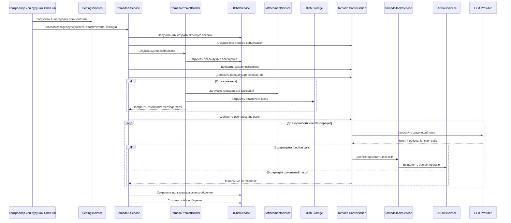
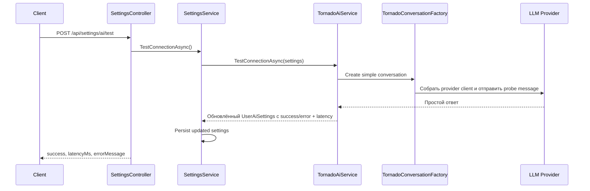
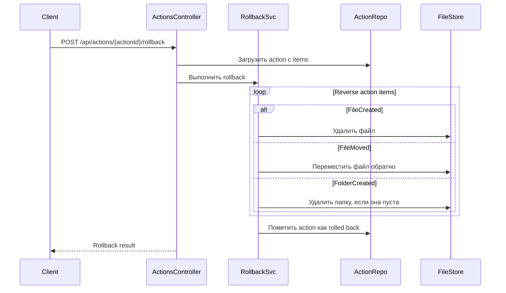
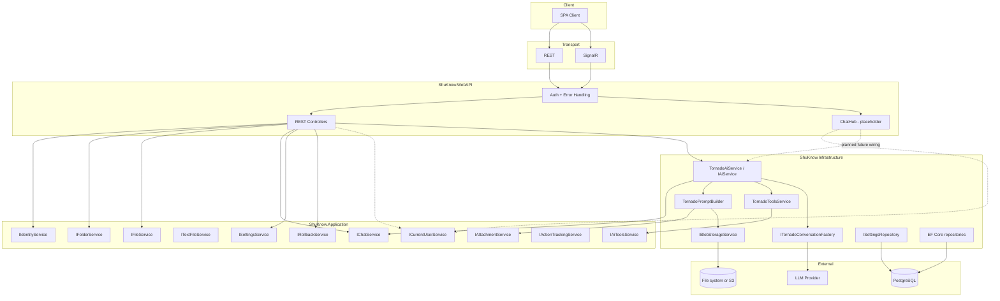

# Обзор архитектуры API

## Назначение

Этот документ объясняет архитектуру API в её текущем состоянии на ветке `66-aiservice`.

- [`docs/openapi.yaml`](C:\Users\Fey\Desktop\coding\pp\ppshu\docs\openapi.yaml) остаётся источником истины для REST-контрактов.
- [`docs/asyncapi.yaml`](C:\Users\Fey\Desktop\coding\pp\ppshu\docs\asyncapi.yaml) остаётся источником истины для intended SignalR-контракта.
- Этот документ фокусируется на runtime-поведении, внутренних границах и branch-specific расхождениях между публичным контрактом и текущей реализацией.

## Обзор системы

ShuKnow по-прежнему использует два transport-style:

- REST для аутентификации, операций с папками и файлами, чтения chat history, загрузки вложений, управления настройками и rollback-endpoints.
- SignalR для предполагаемого long-running chat workflow.

На этой ветке изменился внутренний AI runtime:

- Старый orchestration pipeline удалён.
- В Infrastructure добавлен новый conversation-layer на базе Tornado.
- Публичный SignalR-контракт пока не обновлён, а `ChatHub` всё ещё остаётся stub-ом.

Аутентификация остаётся общей для обоих transport-слоёв:

- HTTP-эндпоинты принимают JWT через `Authorization: Bearer` или через cookie-flow.
- SignalR-соединения по-прежнему используют query-параметр `access_token` и тот же JWT validation pipeline.

## Текущие runtime-flow

### 1. Tornado AI Message Processing Flow

Это текущий внутренний AI-flow, реально реализованный в коде. Он ещё не подключён к публичному `ChatHub`.

Ключевые свойства этого flow:

- Он conversation-based, а не parser-based.
- Он использует model tool calls вместо prompt parsing в промежуточный classification object.
- Он сохраняет только финальное пользовательское сообщение и финальный AI-ответ.
- Он сейчас не отправляет `OnMessageChunk`, `OnClassificationResult`, `OnFileCreated`, `OnFolderCreated` и другие hub-уведомления.

### 2. AI Connection Test Flow

Путь тестирования настроек тоже изменился на этой ветке.

Ключевые свойства:

- Latency измеряется по реальному conversation round-trip.
- Неуспешные тесты теперь сохраняют `LastTestSuccess = false`, `LastTestLatencyMs = null` и текст ошибки.
- Optional base URL валидируется до создания provider client.

### 3. Rollback Flow

Rollback по-прежнему следует старой action-log архитектуре:

Текущий gap:

- Новый Tornado AI-path сейчас не создаёт action-records, поэтому rollback-подсистема остаётся целой, но не подключена к новым AI-triggered операциям.

## Карта компонентов

## Ключевые архитектурные решения

### AI runtime переключился с prompt parsing на tool calling

На этой ветке удалён orchestration pipeline, который зависел от prompt preparation и classification parsing. Новый путь использует `LlmTornado` conversations и model tool calls.

Следствия:

- Модель может проходить через несколько tool-turn до выдачи финального ответа.
- Исполнение tool calls стало явным port-ом (`IAiToolsService`), а не неявным результатом parser-а.
- Ответ модели больше не обязан следовать parser-friendly текстовому формату.

### Вложения остаются REST-concern, но становятся multimodal chat parts

Вложения по-прежнему загружаются через REST и staging-ся в backend. Новый AI-path преобразует их в Tornado `ChatMessagePart`:

- изображения становятся image-part;
- аудио становится audio-part, если MIME type поддерживается;
- остальное становится document-part.

### Тест соединения использует тот же conversation stack, что и реальные запросы

`TestConnectionAsync()` теперь проходит через тот же provider-selection, decrypt и conversation setup, что и обычная обработка сообщений. Это уменьшает число ложноположительных результатов поверхностных connectivity-check.

### Публичный SignalR-контракт опережает текущую реализацию

`docs/asyncapi.yaml` всё ещё описывает intended chat workflow, включая progress- и streaming-events. На этой ветке [`ChatHub`](C:\Users\Fey\Desktop\coding\pp\ppshu\backend\ShuKnow.WebAPI\Hubs\ChatHub.cs) по-прежнему отправляет placeholder-events и не вызывает новый `IAiService`.

## Текущие gaps ветки

| Область | Текущее состояние на `66-aiservice` | Влияние |
|---|---|---|
| Wiring ChatHub | `SendMessage()` и `CancelProcessing()` остаются TODO-stub | SignalR runtime пока не использует новый AI flow |
| Port AI tool execution | `IAiToolsService` не имеет реализации и DI-регистрации | `TornadoAiService` пока нельзя успешно разрешить в production DI |
| Path-based content operations | `IFileService.GetByPathAsync()`, `IFolderService.GetByPathAsync()` и `IFolderService.CreateByPathAsync()` объявлены, но не реализованы | Tool-driven folder/file операции пока неполны |
| Абстракция текстовых файлов | `ITextFileService` существует только как интерфейс | Text editing tools не имеют concrete service |
| Интеграция action tracking | Новый AI flow не записывает actions | Rollback остаётся доступен только для старых action-based flow |
| Streaming notifications | `IChatNotificationService` больше не участвует в активном AI-path | AsyncAPI пока опережает фактическое runtime-поведение |

## Границы и ответственность

- OpenAPI и AsyncAPI по-прежнему задают intended public contracts.
- Текущая branch implementation перенесла значимую часть AI-поведения в Infrastructure.
- Для branch-accurate runtime-поведения стоит ориентироваться на код и этот документ, а не на старые orchestration-based описания.
