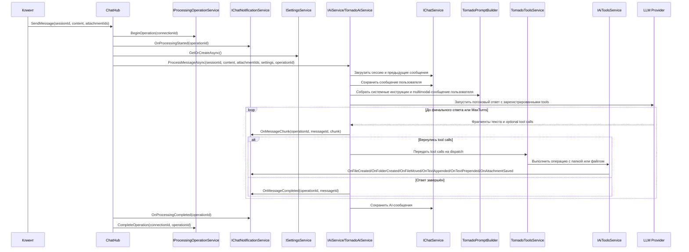
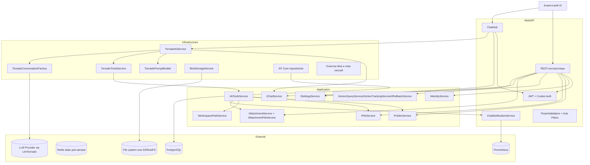

# Обзор архитектуры API

## Назначение

Документ описывает текущее состояние backend API в `backend/ShuKnow.sln`.

- `docs/openapi.yaml` описывает REST-контракт.
- `docs/asyncapi.yaml` описывает SignalR-контракт `ChatHub`.
- Реализованное поведение проверяется по коду в `backend/ShuKnow.*`; Actions/Rollback сейчас остаются объявленным, но не реализованным API.

## Транспортные слои

ShuKnow использует два публичных транспортных слоя:

- REST для аутентификации, папок, файлов, chat-сессий, временно сохранённых вложений, AI-настроек, проверки состояния и метрик.
- SignalR на `/hubs/chat` для долгих AI-операций: отправка сообщения, потоковая передача ответа, файловые события от tool calls и отмена текущей операции.

Общая аутентификация:

- REST принимает JWT через `Authorization: Bearer` и через HTTP-only cookie `token`.
- SignalR использует тот же pipeline JWT bearer. Cookie также читается JWT middleware; отдельного mapping для query-string `access_token` в текущей конфигурации нет.

## Runtime-поток: обработка AI-сообщения в ChatHub

```mermaid
sequenceDiagram
    participant Client as Клиент
    participant Hub as ChatHub
    participant Ops as IProcessingOperationService
    participant Notify as IChatNotificationService
    participant Settings as ISettingsService
    participant AI as IAiService/TornadoAiService
    participant Chat as IChatService
    participant Prompt as TornadoPromptBuilder
    participant Tools as TornadoToolsService
    participant ToolPort as IAiToolsService
    participant LLM as LLM Provider

    Client->>Hub: SendMessage(sessionId, content, attachmentIds)
    Hub->>Ops: BeginOperation(connectionId)
    Hub->>Notify: OnProcessingStarted(operationId)
    Hub->>Settings: GetOrCreateAsync()
    Hub->>AI: ProcessMessageAsync(sessionId, content, attachmentIds, settings, operationId)
    AI->>Chat: Загрузить сессию и предыдущие сообщения
    AI->>Chat: Сохранить сообщение пользователя
    AI->>Prompt: Собрать системные инструкции и multimodal-сообщение пользователя
    AI->>LLM: Запустить потоковый ответ с зарегистрированными tools

    loop До финального ответа или MaxTurns
        LLM-->>AI: Фрагменты текста и optional tool calls
        AI->>Notify: OnMessageChunk(operationId, messageId, chunk)
        alt Вернулись tool calls
            AI->>Tools: Передать tool calls на dispatch
            Tools->>ToolPort: Выполнить операцию с папкой или файлом
            ToolPort->>Notify: OnFileCreated/OnFolderCreated/OnFileMoved/OnTextAppended/OnTextPrepended/OnAttachmentSaved
        else Ответ завершён
            AI->>Notify: OnMessageCompleted(operationId, messageId)
        end
    end

    AI->>Chat: Сохранить AI-сообщения
    Hub->>Notify: OnProcessingCompleted(operationId)
    Hub->>Ops: CompleteOperation(connectionId, operationId)
```

Важное поведение:

- `SendMessageCommand.SessionId` обязателен; chat-сессии сначала создаются через REST.
- `Content` обязателен, если не переданы вложения.
- AI-ответ передаётся chunk-ами. Каждый завершённый AI-turn отправляет `OnMessageCompleted`.
- Tool calls изменяют папки и файлы через сервисы Application и отправляют domain events в текущее SignalR-соединение.
- Attachment IDs создаются через `POST /api/chat/attachments` и помечаются consumed после успешной AI-обработки.
- `CancelProcessing` отменяет активную операцию для текущего соединения. Отдельного cancellation event нет; отмена останавливает обработку и очищает состояние операции.

## Статус REST API

Реализованные области контроллеров:

| Область | Статус |
|---|---|
| Auth | Register, login и `me` реализованы. Login/register возвращают JWT и устанавливают auth cookie. |
| Folders | Реализованы дерево папок, список, создание, чтение, обновление, удаление subtree, move, reorder, children, а также upload/list файлов внутри папки. |
| Files | Реализованы чтение, обновление и удаление метаданных, download/replace/text update контента, move и reorder. |
| Chat | Реализованы создание, чтение и удаление сессий, cursor-пагинация сообщений и multipart staging вложений. |
| Settings | Реализованы чтение и обновление AI-настроек, а также тест соединения с provider. |
| Health/Metrics | `/api/health` и `/metrics` mapped вне controllers. |
| Actions | Эндпоинты существуют, но возвращают `501 Not Implemented`. Сервисы Application и repository-сервисы для actions всё ещё бросают `NotImplementedException`. |

## Карта компонентов

```mermaid
flowchart TB
    Client[Клиентский UI]

    subgraph WebAPI
        Controllers[REST-контроллеры]
        Hub[ChatHub]
        Notifications[ChatNotificationService]
        Auth[JWT + Cookie Auth]
        Validation[FluentValidation + Hub Filters]
    end

    subgraph Application
        Identity[IIdentityService]
        Folders[IFolderService]
        Files[IFileService]
        Workspace[IWorkspacePathService]
        Chat[IChatService]
        Attachments[IAttachmentService + IAttachmentFileService]
        Settings[ISettingsService]
        AiTools[IAiToolsService]
        Actions[IActionQueryService/IActionTrackingService/IRollbackService]
    end

    subgraph Infrastructure
        TornadoAI[TornadoAiService]
        Prompt[TornadoPromptBuilder]
        ToolRegistry[TornadoToolsService]
        ConvFactory[TornadoConversationFactory]
        Blob[BlobStorageService]
        Repos[EF Core repositories]
        Cleanup[Очистка blob и chat-сессий]
    end

    subgraph External
        Postgres[(PostgreSQL)]
        Redis[(Redis state для метрик)]
        BlobStore[(File system или S3/RustFS)]
        LLM[(LLM Provider via LlmTornado)]
        Prometheus[(Prometheus)]
    end

    Client --> Controllers
    Client --> Hub
    Controllers --> Auth
    Hub --> Auth
    Controllers --> Identity
    Controllers --> Folders
    Controllers --> Files
    Controllers --> Chat
    Controllers --> Attachments
    Controllers --> Settings
    Controllers --> Actions
    Hub --> Settings
    Hub --> TornadoAI
    TornadoAI --> Chat
    TornadoAI --> Prompt
    TornadoAI --> ToolRegistry
    TornadoAI --> ConvFactory
    ToolRegistry --> AiTools
    AiTools --> Folders
    AiTools --> Files
    AiTools --> Workspace
    AiTools --> Attachments
    AiTools --> Notifications
    Repos --> Postgres
    Blob --> BlobStore
    Notifications --> Prometheus
    ConvFactory --> LLM
```

## Runtime gaps

- Actions/Rollback не реализован, несмотря на существующие DTO и routes.
- `IActionQueryService`, `IActionTrackingService`, `IRollbackService` и `ActionRepository` всё ещё бросают `NotImplementedException`.
- AI tool operations отправляют live events и метрики, но не создают action records, поэтому rollback не подключён к текущему AI workflow.
- `TornadoPromptBuilder` отвечает за prompt construction; `docs/asyncapi.yaml` нужно держать синхронизированным с hub events, а не со старой classification-parser терминологией.
