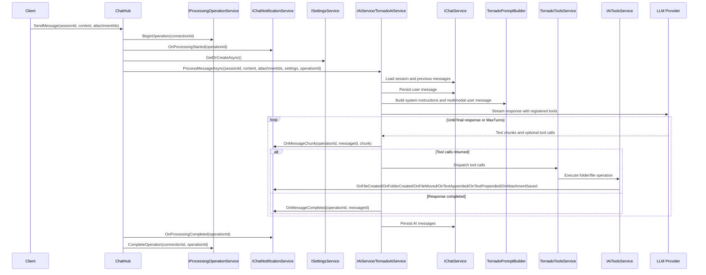
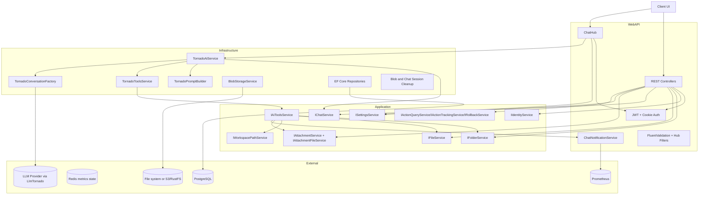

# Обзор архитектуры API

## Назначение

Документ описывает текущее состояние backend API в `backend/ShuKnow.sln`.

- `docs/openapi.yaml` описывает REST-контракт.
- `docs/asyncapi.yaml` описывает SignalR-контракт `ChatHub`.
- Реализованное поведение проверяется по коду в `backend/ShuKnow.*`; Actions/Rollback сейчас остаются объявленным, но не реализованным API.

## Транспортные слои

ShuKnow использует два публичных transport-слоя:

- REST для аутентификации, папок, файлов, chat sessions, staged-вложений, AI-настроек, health check и метрик.
- SignalR на `/hubs/chat` для long-running AI workflow: отправка сообщения, streaming ответа, tool-driven файловые события и отмена текущей операции.

Общая аутентификация:

- REST принимает JWT через `Authorization: Bearer` и через HTTP-only cookie `token`.
- SignalR использует тот же JWT bearer pipeline. Cookie также читается JWT middleware; отдельного query-string `access_token` mapping в текущей конфигурации нет.

## Runtime Flow: ChatHub AI Processing

```mermaid
sequenceDiagram
    participant Client
    participant Hub as ChatHub
    participant Ops as IProcessingOperationService
    participant Notify as IChatNotificationService
    participant Settings as ISettingsService
    participant AI as IAiService/TornadoAiService
    participant Chat as IChatService
    participant Prompt as TornadoPromptBuilder
    participant Tools as TornadoToolsService
    participant ToolPort as IAiToolsService
    participant LLM as LLM Provider

    Client->>Hub: SendMessage(sessionId, content, attachmentIds)
    Hub->>Ops: BeginOperation(connectionId)
    Hub->>Notify: OnProcessingStarted(operationId)
    Hub->>Settings: GetOrCreateAsync()
    Hub->>AI: ProcessMessageAsync(sessionId, content, attachmentIds, settings, operationId)
    AI->>Chat: Load session and previous messages
    AI->>Chat: Persist user message
    AI->>Prompt: Build system instructions and multimodal user message
    AI->>LLM: Stream response with registered tools

    loop Until final response or MaxTurns
        LLM-->>AI: Text chunks and optional tool calls
        AI->>Notify: OnMessageChunk(operationId, messageId, chunk)
        alt Tool calls returned
            AI->>Tools: Dispatch tool calls
            Tools->>ToolPort: Execute folder/file operation
            ToolPort->>Notify: OnFileCreated/OnFolderCreated/OnFileMoved/OnTextAppended/OnTextPrepended/OnAttachmentSaved
        else Response completed
            AI->>Notify: OnMessageCompleted(operationId, messageId)
        end
    end

    AI->>Chat: Persist AI messages
    Hub->>Notify: OnProcessingCompleted(operationId)
    Hub->>Ops: CompleteOperation(connectionId, operationId)
```

Important behavior:

- `SendMessageCommand.SessionId` is required; chat sessions are created through REST first.
- `Content` is required unless attachments are supplied.
- AI output is streamed as chunks. Each completed AI turn emits `OnMessageCompleted`.
- Tool calls mutate folders/files through application services and emit domain events to the current SignalR connection.
- Attachment IDs are staged through `POST /api/chat/attachments` and are marked consumed after successful AI processing.
- `CancelProcessing` cancels the active operation for the current connection. There is no separate cancellation event; cancellation stops processing and completes operation cleanup.

## REST API Status

Implemented controller areas:

| Area | Status |
|---|---|
| Auth | Register, login, and `me` are implemented. Login/register return the JWT and set the auth cookie. |
| Folders | Tree, list, create, get, update, delete subtree, move, reorder, children, and file upload/list under a folder are implemented. |
| Files | Metadata read/update/delete, content download/replace/text update, move, and reorder are implemented. |
| Chat | Session create/get/delete, cursor-paginated messages, and multipart attachment staging are implemented. |
| Settings | Get/update AI settings and provider connection test are implemented. |
| Health/Metrics | `/api/health` and `/metrics` are mapped outside controllers. |
| Actions | Endpoints exist but return `501 Not Implemented`. Application/repository services behind actions still throw `NotImplementedException`. |

## Component Map

```mermaid
flowchart TB
    Client[Client UI]

    subgraph WebAPI
        Controllers[REST Controllers]
        Hub[ChatHub]
        Notifications[ChatNotificationService]
        Auth[JWT + Cookie Auth]
        Validation[FluentValidation + Hub Filters]
    end

    subgraph Application
        Identity[IIdentityService]
        Folders[IFolderService]
        Files[IFileService]
        Workspace[IWorkspacePathService]
        Chat[IChatService]
        Attachments[IAttachmentService + IAttachmentFileService]
        Settings[ISettingsService]
        AiTools[IAiToolsService]
        Actions[IActionQueryService/IActionTrackingService/IRollbackService]
    end

    subgraph Infrastructure
        TornadoAI[TornadoAiService]
        Prompt[TornadoPromptBuilder]
        ToolRegistry[TornadoToolsService]
        ConvFactory[TornadoConversationFactory]
        Blob[BlobStorageService]
        Repos[EF Core Repositories]
        Cleanup[Blob and Chat Session Cleanup]
    end

    subgraph External
        Postgres[(PostgreSQL)]
        Redis[(Redis metrics state)]
        BlobStore[(File system or S3/RustFS)]
        LLM[(LLM Provider via LlmTornado)]
        Prometheus[(Prometheus)]
    end

    Client --> Controllers
    Client --> Hub
    Controllers --> Auth
    Hub --> Auth
    Controllers --> Identity
    Controllers --> Folders
    Controllers --> Files
    Controllers --> Chat
    Controllers --> Attachments
    Controllers --> Settings
    Controllers --> Actions
    Hub --> Settings
    Hub --> TornadoAI
    TornadoAI --> Chat
    TornadoAI --> Prompt
    TornadoAI --> ToolRegistry
    TornadoAI --> ConvFactory
    ToolRegistry --> AiTools
    AiTools --> Folders
    AiTools --> Files
    AiTools --> Workspace
    AiTools --> Attachments
    AiTools --> Notifications
    Repos --> Postgres
    Blob --> BlobStore
    Notifications --> Prometheus
    ConvFactory --> LLM
```

## Runtime Gaps

- Actions/Rollback is not implemented despite existing DTOs and routes.
- `IActionQueryService`, `IActionTrackingService`, `IRollbackService`, and `ActionRepository` still throw `NotImplementedException`.
- AI tool operations emit live events and metrics, but they do not create action records, so rollback is not connected to the current AI workflow.
- `TornadoPromptBuilder` still owns prompt construction; keep `docs/asyncapi.yaml` aligned with hub events rather than older classification-parser terminology.
