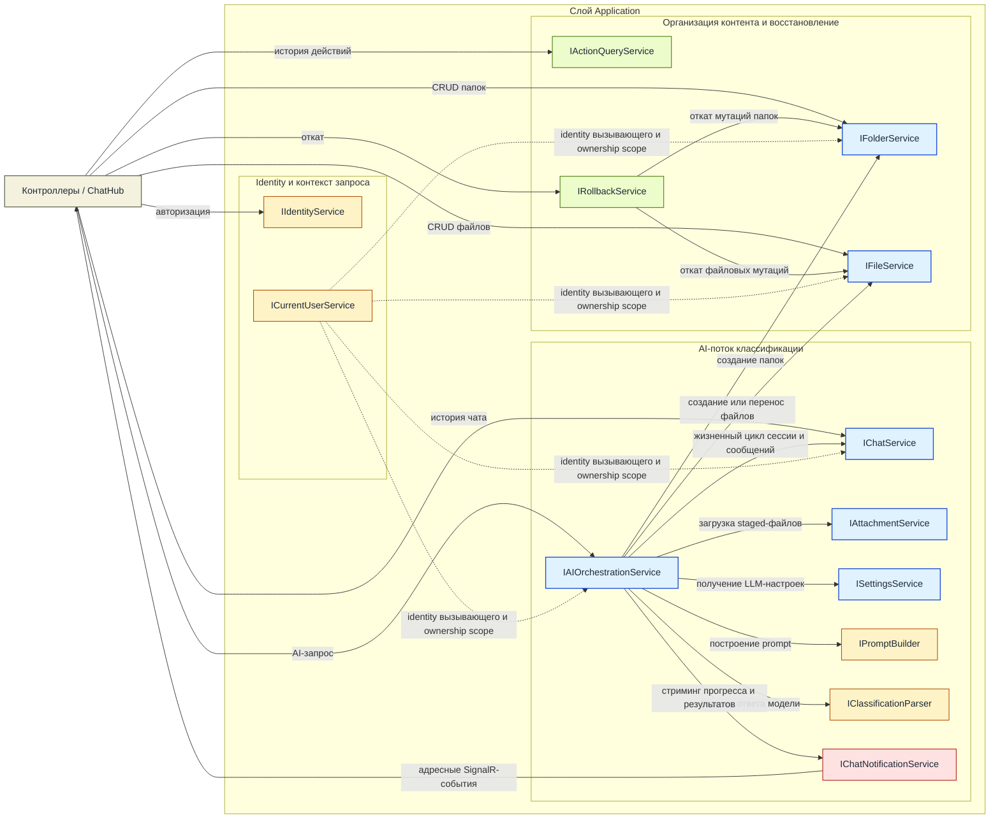
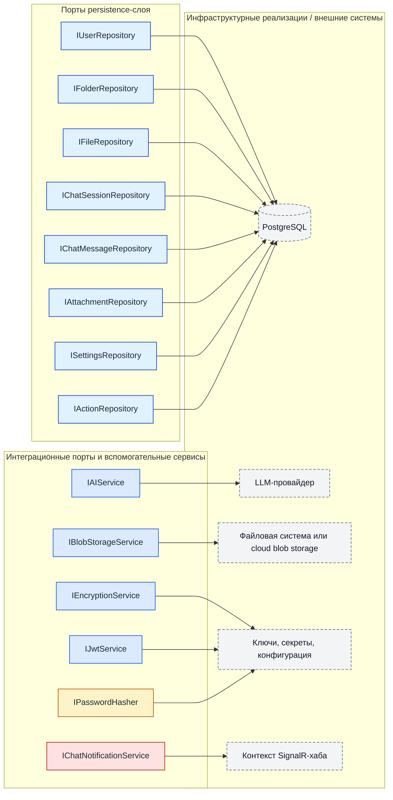

# ShuKnow MVP — Архитектура сервисов

---

## 1. Слой Application: интерфейсы сервисов

Это основные единицы бизнес-логики. Каждый сервис определяется как интерфейс в `ShuKnow.Application`, внедряется в контроллеры или хаб и реализуется в том же слое, при этом инфраструктурные зависимости передаются через порты.

---

### 1.1 ICurrentUserService (реализован)

**Назначение.** Предоставляет identity вызывающего пользователя всем остальным сервисам, не связывая их с деталями транспорта HTTP или SignalR. Каждый сервис, который проверяет владение ресурсом (а это почти все сервисы), зависит именно от него, а не читает `HttpContext` напрямую.

**Методы**

| Метод | Описание |
|---|---|
| `UserId: Guid` | Возвращает ID аутентифицированного пользователя, извлечённый из claim `sub` / `nameidentifier` в JWT. |
| `IsAuthenticated: bool` | Показывает, содержит ли текущий контекст запроса валидную пользовательскую identity. |

---

### 1.2 IFolderService

**Назначение.** Управляет полным жизненным циклом виртуальной иерархии папок. Следит за всеми инвариантами на уровне папок: уникальность имени в пределах одного родителя, предотвращение циклов при перемещении, защита системной папки `Inbox` и автоматическое создание `Inbox` при первом использовании.

**Методы**

| Метод | Описание |
|---|---|
| `GetTreeAsync()` → `List<FolderTreeNode>` | Возвращает полное рекурсивное дерево текущего пользователя, включая количество файлов в каждом узле. Используется для рендера боковой панели. |
| `ListAsync(parentId?)` → `List<Folder>` | Плоский список папок на указанном уровне (`root`, если `parentId` равен `null`). Облегчённая альтернатива полному дереву. |
| `GetByIdAsync(folderId)` → `Folder` | Возвращает одну папку с метаданными и массивом `path` с breadcrumb от корня до текущего узла. |
| `GetChildrenAsync(folderId)` → `List<Folder>` | Возвращает прямые дочерние папки. Поддерживает ленивую загрузку раскрытых узлов дерева. |
| `CreateAsync(request)` → `Folder` | Создаёт папку. Проверяет уникальность имени среди соседних папок. Вызывает `EnsureInboxExistsAsync`, если это первая папка пользователя. |
| `UpdateAsync(folderId, request)` → `Folder` | Переименовывает папку и/или обновляет описание. Проверяет уникальность имени среди соседних папок. |
| `DeleteAsync(folderId, recursive)` | Удаляет папку. Если `recursive=false` и у папки есть дочерние папки или файлы, возвращает ошибку `409`. Папку Inbox удалять нельзя. |
| `MoveAsync(folderId, newParentId?)` → `Folder` | Перемещает папку к новому родителю или в корень. Проверяет, что не возникает цикл (папка не может стать потомком самой себя) и что имя уникально в целевой области. |
| `ReorderAsync(folderId, position)` | Устанавливает для папки `SortOrder` в указанную позицию с нуля и переиндексирует всех соседей. |
| `EnsureInboxExistsAsync()` → `Folder` | Внутренний метод: создаёт папку `Inbox`, если у пользователя ещё нет папок. Вызывается из `CreateAsync` и из AI-orchestration-потока. |

**Зависимости**

| Зависимость | Зачем нужна |
|---|---|
| `IFolderRepository` | Все операции сохранения и чтения сущностей папок. |
| `IFileRepository` | Нужен для рекурсивного удаления (каскад по файлам) и обогащения данными о количестве файлов. |
| `ICurrentUserService` | Ограничение по владельцу: каждый запрос и каждая мутация фильтруются по текущему пользователю. |

---

### 1.3 IFileService

**Назначение.** Управляет CRUD-операциями над метаданными файлов, загрузкой/скачиванием/заменой бинарного содержимого и перемещением файлов между папками. Проверяет уникальность имени в пределах папки, применяет ограничения по размеру и делегирует хранение бинарных данных абстракции blob-хранилища.

**Методы**

| Метод | Описание |
|---|---|
| `GetByIdAsync(fileId)` → `File` | Метаданные файла, включая имя папки-владельца. |
| `ListByFolderAsync(folderId, page, pageSize)` → `(List<File> Files, int TotalCount)` | Пагинированный список файлов внутри папки по offset-схеме. |
| `UploadAsync(folderId, stream, fileName, contentType, description?)` → `File` | Сохраняет бинарное содержимое через `IBlobStorageService`, создаёт `File`. Проверяет уникальность имени и ограничение по размеру. |
| `UpdateMetadataAsync(fileId, request)` → `File` | Обновляет имя и описание. Проверяет уникальность имени в текущей папке файла. |
| `DeleteAsync(fileId)` | Удаляет запись метаданных и бинарный blob. |
| `GetContentAsync(fileId, rangeStart?, rangeEnd?)` → `(Stream Content, string ContentType, long SizeBytes)` | Стримит бинарное содержимое. Возвращает content type и поддерживает HTTP Range для частичных загрузок. |
| `ReplaceContentAsync(fileId, stream, contentType)` → `File` | Заменяет бинарный blob на месте. Метаданные (имя, описание) не меняются; обновляются `sizeBytes` и `contentType`. |
| `MoveAsync(fileId, targetFolderId)` → `File` | Меняет `FolderId` файла. Проверяет уникальность имени в целевой папке. |
| `DeleteByFolderAsync(folderId)` | Удаляет все файлы в папке. Используется при рекурсивном удалении папки. |

**Зависимости**

| Зависимость | Зачем нужна |
|---|---|
| `IFileRepository` | Хранение и чтение метаданных. |
| `IFolderRepository` | Проверка существования целевой папки при загрузке и перемещении. |
| `IBlobStorageService` | Хранение и получение бинарного содержимого файлов. |
| `ICurrentUserService` | Ограничение по владельцу. |

---

### 1.4 IChatService

**Назначение.** Управляет моделью одной активной сессии, сохраняет сообщения (пользовательские, AI и сообщения об отмене) и отдаёт историю сообщений с курсорной пагинацией.

**Методы**

| Метод | Описание |
|---|---|
| `GetOrCreateActiveSessionAsync()` → `ChatSession` | Возвращает активную сессию пользователя. Если её нет, создаёт новую. Операция идемпотентна. |
| `DeleteSessionAsync()` | Закрывает/удаляет активную сессию и все её сообщения. Следующий вызов `GetOrCreate` начнёт с чистого листа. |
| `GetMessagesAsync(cursor?, limit)` → `(List<ChatMessage> Messages, string? NextCursor)` | История сообщений с курсорной пагинацией, сначала новые. Курсор непрозрачный (кодирует `CreatedAt` + `Id` для keyset pagination). |
| `PersistUserMessageAsync(sessionId, content, attachments?)` → `ChatMessage` | Сохраняет пользовательское сообщение и привязывает подготовленные вложения. Возвращает сохранённую сущность с ID и timestamp, назначенными сервером. |
| `PersistAiMessageAsync(sessionId, content)` → `ChatMessage` | Сохраняет финальный текст AI-ответа. Вызывается сервисом orchestration после завершения стриминга. |
| `PersistCancellationRecordAsync(sessionId)` → `ChatMessage` | Сохраняет системное сообщение о том, что AI-ответ был отменён. Это сохраняет целостность таймлайна. |

**Зависимости**

| Зависимость | Зачем нужна |
|---|---|
| `IChatSessionRepository` | CRUD-операции над сессией. |
| `IChatMessageRepository` | Сохранение сообщений и курсорно-пагинированные запросы. |
| `ICurrentUserService` | Ограничение по владельцу. |

---

### 1.5 IAttachmentService

**Назначение.** Подготавливает загрузки файлов, которые будут использованы в будущем вызове `SendMessage` через хаб. Вложения представляют собой временную staging-зону — они существуют потому, что стандартный лимит сообщения SignalR в 32 КБ делает его непригодным для передачи бинарных данных, поэтому файлы должны сначала приходить через REST, а уже затем упоминаться в сообщении чата по ID.

**Методы**

| Метод | Описание |
|---|---|
| `UploadAsync(files)` → `List<ChatAttachment>` | Принимает один или несколько файлов, сохраняет бинарное содержимое через `IBlobStorageService`, создаёт записи `ChatAttachment` с метаданными. Возвращает ID для дальнейшего использования. |
| `GetByIdsAsync(attachmentIds)` → `List<ChatAttachment>` | Получает сущности вложений вместе с их storage keys. Используется orchestration-сервисом для построения AI-prompts. Проверяет, что все ID принадлежат текущему пользователю и ещё не были использованы. |
| `MarkConsumedAsync(attachmentIds)` | Помечает вложения как использованные, чтобы их нельзя было повторно использовать или удалить как просроченные. Вызывается после успешной привязки к сообщению чата. |
| `PurgeExpiredAsync()` | Удаляет вложения старше 1 часа, которые так и не были использованы. Предназначен для вызова фоновой задачей или hosted service. |

**Зависимости**

| Зависимость | Зачем нужна |
|---|---|
| `IAttachmentRepository` | Хранение и чтение метаданных вложений. |
| `IBlobStorageService` | Хранение бинарного содержимого. |
| `ICurrentUserService` | Проверка владельца. |

---

### 1.6 ISettingsService

**Назначение.** Управляет пользовательской конфигурацией AI/LLM-провайдера (base URL и API key). Предоставляет проверку соединения.

**Методы**

| Метод | Описание |
|---|---|
| `GetAsync()` → `AiSettings?` | Возвращает текущую конфигурацию. |
| `UpdateAsync(request)` → `AiSettings` | Сохраняет или перезаписывает base URL и API key. Шифрует API key перед сохранением. |
| `TestConnectionAsync()` → `AiConnectionTest` | Расшифровывает сохранённый API key, отправляет минимальный probe-запрос к настроенному LLM endpoint и возвращает `success`, `latencyMs` и `errorMessage`. Возвращает `422`, если настройки ещё не заданы. |

**Зависимости**

| Зависимость | Зачем нужна |
|---|---|
| `ISettingsRepository` | Хранение `UserSettings`. |
| `IEncryptionService` | Шифрование API key при записи и расшифровка при чтении (для теста и для AI-запросов). |
| `IAIService` | Отправка probe-запроса при `TestConnectionAsync`. |
| `ICurrentUserService` | Ограничение по владельцу. |

---

### 1.7 IAIOrchestrationService

**Назначение.** Это центральный оркестратор AI-пайплайна классификации — самый сложный сервис в системе. Вызывается исключительно из `ChatHub`.

**Методы**

| Метод | Описание |
|---|---|
| `ProcessMessageAsync(content, context?, attachmentIds?, callerConnectionId, cancellationToken)` | Выполняет полный pipeline классификации (описан ниже). Ничего не возвращает — весь вывод отправляется как события через `IChatNotificationService`. `CancellationToken` проверяется на каждой асинхронной границе, чтобы `CancelProcessing` мог корректно прервать поток. |

**Внутренний pipeline (один метод, несколько стадий):**

1. **Разрешение сессии.** Загружает или создаёт активную chat-сессию через `IChatService`.
2. **Сохранение пользовательского сообщения.** Сохраняет пользовательское сообщение и привязывает вложения через `IChatService`.
3. **Отправка `OnProcessingStarted`.** Генерирует `operationId` (GUID), который связывает все последующие события этого запуска.
4. **Получение настроек.** Загружает и расшифровывает AI-конфигурацию пользователя через `ISettingsService`. Если она не настроена, завершается ошибкой `LLM_CONNECTION_FAILED`.
5. **Построение prompt.** Делегирует это в `IPromptBuilder`:
   - Загружает дерево папок пользователя (через `IFolderRepository`), чтобы AI видел существующие категории.
   - Загружает содержимое вложений (через `IAttachmentService`), чтобы предоставить материал для классификации.
   - Объединяет всё это с текстом сообщения пользователя и необязательной подсказкой `context`.
6. **Потоковый вызов LLM.** Вызывает `IAIService.StreamCompletionAsync()` с prompt и расшифрованными пользовательскими учётными данными. Для каждого полученного token chunk отправляет `OnMessageChunk`. Полный текст ответа накапливается.
7. **Парсинг классификации.** Передаёт полный ответ в `IClassificationParser`, чтобы извлечь структурированные решения (имя файла → целевая папка, флаг создания новой папки). Отправляет `OnClassificationResult`.
8. **Создание записи действия.** Создаёт сущность `Action` через `IActionRepository`, чтобы начать записывать мутации.
9. **Цикл исполнения решений.** Для каждого решения классификации:
   - Если целевая папка не существует, создаёт её через `IFolderService`, отправляет `OnFolderCreated`, добавляет item действия `FolderCreated`.
   - Создаёт файл в целевой папке (из содержимого вложения) через `IFileService`, отправляет `OnFileCreated`, добавляет item действия `FileCreated`.
   - Или, если решение означает перенос существующего файла, перемещает его через `IFileService`, отправляет `OnFileMoved`, добавляет item действия `FileMoved` (с записью исходной папки для отката).
10. **Сохранение AI-сообщения.** Сохраняет полный текст AI-ответа через `IChatService`. Отправляет `OnMessageCompleted`.
11. **Финализация.** Отправляет `OnProcessingCompleted` с `actionId`, summary и количеством объектов.

**Обработка ошибок:** Любое исключение после `OnProcessingStarted` приводит к отправке `OnProcessingFailed` с подходящим кодом ошибки (`LLM_CONNECTION_FAILED`, `LLM_RATE_LIMITED`, `LLM_INVALID_RESPONSE`, `CLASSIFICATION_PARSE_ERROR`, `FILE_OPERATION_FAILED`, `INTERNAL_ERROR`). Частичные мутации, которые уже успели произойти, остаются как есть (пользователь может выполнить rollback через action, если оно уже было создано).

**Обработка отмены:** Когда токен отменяется, сервис прерывает LLM HTTP-запрос, отбрасывает частичное состояние результата, сохраняет запись об отмене в chat-сессии и отправляет `OnProcessingCancelled`.

**Зависимости**

| Зависимость | Зачем нужна |
|---|---|
| `IChatService` | Разрешение сессии, сохранение сообщений. |
| `IAttachmentService` | Получение подготовленных вложений для построения prompt. |
| `ISettingsService` | Загрузка расшифрованных LLM-учётных данных. |
| `IFolderService` | Создание папок во время исполнения, загрузка дерева для контекста prompt. |
| `IFileService` | Создание и перемещение файлов во время исполнения. |
| `IFolderRepository` | Загрузка сырого дерева папок для построения prompt (в обход DTO-mapping). |
| `IAIService` | Потоковое получение ответа от LLM. |
| `IActionRepository` | Создание и пополнение action items. |
| `IPromptBuilder` | Построение prompt. |
| `IClassificationParser` | Преобразование текста LLM в структурированные решения. |
| `IChatNotificationService` | Отправка всех real-time-событий вызывающему клиенту. |
| `ICurrentUserService` | Контекст владельца. |

---

### 1.8 IActionQueryService

**Назначение.** Предоставляет доступ только на чтение к истории AI-действий. Выделен отдельно от `IRollbackService`, потому что просмотр истории действий — это query-задача со своей пагинацией, тогда как rollback — это команда с нетривиальными побочными эффектами.

**Методы**

| Метод | Описание |
|---|---|
| `ListAsync(page, pageSize)` → `(List<Action> Actions, int TotalCount)` | Пагинированный список действий по offset-схеме, сначала новые. Каждый элемент включает summary, количество items и флаг `canRollback`. |
| `GetByIdAsync(actionId)` → `(Action Action, List<ActionItem> Items)` | Полная детализация одного действия, включая все дочерние `ActionItem` (созданные файлы, перемещённые файлы, созданные папки). |

**Зависимости**

| Зависимость | Зачем нужна |
|---|---|
| `IActionRepository` | Чтение action и данных action-item. |
| `ICurrentUserService` | Ограничение по владельцу. |

---

### 1.9 IRollbackService

**Назначение.** Отменяет записанное AI-действие, проходя по его action items в обратном порядке и откатывая каждую мутацию.

**Методы**

| Метод | Описание |
|---|---|
| `RollbackAsync(actionId)` → `RollbackResult` | Загружает действие, проверяет, что его можно откатить (оно ещё не откатано, а файлы не были изменены после выполнения), разворачивает каждый item в обратном порядке, помечает действие как откатанное и возвращает результат. |
| `RollbackLastAsync()` → `RollbackResult` | Находит последнее действие, доступное для отката, и делегирует выполнение в `RollbackAsync`. Возвращает `404`, если такого действия нет. |

**Зависимости**

| Зависимость | Зачем нужна |
|---|---|
| `IActionRepository` | Загрузка действия вместе с items, пометка как откатанного. |
| `IFileService` | Удаление и перемещение файлов. |
| `IFolderService` | Удаление папок. |
| `ICurrentUserService` | Проверка владельца. |

---

### 1.10 IPromptBuilder

**Назначение.** Строит LLM prompt из контекстных входных данных.

**Методы**

| Метод | Описание |
|---|---|
| `BuildClassificationPrompt(folderTree, userMessage, attachmentDescriptions, context?)` → `string` | Собирает структурированный prompt, который включает: (1) существующую иерархию папок пользователя с описаниями, (2) сообщение пользователя, (3) метаданные и краткие summaries содержимого для каждого вложения, (4) необязательную подсказку контекста и (5) инструкции для AI, чтобы он вернул пригодный для парсинга ответ классификации. |

---

### 1.11 IClassificationParser

**Назначение.** Разбирает текстовый ответ LLM в структурированный список решений классификации. LLM инструктируется (через prompt) использовать определённые tools; этот сервис извлекает и валидирует вызовы этих tools.

**Методы**

| Метод | Описание |
|---|---|
| `Parse(llmResponseText)` → `List<ClassificationDecision>` | Извлекает решения классификации из ответа |

---

### 1.12 IChatNotificationService

**Назначение.** Абстрагирует транспортный механизм отправки real-time-событий из слоя Application клиенту. Интерфейс определён в Application; реализация находится в WebAPI и использует `IHubContext<ChatHub>`. Эта граница не позволяет типам SignalR утекать в слой Application.

**Методы**

| Метод | Описание |
|---|---|
| `SendProcessingStartedAsync(connectionId, event)` | Сообщает, что AI-обработка началась. |
| `SendMessageChunkAsync(connectionId, event)` | Стримит chunk токенов клиенту. |
| `SendMessageCompletedAsync(connectionId, message)` | Отправляет финальное сохранённое AI-сообщение. |
| `SendClassificationResultAsync(connectionId, event)` | Отправляет план классификации. |
| `SendFileCreatedAsync(connectionId, file)` | Сообщает, что файл был создан. |
| `SendFileMovedAsync(connectionId, event)` | Сообщает, что файл был перемещён. |
| `SendFolderCreatedAsync(connectionId, folder)` | Сообщает, что папка была создана. |
| `SendProcessingCompletedAsync(connectionId, event)` | Сообщает, что все операции завершены. |
| `SendProcessingFailedAsync(connectionId, event)` | Сообщает об ошибке. |
| `SendProcessingCancelledAsync(connectionId, event)` | Подтверждает отмену. |

Все методы принимают `connectionId` (`string`) для адресной отправки в конкретное SignalR-соединение.

**Зависимости (реализация)**

| Зависимость | Зачем нужна |
|---|---|
| `IHubContext<ChatHub>` | Отправка сообщений в конкретные SignalR-соединения. |

---

## 2. Слой Application: интерфейсы портов (контракты инфраструктуры)

Эти интерфейсы определены в `ShuKnow.Application` и реализуются в `ShuKnow.Infrastructure`. Они описывают, что именно приложению нужно от persistence-слоя и внешних систем, не задавая способ реализации.

---

### 2.1 IUserRepository

| Метод | Описание |
|---|---|
| `GetByIdAsync(userId)` → `User?` | Поиск по первичному ключу. |
| `AddAsync(user)` | Сохраняет нового пользователя. |

---

### 2.2 IFolderRepository

| Метод | Описание |
|---|---|
| `GetByIdAsync(folderId, userId)` → `Folder?` | Одна папка с ограничением по владельцу. |
| `GetTreeAsync(userId)` → `List<Folder>` | Все папки пользователя, загруженные плоским списком (дерево строит сервис). |
| `GetChildrenAsync(parentId, userId)` → `List<Folder>` | Прямые дочерние папки. |
| `GetRootFoldersAsync(userId)` → `List<Folder>` | Папки корневого уровня. |
| `GetSiblingsAsync(parentId?, userId)` → `List<Folder>` | Все соседние папки на одном уровне (для переупорядочивания и проверки уникальности). |
| `GetAncestorIdsAsync(folderId)` → `List<Guid>` | Цепочка предков (для проверки циклов при перемещении). |
| `ExistsByNameInParentAsync(name, parentId?, userId, excludeId?)` → `bool` | Проверка уникальности имени в пределах одного родителя. |
| `AddAsync(folder)` | Сохраняет новую папку. |
| `UpdateAsync(folder)` | Обновляет существующую папку. |
| `DeleteAsync(folderId)` | Удаляет одну папку. |
| `DeleteSubtreeAsync(folderId)` | Рекурсивно удаляет папку и всех её потомков. |
| `CountByUserAsync(userId)` → `int` | Используется, чтобы определить, нужно ли автоматически создавать Inbox. |

---

### 2.3 IFileRepository

| Метод | Описание |
|---|---|
| `GetByIdAsync(fileId, userId)` → `File?` | Один файл с ограничением по владельцу. |
| `ListByFolderAsync(folderId, userId, page, pageSize)` → `(List<File>, int totalCount)` | Пагинированный список файлов в папке. |
| `ExistsByNameInFolderAsync(name, folderId, userId, excludeId?)` → `bool` | Проверка уникальности имени в пределах папки. |
| `CountByFolderAsync(folderId)` → `int` | Количество файлов в папке. |
| `AddAsync(file)` | Сохраняет новую файловую сущность. |
| `UpdateAsync(file)` | Обновляет метаданные. |
| `DeleteAsync(fileId)` | Удаляет файловую сущность. |
| `DeleteByFolderAsync(folderId)` | Удаляет все файлы в папке (для рекурсивного удаления папки). |
| `GetByFolderAsync(folderId)` → `List<File>` | Все файлы в папке (для рекурсивного удаления папки — нужны storage keys для удаления blob-объектов). |

---

### 2.4 IChatSessionRepository

| Метод | Описание |
|---|---|
| `GetActiveAsync(userId)` → `ChatSession?` | Возвращает активную сессию пользователя или `null`. |
| `AddAsync(session)` | Сохраняет новую сессию. |
| `DeleteAsync(sessionId)` | Удаляет сессию. |

---

### 2.5 IChatMessageRepository

| Метод | Описание |
|---|---|
| `AddAsync(message)` | Сохраняет сообщение. |
| `GetPageAsync(sessionId, cursor?, limit)` → `(List<ChatMessage>, string? nextCursor)` | Курсорно-пагинированный запрос, сначала новые. Курсор кодирует `(CreatedAt, Id)`. |
| `DeleteBySessionAsync(sessionId)` | Удаляет все сообщения сессии. |

---

### 2.6 IActionRepository

| Метод | Описание |
|---|---|
| `GetByIdWithItemsAsync(actionId, userId)` → `Action?` | Загружает действие вместе со всеми дочерними элементами. |
| `ListAsync(userId, page, pageSize)` → `(List<Action>, int totalCount)` | Пагинированный список действий, сначала новые. |
| `GetLastEligibleAsync(userId)` → `Action?` | Самое последнее действие, для которого `IsRolledBack == false`. |
| `AddAsync(action)` | Сохраняет новое действие (вместе с item-элементами через EF navigation). |
| `AddItemAsync(actionId, item)` | Добавляет элемент действия во время orchestration. |
| `MarkRolledBackAsync(actionId)` | Устанавливает флаг `IsRolledBack`. |

---

### 2.7 ISettingsRepository

| Метод | Описание |
|---|---|
| `GetByUserAsync(userId)` → `UserSettings?` | Загружает настройки пользователя. |
| `UpsertAsync(settings)` | Выполняет insert или update настроек. |

---

### 2.8 IAttachmentRepository

**Назначение.** Хранение сущностей staged-вложений.

| Метод | Описание |
|---|---|
| `GetByIdsAsync(ids, userId)` → `List<Attachment>` | Получает несколько вложений по ID с ограничением по владельцу. |
| `AddRangeAsync(attachments)` | Сохраняет несколько вложений. |
| `MarkConsumedAsync(ids)` | Обновляет статус на consumed. |
| `GetExpiredUnconsumedAsync(olderThan)` → `List<Attachment>` | Используется purge-задачей. |
| `DeleteRangeAsync(ids)` | Удаляет записи вложений. |

---

### 2.9 IAIService

**Назначение.** Низкоуровневое взаимодействие с LLM-провайдером. Это инфраструктурный адаптер, который умеет выполнять HTTP-запросы к OpenAI-совместимым API.

| Метод | Описание |
|---|---|
| `StreamCompletionAsync(prompt, baseUrl, apiKey, cancellationToken)` → `IAsyncEnumerable<string>` | Отправляет completion-запрос и по мере поступления SSE-потока отдаёт чанки токенов. |
| `TestConnectionAsync(baseUrl, apiKey)` → `(bool success, int? latencyMs, string? error)` | Отправляет минимальный запрос (например, список моделей), чтобы проверить соединение и валидность учётных данных. |

**Зависимости**

| Зависимость | Зачем нужна |
|---|---|
| `IHttpClientFactory` | Создание HTTP-клиентов для вызовов LLM API. |

---

### 2.10 IBlobStorageService

**Назначение.** Абстракция хранилища бинарных файлов. Отвязывает приложение от физического механизма хранения (локальная файловая система для MVP, позже облачное blob-хранилище).

| Метод | Описание |
|---|---|
| `SaveAsync(stream, contentType)` → `string storageKey` | Сохраняет бинарное содержимое и возвращает непрозрачный ключ. |
| `GetAsync(storageKey)` → `Stream` | Получает всё бинарное содержимое. |
| `GetRangeAsync(storageKey, offset, length)` → `Stream` | Получает диапазон байтов (для поддержки HTTP Range). |
| `DeleteAsync(storageKey)` | Удаляет бинарное содержимое. |
| `GetSizeAsync(storageKey)` → `long` | Возвращает размер сохранённого содержимого (для Range/Content-Length). |

---

### 2.11 IEncryptionService

**Назначение.** Шифрует и расшифровывает чувствительные данные в покое, в частности API keys для LLM.

| Метод | Описание |
|---|---|
| `Encrypt(plainText)` → `string` | Возвращает зашифрованный ciphertext (например, AES-256-GCM в base64). |
| `Decrypt(cipherText)` → `string` | Возвращает исходный plaintext. |

**Зависимости.** Ключ шифрования (из `IOptions<EncryptionSettings>` или из key vault).

---

## 3. Поток зависимостей

Эту архитектуру удобнее понимать в двух дополняющих друг друга представлениях: как application-сервисы координируются во время выполнения и где завершаются инфраструктурные порты.

### 3.1 Взаимодействие сервисов во время выполнения

### 3.2 Связь портов и инфраструктуры

