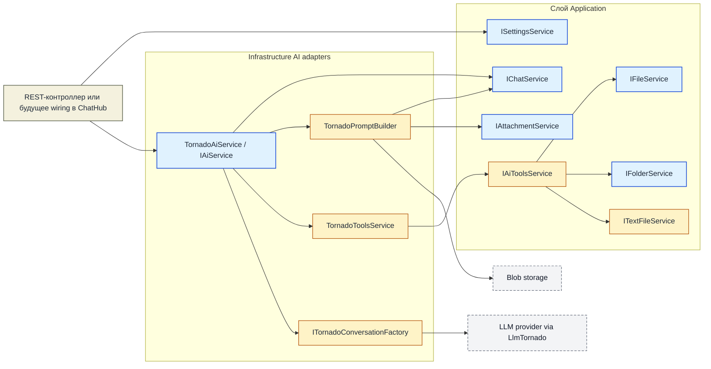
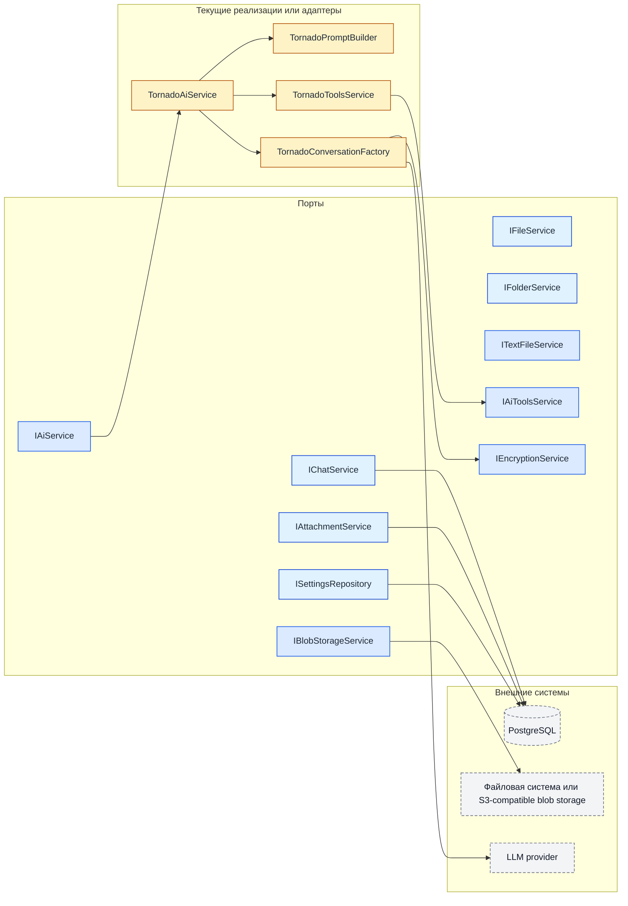

# ShuKnow MVP — Архитектура сервисов

## Область действия

Этот документ отражает текущее состояние ветки `66-aiservice` относительно `main`.

- `docs/openapi.yaml` и `docs/asyncapi.yaml` по-прежнему описывают внешние REST- и SignalR-контракты.
- Этот документ описывает текущий граф сервисов и появившиеся на ветке implementation gaps.
- Для реально реализованного поведения источником истины остаётся код в `backend/ShuKnow.*`.

## 1. Интерфейсы сервисов слоя Application

Таблица ниже концентрируется на интерфейсах, которые изменились на этой ветке или получили другую runtime-роль.

| Интерфейс | Статус на ветке | Примечание |
|---|---|---|
| `ICurrentUserService` | Реализован | По-прежнему задаёт ownership-boundary для application-сервисов. |
| `IIdentityService` | Реализован | Изменений по ветке нет. |
| `ICurrentConnectionService` | Зарегистрирован в WebAPI | По-прежнему доступен для адресных SignalR-уведомлений, но новый AI-path его сейчас не использует. |
| `IFolderService` | Частично реализован | Добавлены path-based методы `GetByPathAsync()` и `CreateByPathAsync()`. Текущий `FolderService` всё ещё бросает `NotImplementedException` для ряда методов, включая новые path-based. |
| `IFileService` | Частично реализован | Добавлен `GetByPathAsync()`. Текущий `FileService` по-прежнему бросает `NotImplementedException` для этого метода. |
| `ITextFileService` | Добавлен, не подключён | Новый application-port для создания текстовых файлов и операций prepend/append. Реализации и DI-регистрации пока нет. |
| `IAttachmentService` | Реализован | Теперь используется напрямую в `TornadoPromptBuilder` для преобразования staged-вложений в multimodal message parts. |
| `IChatService` | Изменён и частично реализован | Добавлен `GetMessagesAsync(ct)` для полной истории активной сессии и унифицирована запись сообщений через `PersistMessageAsync()`. |
| `ISettingsService` | Реализован | `TestConnectionAsync()` теперь сохраняет экземпляр `UserAiSettings`, возвращённый из `IAiService.TestConnectionAsync()`. |
| `IAiService` | Контракт заменён, реализация в Infrastructure | Старый streaming-only интерфейс удалён. Новый контракт владеет обработкой целого сообщения и тестом соединения. |
| `IAiToolsService` | Добавлен, не подключён | Новый port для AI-triggered операций (`create_folder`, `create_text_file`, `save_attachment`, `append_text`, `prepend_text`, `move_file`). Реализации и DI-регистрации пока нет. |
| `IActionQueryService` | Реализован | Изменений по ветке нет. |
| `IActionTrackingService` | Реализован | Изменений по ветке нет, но новый AI-path его сейчас не использует. |
| `IRollbackService` | Реализован | Изменений по ветке нет. |
| `IChatNotificationService` | Реализован в WebAPI | Сервис по-прежнему существует, но текущий AI-path не отправляет через него события. |

## 2. Ключевые изменения сервисов

### 2.1 `IChatService`

Теперь у чат-сервиса две read-ветки и одна write-ветка:

| Метод | Текущая роль |
|---|---|
| `GetOrCreateActiveSessionAsync()` | Разрешает единственную активную сессию текущего пользователя. |
| `DeleteSessionAsync()` | Удаляет активную сессию и её сообщения. |
| `GetMessagesAsync(cursor, limit)` | Курсорно-пагинированное чтение для публичного chat-history API. |
| `GetMessagesAsync(ct)` | Возвращает in-memory коллекцию сообщений активной сессии. Используется `TornadoPromptBuilder` для гидрации истории разговора. |
| `PersistMessageAsync(message)` | Унифицированная точка записи и для user-, и для AI-сообщений. |

Примечания по реализации:

- `ChatService` больше не предоставляет отдельные `PersistUserMessageAsync`, `PersistAiMessageAsync` и `PersistCancellationRecordAsync`.
- В текущей реализации сохранение идёт через `IChatMessageRepository`, но в коде остаётся комментарий `// TODO: add index increment`.
- `ChatSession.Messages` теперь представлен как `IReadOnlyCollection<ChatMessage>` и используется как источник для non-paginated history path.

### 2.2 `IAiService`

`IAiService` был переработан из низкоуровневого streaming-адаптера в более высокий AI workflow boundary:

| Метод | Текущая роль |
|---|---|
| `ProcessMessageAsync(content, attachmentIds, settings)` | Создаёт conversation, загружает предыдущие сообщения, разрешает вложения, исполняет tool calls и сохраняет финальные user/AI сообщения. |
| `TestConnectionAsync(settings)` | Выполняет минимальный conversation round-trip, измеряет latency и мутирует переданный `UserAiSettings` актуальным результатом теста. |

Этот интерфейс теперь реализуется [`TornadoAiService`](C:\Users\Fey\Desktop\coding\pp\ppshu\backend\ShuKnow.Infrastructure\Services\TornadoAiService.cs), а не удалённым `AiService`.

### 2.3 `IAiToolsService`

Это новый application-port, введённый для исполнения model tools:

| Метод | Ожидаемое поведение |
|---|---|
| `CreateFolderAsync(folderPath, description, emoji)` | Создание папки по пути. |
| `CreateTextFileAsync(filePath, content)` | Создание текстового файла по пути. |
| `SaveAttachment(attachmentId, filePath)` | Сохранение staged-вложения в файловый путь. |
| `AppendTextAsync(filePath, text)` | Добавление текста в конец существующего файла. |
| `PrependTextAsync(filePath, text)` | Добавление текста в начало существующего файла. |
| `MoveFileAsync(sourcePath, destinationPath)` | Перемещение файла между путями. |

Текущее состояние ветки:

- [`TornadoToolsService`](C:\Users\Fey\Desktop\coding\pp\ppshu\backend\ShuKnow.Infrastructure\Services\TornadoToolsService.cs) регистрирует эти методы как LLM tools.
- Конкретной реализации `IAiToolsService` в ветке нет.
- DI-регистрации `IAiToolsService` тоже нет, поэтому runtime-разрешение `TornadoAiService` сейчас завершится ошибкой, пока этот port не будет реализован и зарегистрирован.

### 2.4 Удалённые сервисы

На этой ветке удалены следующие интерфейсы и реализации:

- `IAIOrchestrationService`
- `IPromptPreparationService`
- `IPromptBuilder`
- `IClassificationParser`
- `AiOrchestrationService`
- `PromptPreparationService`
- `PromptBuilder`
- `ClassificationParser`
- `AiService`

Их обязанности заменены infrastructure-side компонентами Tornado:

- [`TornadoAiService`](C:\Users\Fey\Desktop\coding\pp\ppshu\backend\ShuKnow.Infrastructure\Services\TornadoAiService.cs)
- [`TornadoPromptBuilder`](C:\Users\Fey\Desktop\coding\pp\ppshu\backend\ShuKnow.Infrastructure\Services\TornadoPromptBuilder.cs)
- [`TornadoToolsService`](C:\Users\Fey\Desktop\coding\pp\ppshu\backend\ShuKnow.Infrastructure\Services\TornadoToolsService.cs)
- [`ITornadoConversationFactory`](C:\Users\Fey\Desktop\coding\pp\ppshu\backend\ShuKnow.Infrastructure\Services\ITornadoConversationFactory.cs)

## 3. Infrastructure-адаптеры нового AI-path

### 3.1 `TornadoAiService`

Обязанности:

1. Разрешить активную chat-сессию.
2. Создать Tornado conversation с зарегистрированными tools.
3. Добавить system instructions.
4. Подгрузить историю из `IChatService`.
5. Развернуть вложения в `ChatMessagePart`.
6. Выполнять LLM conversation до сходимости или до `MaxTurns = 10`.
7. Диспетчеризовать tool calls через `TornadoToolsService`.
8. Сохранить финальное пользовательское сообщение и финальный AI-ответ через `IChatService`.

Замечания по поведению:

- Финальное пользовательское сообщение сохраняется после успешной сходимости, а не до начала tool execution.
- Ошибки conversation приводят к `Result.Error("Error while processing message")`.
- Несходящиеся tool loops возвращают `Result.Error("Agent did not converge after 10 iterations")`.

### 3.2 `TornadoPromptBuilder`

Обязанности:

- Построить строку system instructions.
- Загрузить предыдущие сообщения и смаппить их в Tornado chat messages.
- Загрузить метаданные вложений и blob-данные.
- Преобразовать вложения в text-, image-, audio- или document-parts.

Текущий gap:

- `CreateSystemInstructions()` пока возвращает placeholder-строку на русском и ещё не инжектит folder-tree context.

### 3.3 `ITornadoConversationFactory` и `ITornadoConversation`

Эти infrastructure-абстракции изолируют SDK `LlmTornado`:

- `ITornadoConversationFactory` создаёт либо tool-enabled conversation, либо simple conversation для теста соединения.
- `ITornadoConversation` скрывает конкретный тип Tornado `Conversation` за testable interface.
- `TornadoConversationFactory` расшифровывает API key, маппит `AiProvider` в `LlmTornado` provider-ы, валидирует optional base URL и собирает conversation request.

### 3.4 Вспомогательные утилиты

- [`TornadoMappers`](C:\Users\Fey\Desktop\coding\pp\ppshu\backend\ShuKnow.Infrastructure\Extensions\TornadoMappers.cs) маппит provider enum, chat roles и audio MIME types в типы Tornado SDK.
- [`LatencyMeasureUtil`](C:\Users\Fey\Desktop\coding\pp\ppshu\backend\ShuKnow.Infrastructure\Misc\LatencyMeasureUtil.cs) измеряет latency успешного connection test.
- [`UserAiSettingsExtensions.ParseBaseUrl()`](C:\Users\Fey\Desktop\coding\pp\ppshu\backend\ShuKnow.Domain\Extensions\UserAiSettingsExtensions.cs) валидирует optional absolute base URL до использования conversation factory.

## 4. Поток зависимостей

### 4.1 Runtime AI interaction на этой ветке

### 4.2 Связь портов и реализаций

## 5. Основные gaps текущей ветки

Это ключевые documentation-relevant gaps, которые появились на ветке:

1. [`ChatHub`](C:\Users\Fey\Desktop\coding\pp\ppshu\backend\ShuKnow.WebAPI\Hubs\ChatHub.cs) всё ещё содержит placeholder-реализации `SendMessage()` и `CancelProcessing()`. AsyncAPI-контракт пока опережает реальную runtime-интеграцию.
2. `IAiToolsService` требуется `TornadoToolsService`, но реализации и DI-регистрации для него пока нет.
3. `ITextFileService` объявлен, но не реализован и не зарегистрирован.
4. `IFolderService.GetByPathAsync()`, `IFolderService.CreateByPathAsync()` и `IFileService.GetByPathAsync()` объявлены, но сейчас бросают `NotImplementedException`.
5. Новый AI-path не использует `IActionTrackingService`, `IActionQueryService`, `IRollbackService` и `IChatNotificationService`. Эти сервисы по-прежнему существуют, но они больше не являются частью активного AI-flow на этой ветке.
