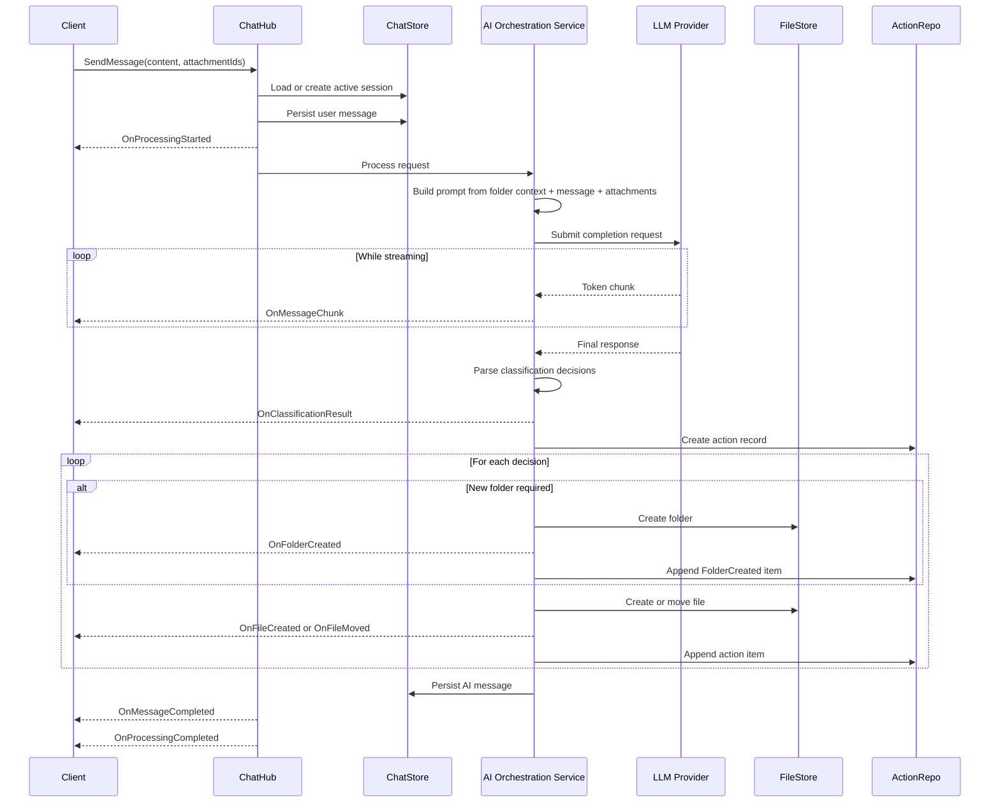
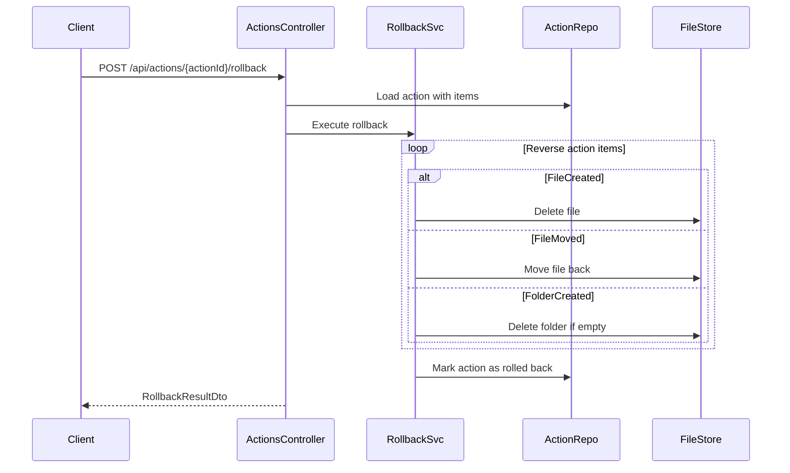
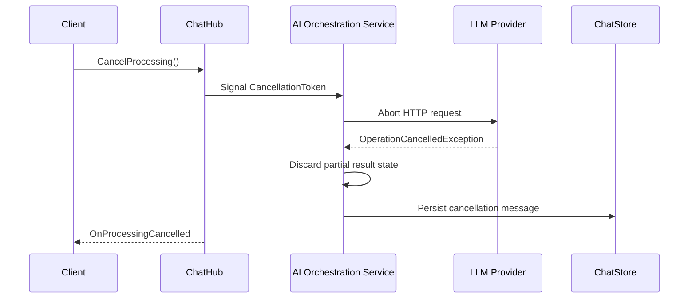
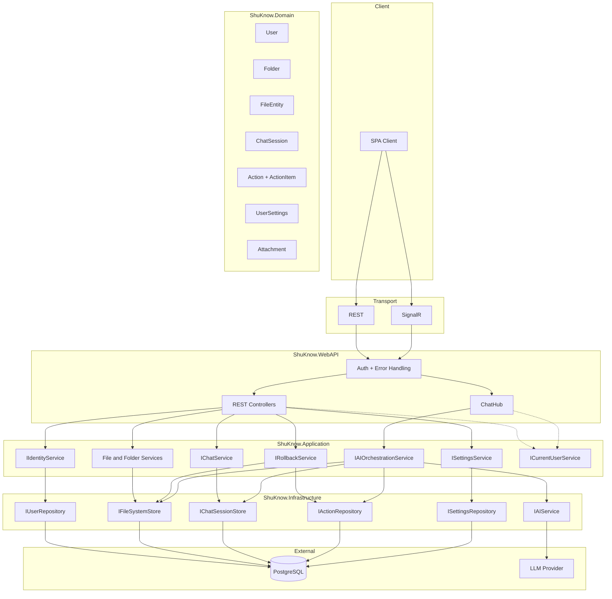

# API Architecture Overview

## Purpose

This document explains how the API is structured and why it is designed this way.

- [docs/openapi.yaml](../openapi.yaml) is the source of truth for REST contracts.
- [docs/asyncapi.yaml](../asyncapi.yaml) is the source of truth for SignalR events and message payloads.
- This document focuses on runtime behavior, component boundaries, and architectural decisions.

## System Overview

ShuKnow exposes two communication styles:

- REST for request-response operations such as authentication, folder and file CRUD, chat session reads, attachment upload, settings management, and rollback endpoints.
- SignalR for long-running AI workflows such as message submission, token streaming, progress notifications, and cancellation.

Authentication is shared across both transports:

- HTTP endpoints accept JWT from either the `Authorization: Bearer` header or an HTTP-only cookie.
- SignalR connections use the `access_token` query parameter and pass through the same JWT validation pipeline.

The system is layered:

- `ShuKnow.WebAPI` exposes controllers and the chat hub.
- `ShuKnow.Application` coordinates use cases and orchestration.
- `ShuKnow.Domain` contains core entities and business rules.
- `ShuKnow.Infrastructure` persists data and integrates with the LLM provider.

## Runtime Flows

### AI Classification Flow

This is the main end-to-end workflow in the product.

### Rollback Flow

Rollback is modeled as a deterministic reversal of a recorded AI action, not as a best-effort filesystem diff.

### Cancellation Flow

Cancellation interrupts in-flight AI work and prevents partial results from being treated as complete output.

## Component Map

## Key Architectural Decisions

### Attachments Are Uploaded via REST

SignalR is not a good transport for binary payloads of practical size. Attachment upload stays on REST because `multipart/form-data` is reliable, browser-friendly, and easier to validate and limit.

### Chat Sending Uses SignalR Instead of REST

AI processing is long-running and benefits from incremental feedback. SignalR enables token streaming, progress events, file mutation notifications, and cancellation without turning a single HTTP request into a fragile polling workflow.

### Chat Message History Uses Cursor Pagination

Messages are append-only and frequently read from newest to oldest. Cursor pagination avoids unstable pages when new messages arrive during browsing.

### Rollback Uses an Explicit Action Aggregate

Every AI run records what changed. Rollback then reverses that record in a predictable order. This is more auditable and safer than reconstructing changes from timestamps or snapshots.

### Folder Tree Is Loaded as a Tree, Files Are Paginated Separately

The folder tree supports navigation and AI context building, so loading it as a single structure keeps the client model simple. Files can grow much faster than folders, so file listings remain paginated.

### AI Settings Validation Is a Separate Operation

Testing provider connectivity before the first real AI request gives faster feedback and avoids mixing configuration failures with business workflows.

## Domain Gaps Required by the API Design

The current contract implies several domain and persistence capabilities that must exist for the architecture to be complete.

| Area | Required addition | Why it exists |
|---|---|---|
| Content ordering | `Folder.SortOrder` and `FileEntity.SortOrder` | Folders and files share the same ordering space within a parent, enabling mixed drag-and-drop reordering. |
| User AI config | `UserSettings` with encrypted API key, `AiProvider` enum, and `ModelId` | Required for per-user LLM configuration including provider and model selection. |
| Rollback log | `Action` aggregate with `ActionItem` children | Required for deterministic rollback. |
| Temporary attachments | `Attachment` staging entity | Required because attachments are uploaded before `SendMessage`. |
| File move history | Original location tracking inside action items | Required so rollback can restore moved files. |

## Key Contract Details

The full DTO schemas live in [openapi.yaml](../openapi.yaml). This section highlights fields and endpoints that carry architectural implications.

**UserDto** includes both `id` (Guid) and `login` (string), so the client can display a user name without a separate profile lookup.

**FolderDto / FolderTreeNodeDto** include an `emoji` field (string?, max 8 chars) that allows users to assign an icon to a folder.

**FileDto** includes `sortOrder` (int) that shares the same ordering space as sibling folders, enabling mixed drag-and-drop reordering of files and folders within a parent. It also includes `createdAt` (DateTimeOffset) for display and sorting by creation time.

**AiSettingsDto** includes `provider` (AiProvider enum: OpenAI, OpenRouter, Gemini, Anthropic) and `modelId` (string?) alongside the existing base URL and API key, allowing users to select specific LLM providers and models. Backend serializes enum values as lowercase and parses case-insensitively.

**`PATCH /api/files/{fileId}/content`** — A lightweight JSON-body endpoint for updating text content of text-based files. Unlike the multipart binary `PUT` on `/api/files/{fileId}/content`, this accepts a JSON payload with the new text, avoiding multipart overhead for simple edits.

**`PATCH /api/files/{fileId}/reorder`** — Reorders a file within its parent folder, following the same pattern as folder reorder (`PATCH /api/folders/{folderId}/reorder`).

## Boundaries and Ownership

- OpenAPI and AsyncAPI define the external contracts.
- This document defines the intended behavior around those contracts.
- If the contracts change, update the YAML files first and then adjust this document only when the runtime model or architectural reasoning also changes.