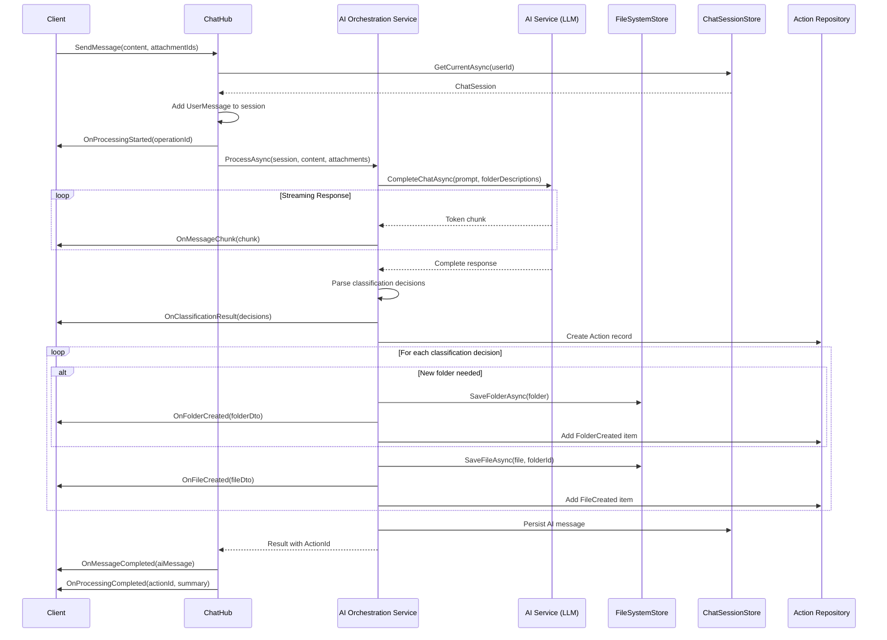
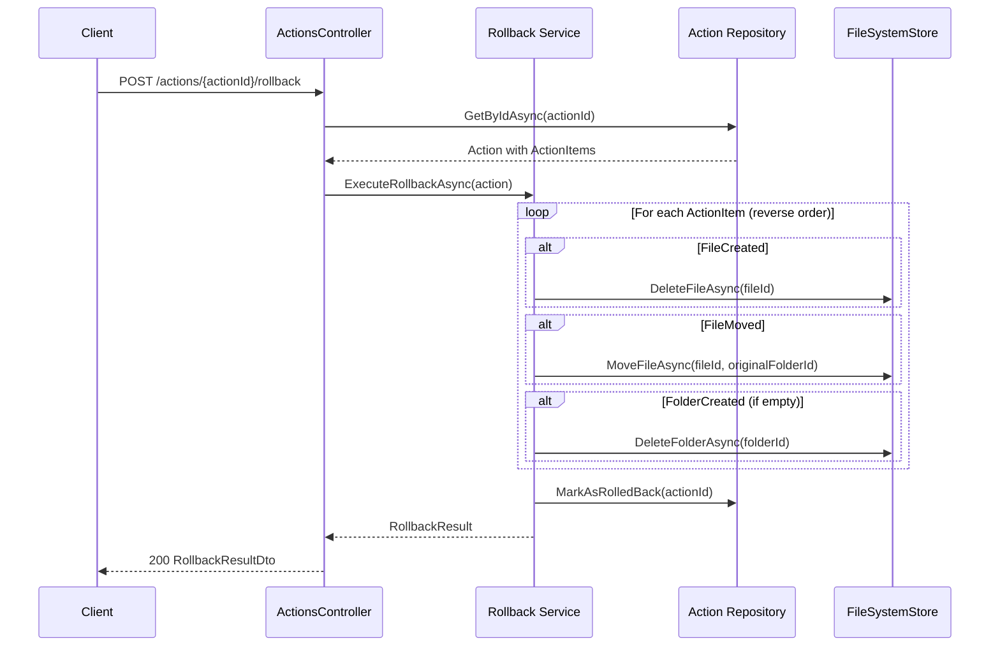
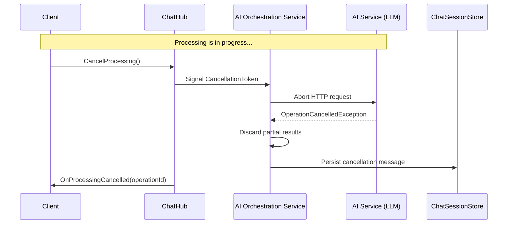

# API Architecture Design

---

## 1. Architecture Overview

### 1.1 Communication Patterns

| Pattern | Use Case |
|---------|----------|
| **REST API** | CRUD operations on folders, files, settings; chat session management; attachment uploads; action history and rollback |
| **SignalR WebSocket** | AI message processing, LLM response streaming, real-time file/folder mutation notifications, processing cancellation |

### 1.2 Authentication

All endpoints (except registration and login) require JWT authentication. The token is read from either the `Authorization: Bearer` header or an HTTP-only cookie (`SameSite=None; Secure`). SignalR authenticates via the `access_token` query parameter on connection, which the middleware maps into the same JWT pipeline.

---

## 2. REST API Endpoints

### 2.1 Authentication — `AuthController`

Base route: `/api/auth`

| Method | Route | Body | Response | Auth |
|--------|-------|------|----------|------|
| `POST` | `/api/auth/register` | `RegisterRequest` | `string` (JWT) | No |
| `POST` | `/api/auth/login` | `LoginRequest` | `string` (JWT) | No |
| `GET` | `/api/auth/me` | — | `UserDto` | Yes |

On success, the JWT is set as an HTTP-only cookie and also returned in the body.

---

### 2.2 Folders — `FoldersController`

Manages the virtual file system hierarchy with descriptions for AI.

Base route: `/api/folders`

| Method | Route | Body / Query | Response | Description |
|--------|-------|-------------|----------|-------------|
| `GET` | `/api/folders/tree` | — | `FolderTreeNodeDto[]` | Full hierarchical tree for the authenticated user. Each node contains children recursively and a file count. Used to render the sidebar. |
| `GET` | `/api/folders` | `?parentId={guid\|null}` | `FolderDto[]` | Flat list of folders at a given level. `parentId=null` (or omitted) returns root folders. Lightweight alternative to tree. |
| `POST` | `/api/folders` | `CreateFolderRequest` | `FolderDto` (201) | Create a folder. Validates name uniqueness within parent scope. If no folders exist, `Inbox` is auto-ensured first. |
| `GET` | `/api/folders/{folderId}` | — | `FolderDto` | Single folder with metadata. `Path` breadcrumb is populated. |
| `PUT` | `/api/folders/{folderId}` | `UpdateFolderRequest` | `FolderDto` | Update name and/or description. Validates name uniqueness. |
| `DELETE` | `/api/folders/{folderId}` | `?recursive=false` | 204 | Delete folder. If `recursive=true`, deletes all children and files. If `false` and folder is non-empty, returns 409 Conflict. Inbox cannot be deleted. |
| `PATCH` | `/api/folders/{folderId}/move` | `MoveFolderRequest` | `FolderDto` | Move folder to a new parent (or root if `null`). Validates no cycle, name uniqueness in target scope. |
| `PATCH` | `/api/folders/{folderId}/reorder` | `ReorderFolderRequest` | 204 | Change sort position among siblings. Accepts target `position` (0-based). Server re-indexes siblings. |
| `GET` | `/api/folders/{folderId}/children` | — | `FolderDto[]` | Direct child folders. Useful for lazy-loading expanded nodes. |
| `GET` | `/api/folders/{folderId}/files` | `?page&pageSize` | `PagedResult<FileDto>` | Paginated files in a folder. Offset-based. Default `pageSize=50`. |

**Request DTOs:**

```
CreateFolderRequest {
    Name: string (required)
    Description: string?
    ParentFolderId: Guid?
}

UpdateFolderRequest {
    Name: string?
    Description: string?
}

MoveFolderRequest {
    NewParentFolderId: Guid?           // null = move to root
}

ReorderFolderRequest {
    Position: int                       // 0-based target index
}
```

**Response DTOs:**

```
FolderDto {
    Id: Guid
    Name: string
    Description: string
    ParentFolderId: Guid?
    SortOrder: int
    FileCount: int
    HasChildren: bool
    Path: string[]?                     // breadcrumb, populated on GET /{id}
    CreatedAt: DateTime
}

FolderTreeNodeDto {
    Id: Guid
    Name: string
    Description: string
    SortOrder: int
    FileCount: int
    Children: FolderTreeNodeDto[]
}
```

---

### 2.3 Files — `FilesController`

Manages file entities within the folder ecosystem. File creation is nested under folders; all other operations use the file's own ID.

| Method | Route | Body | Response | Description |
|--------|-------|------|----------|-------------|
| `POST` | `/api/folders/{folderId}/files` | `multipart/form-data`: `file`, `name?`, `description?` | `FileDto` (201) | Upload a file into a folder. If `name` is omitted, original filename is used. Validates name uniqueness. File size limit enforced (configurable, e.g. 10 MB for MVP). |
| `GET` | `/api/files/{fileId}` | — | `FileDto` | File metadata (name, description, content type, size, timestamps). |
| `GET` | `/api/files/{fileId}/content` | — | Binary stream | Download/stream the actual file content. Returns `application/octet-stream` or the stored MIME type. Supports `Range` header for large files. |
| `PUT` | `/api/files/{fileId}` | `UpdateFileRequest` | `FileDto` | Update name and/or description. Validates name uniqueness within folder. |
| `PUT` | `/api/files/{fileId}/content` | `multipart/form-data`: `file` | `FileDto` | Replace file content. Updates `UpdatedAt`. |
| `DELETE` | `/api/files/{fileId}` | — | 204 | Permanently delete file. |
| `PATCH` | `/api/files/{fileId}/move` | `MoveFileRequest` | `FileDto` | Move file to a different folder. Validates name uniqueness in target folder. |

**Request DTOs:**

```
UpdateFileRequest {
    Name: string?
    Description: string?
}

MoveFileRequest {
    TargetFolderId: Guid (required)
}
```

**Response DTO:**

```
FileDto {
    Id: Guid
    FolderId: Guid
    FolderName: string
    Name: string
    Description: string
    ContentType: string
    SizeBytes: long
    CreatedAt: DateTime
    UpdatedAt: DateTime
}
```

Upload uses `multipart/form-data` with form fields, not a JSON body.

---

### 2.4 Chat — `ChatController`

The chat resource is singular — there is always at most one active session. REST provides read access and attachment staging; message sending is done via the SignalR hub (§3).

Base route: `/api/chat`

| Method | Route | Body / Query | Response | Description |
|--------|-------|-------------|----------|-------------|
| `GET` | `/api/chat/session` | — | `ChatSessionDto` | Get current active session. If none exists, creates a new one transparently (idempotent). Returns session metadata. |
| `DELETE` | `/api/chat/session` | — | 204 | Close and discard the current session. Next `GET` creates a fresh one. |
| `GET` | `/api/chat/session/messages` | `?cursor&limit` | `CursorPagedResult<ChatMessageDto>` | Paginated messages in the current session. Cursor-based (by `CreatedAt` descending). Default `limit=50`. Returns `nextCursor` and `hasMore`. |
| `POST` | `/api/chat/attachments` | `multipart/form-data`: `files[]` | `AttachmentDto[]` | Upload files that will be referenced in a hub message. Returns temporary attachment IDs. Attachments are purged if unreferenced after 1 hour. |

> **Note:** Sending a message and triggering AI processing is done exclusively via the SignalR hub. This endpoint exists because SignalR is not suited for binary transfer (default message size limit is 32 KB, and binary streaming through WebSocket is fragile).

**Response DTOs:**

```
ChatSessionDto {
    Id: Guid
    CreatedAt: DateTime
    MessageCount: int
    CanRollback: bool
}

ChatMessageDto {
    Id: Guid
    Role: string                        // "User" | "Ai"
    Content: string
    Attachments: AttachmentDto[]?
    CreatedAt: DateTime
}

AttachmentDto {
    Id: Guid
    FileName: string
    ContentType: string
    SizeBytes: long
}
```

---

### 2.5 AI Settings — `SettingsController`

User configuration for the LLM provider connection.

Base route: `/api/settings`

| Method | Route | Body | Response | Description |
|--------|-------|------|----------|-------------|
| `GET` | `/api/settings/ai` | — | `AiSettingsDto` | Returns current AI configuration. The API key is masked (`sk-****abcd`). Base URL is returned in full. |
| `PUT` | `/api/settings/ai` | `UpdateAiSettingsRequest` | `AiSettingsDto` | Set or update the LLM provider base URL and API key. Key is stored encrypted at rest. |
| `POST` | `/api/settings/ai/test` | — | `AiConnectionTestDto` | Test connectivity to the configured LLM provider. Sends a minimal probe request using stored credentials. Returns latency and success status. |

**Request DTO:**

```
UpdateAiSettingsRequest {
    BaseUrl: string (required)
    ApiKey: string (required)
}
```

**Response DTOs:**

```
AiSettingsDto {
    BaseUrl: string
    ApiKeyMasked: string                // "sk-****abcd"
    IsConfigured: bool
    LastTestedAt: DateTime?
}

AiConnectionTestDto {
    Success: bool
    LatencyMs: int?
    ErrorMessage: string?
}
```

---

### 2.6 Actions & Rollback — `ActionsController`

Each AI processing run produces an `Action` record — a log of every mutation (files created, files moved, folders created). Rollback reverses a specific action by iterating its items in reverse order.

Base route: `/api/actions`

| Method | Route | Body / Query | Response | Description |
|--------|-------|-------------|----------|-------------|
| `GET` | `/api/actions` | `?page&pageSize` | `PagedResult<ActionDto>` | List of recent AI-generated actions, newest first. Each action includes a summary and rollback eligibility. |
| `GET` | `/api/actions/{actionId}` | — | `ActionDetailDto` | Detailed view of a single action: every file created/moved, folders created, content classified. |
| `POST` | `/api/actions/{actionId}/rollback` | — | `RollbackResultDto` | Reverse a specific action. Deletes files that were created, moves files back to original folders, removes created folders (if empty). Returns list of restored/reverted items. Non-reversible if files have been manually modified since. |
| `POST` | `/api/actions/rollback-last` | — | `RollbackResultDto` | Convenience: rollback the most recent eligible action. |

**Response DTOs:**

```
ActionDto {
    Id: Guid
    Summary: string
    ItemCount: int
    CreatedAt: DateTime
    CanRollback: bool
}

ActionDetailDto {
    Id: Guid
    Summary: string
    CreatedAt: DateTime
    Items: ActionItemDto[]
}

ActionItemDto {
    Type: string                        // "FileCreated" | "FileMoved" | "FolderCreated"
    FileId: Guid?
    FolderId: Guid?
    FileName: string?
    FolderName: string?
    TargetFolderName: string?
}

RollbackResultDto {
    ActionId: Guid
    RestoredItems: RollbackItemDto[]
    FullyReverted: bool
}

RollbackItemDto {
    Type: string
    Description: string
}
```

---

### 2.7 Shared DTOs — Pagination

```
PagedResult<T> {
    Items: T[]
    TotalCount: int
    Page: int
    PageSize: int
    HasNextPage: bool
}

CursorPagedResult<T> {
    Items: T[]
    NextCursor: string?
    HasMore: bool
}
```

---

## 3. SignalR Hub — `ChatHub`

**Endpoint:** `/hubs/chat`

**Authentication:** JWT via `access_token` query string parameter (standard for SignalR). The hub resolves `ICurrentUserService` from the connection context.

**Connection lifecycle:** The client connects when the app loads and disconnects on close. The hub is stateless per connection — all state is in the database and the `IAIOrchestrationService`.

### 3.1 Connection Lifecycle

```
Client                                     Server
  │                                           │
  │── Connect (access_token=JWT) ────────────►│
  │                                           │ Validate JWT
  │                                           │ Join group user:{userId}
  │                                           │
  │── SendMessage(content, attachmentIds) ───►│
  │                                           │ Persist user message
  │◄──── OnProcessingStarted ─────────────────│
  │◄──── OnMessageChunk (n times) ────────────│ Stream LLM tokens
  │◄──── OnMessageCompleted ──────────────────│
  │◄──── OnClassificationResult ──────────────│ Show the plan
  │◄──── OnFileCreated (per file) ────────────│ Execute mutations
  │◄──── OnFolderCreated (if needed) ─────────│
  │◄──── OnProcessingCompleted ───────────────│ Done, ActionId
  │                                           │
  │── CancelProcessing ──────────────────────►│
  │◄──── OnProcessingCancelled ───────────────│
  │                                           │
  │── Disconnect ────────────────────────────►│
  │                                           │ Leave group
```

### 3.2 Client → Server Methods

| Method | Parameters | Description |
|--------|-----------|-------------|
| `SendMessage` | `SendMessageCommand` | Primary action. Submits user content for AI classification. The server: (1) persists user message in chat session, (2) builds the LLM prompt from folder descriptions + user content, (3) calls the LLM, (4) parses classification decisions, (5) executes file operations, (6) streams progress events. Attachments are previously uploaded via REST. |
| `CancelProcessing` | — | Triggers `CancellationToken` on the active AI call. The server aborts the LLM request, records a cancellation message in the session, and confirms via `OnProcessingCancelled`. |

**Input Model:**

```
SendMessageCommand {
    Content: string (required)
    Context: string?                    // optional user hint
    AttachmentIds: Guid[]?              // from POST /api/chat/attachments
}
```

### 3.3 Server → Client Events

| Event | Payload | Description |
|-------|---------|-------------|
| `OnProcessingStarted` | `ProcessingStartedEvent` | Emitted immediately after `SendMessage`. Client should show a loading/processing state. |
| `OnMessageChunk` | `MessageChunkEvent` | Streamed token(s) from the LLM response. Client appends to the AI message bubble in real time. |
| `OnMessageCompleted` | `ChatMessageDto` | The full AI message has been received, parsed, and persisted. Contains the complete content. |
| `OnClassificationResult` | `ClassificationResultEvent` | Parsed AI output: which content goes where. Emitted before file operations begin so the user can see the plan. |
| `OnFileCreated` | `FileDto` | A file was created in a folder as part of the classification. Client should update the sidebar. |
| `OnFileMoved` | `FileMovedEvent` | A file was moved (reclassification or disambiguation). |
| `OnFolderCreated` | `FolderDto` | A new folder was created (if AI determines no existing folder matches). |
| `OnProcessingCompleted` | `ProcessingCompletedEvent` | All operations finished. `ActionId` can be used for rollback. |
| `OnProcessingFailed` | `ProcessingFailedEvent` | LLM call failed, classification parsing failed, or a file operation failed. |
| `OnProcessingCancelled` | `ProcessingCancelledEvent` | Confirmation that processing was cancelled. |

**Event Payloads:**

```
ProcessingStartedEvent {
    OperationId: Guid
}

MessageChunkEvent {
    OperationId: Guid
    MessageId: Guid
    Chunk: string
}

ClassificationResultEvent {
    OperationId: Guid
    Decisions: ClassificationDecisionDto[]
}

ClassificationDecisionDto {
    FileName: string
    TargetFolderName: string
    TargetFolderId: Guid?               // null if folder will be created
    IsNewFolder: bool
}

FileMovedEvent {
    FileId: Guid
    FromFolderId: Guid
    ToFolderId: Guid
}

ProcessingCompletedEvent {
    OperationId: Guid
    ActionId: Guid                      // for rollback
    Summary: string
    FilesCreated: int
    FilesMoved: int
}

ProcessingFailedEvent {
    OperationId: Guid
    Error: string
    Code: string
}

ProcessingCancelledEvent {
    OperationId: Guid
}
```

### 3.4 Hub Groups

Each user is added to a group `user:{userId}` on connection. All events are dispatched to the user's group, ensuring that if the user has multiple tabs open, all receive updates.

---

## 4. Core Processing Flows

### 4.1 Send Message with AI Classification



### 4.2 Rollback Flow



### 4.3 Cancellation Flow



---

## 5. Architecture Diagram

```mermaid
flowchart TB
    subgraph CLIENT["👤 Client SPA"]
        direction LR
        UI_SIDEBAR["📁 Sidebar<br/>(Folder Tree)"]
        UI_CHAT["💬 Chat Panel<br/>(Messages + Console)"]
        UI_SETTINGS["⚙️ Settings"]
    end

    subgraph TRANSPORT["Transport Layer"]
        direction LR
        HTTP["REST / HTTP"]
        WS["SignalR / WebSocket"]
    end

    subgraph WEBAPI["ShuKnow.WebAPI"]
        direction TB

        subgraph MW["Middleware"]
            JWT_MW["JWT Authentication<br/>(Cookie + Bearer)"]
            ERR_MW["Exception Handling<br/>(Ardalis.Result → HTTP)"]
            RATE_MW["Rate Limiting"]
        end

        subgraph CONTROLLERS["REST Controllers"]
            AUTH_C["AuthController<br/>POST /register<br/>POST /login<br/>GET /me"]
            FOLDERS_C["FoldersController<br/>GET / POST /api/folders<br/>GET /api/folders/tree<br/>GET / PUT / DELETE /:id<br/>PATCH /:id/move<br/>PATCH /:id/reorder<br/>GET /:id/children<br/>GET /:id/files"]
            FILES_C["FilesController<br/>POST /api/folders/:id/files<br/>GET /api/files/:id<br/>GET /api/files/:id/content<br/>PUT / DELETE /api/files/:id<br/>PATCH /:id/move"]
            CHAT_C["ChatController<br/>GET / DELETE /api/chat/session<br/>GET /session/messages<br/>POST /chat/attachments"]
            SETTINGS_C["SettingsController<br/>GET / PUT /api/settings/ai<br/>POST /api/settings/ai/test"]
            ACTIONS_C["ActionsController<br/>GET /api/actions<br/>GET /:id<br/>POST /:id/rollback<br/>POST /rollback-last"]
        end

        subgraph HUB["SignalR Hub"]
            CHAT_HUB["ChatHub<br/>/hubs/chat<br/>─────────────────<br/>⬆ SendMessage<br/>⬆ CancelProcessing<br/>─────────────────<br/>⬇ OnProcessingStarted<br/>⬇ OnMessageChunk<br/>⬇ OnMessageCompleted<br/>⬇ OnClassificationResult<br/>⬇ OnFileCreated<br/>⬇ OnFileMoved<br/>⬇ OnFolderCreated<br/>⬇ OnProcessingCompleted<br/>⬇ OnProcessingFailed<br/>⬇ OnProcessingCancelled"]
        end
    end

    subgraph APPLICATION["ShuKnow.Application"]
        direction TB
        IDENTITY_SVC["IIdentityService"]
        FOLDER_SVC["IFolderService"]
        FILE_SVC["IFileService"]
        CHAT_SVC["IChatService"]
        AI_ORCH["IAIOrchestrationService<br/>──────────────<br/>Core pipeline:<br/>Build prompt →<br/>Call LLM →<br/>Parse decisions →<br/>Execute mutations →<br/>Record action"]
        SETTINGS_SVC["ISettingsService"]
        ROLLBACK_SVC["IRollbackService"]
        CURRENT_USER["ICurrentUserService"]
    end

    subgraph DOMAIN["ShuKnow.Domain"]
        direction LR
        E_USER["User"]
        E_FOLDER["Folder<br/>(hierarchical,<br/>self-ref ParentId,<br/>SortOrder)"]
        E_FILE["FileEntity<br/>+ FileContent VO"]
        E_SESSION["ChatSession<br/>+ ChatMessage[]"]
        E_ACTION["Action<br/>+ ActionItem[]<br/>(rollback log)"]
        E_SETTINGS["UserSettings<br/>(AI config)"]
        E_ATTACH["Attachment<br/>(temp staging)"]
    end

    subgraph INFRASTRUCTURE["ShuKnow.Infrastructure"]
        direction TB
        FS_STORE["IFileSystemStore<br/>(EF Core impl)"]
        CHAT_STORE["IChatSessionStore<br/>(EF Core impl)"]
        AI_SVC["IAIService<br/>(LLMTornado impl)"]
        USER_REPO["IUserRepository<br/>(EF Core impl)"]
        SETTINGS_REPO["ISettingsRepository<br/>(EF Core impl)"]
        ACTION_REPO["IActionRepository<br/>(EF Core impl)"]
    end

    subgraph EXTERNAL["External Systems"]
        PG[("🐘 PostgreSQL")]
        LLM["🤖 LLM Provider<br/>(user's API key)"]
    end

    %% Client → Transport
    UI_SIDEBAR -->|"folder/file ops"| HTTP
    UI_CHAT -->|"session read,<br/>attachment upload"| HTTP
    UI_CHAT -->|"send message,<br/>stream response"| WS
    UI_SETTINGS -->|"config read/write,<br/>test connection"| HTTP

    %% Transport → WebAPI
    HTTP --> MW --> CONTROLLERS
    WS --> MW --> HUB

    %% Controllers → Application
    AUTH_C --> IDENTITY_SVC
    FOLDERS_C --> FOLDER_SVC
    FILES_C --> FILE_SVC
    CHAT_C --> CHAT_SVC
    SETTINGS_C --> SETTINGS_SVC
    ACTIONS_C --> ROLLBACK_SVC
    CHAT_HUB --> AI_ORCH

    %% Cross-cutting
    CONTROLLERS -.->|"resolves userId"| CURRENT_USER
    HUB -.->|"resolves userId"| CURRENT_USER

    %% Application → Infrastructure
    IDENTITY_SVC --> USER_REPO
    FOLDER_SVC --> FS_STORE
    FILE_SVC --> FS_STORE
    CHAT_SVC --> CHAT_STORE
    SETTINGS_SVC --> SETTINGS_REPO
    ROLLBACK_SVC --> ACTION_REPO
    ROLLBACK_SVC --> FS_STORE
    AI_ORCH --> AI_SVC
    AI_ORCH --> CHAT_STORE
    AI_ORCH --> FS_STORE
    AI_ORCH --> ACTION_REPO

    %% Infrastructure → External
    FS_STORE --> PG
    CHAT_STORE --> PG
    USER_REPO --> PG
    SETTINGS_REPO --> PG
    ACTION_REPO --> PG
    AI_SVC -->|"user's baseUrl +<br/>bearer token"| LLM

    %% Domain references
    FOLDER_SVC -.-> E_FOLDER
    FILE_SVC -.-> E_FILE
    CHAT_SVC -.-> E_SESSION
    AI_ORCH -.-> E_ACTION
    ROLLBACK_SVC -.-> E_ACTION
    SETTINGS_SVC -.-> E_SETTINGS

    style CLIENT fill:#e8f4fd,stroke:#2196F3
    style WEBAPI fill:#fff3e0,stroke:#FF9800
    style APPLICATION fill:#f3e5f5,stroke:#9C27B0
    style DOMAIN fill:#e8f5e9,stroke:#4CAF50
    style INFRASTRUCTURE fill:#fce4ec,stroke:#E91E63
    style EXTERNAL fill:#f5f5f5,stroke:#9E9E9E
```



---

## 6. Key Design Decisions & Rationale

### Why Attachments Upload via REST, Not Hub

SignalR is message-oriented and has default message size limits (32 KB). Uploading files (images, documents up to 10 MB) through a WebSocket frame is fragile and requires chunking. Instead, files are uploaded via standard `multipart/form-data` REST endpoint, which is battle-tested for binary payloads, supports progress tracking natively in browsers, and returns stable attachment IDs that the hub message references.

### Why Cursor-Based Pagination for Chat Messages

Chat messages are append-only and always read in chronological order. Offset-based pagination suffers from drift when new messages are inserted during pagination. Cursor-based (keyset on `CreatedAt` + `Id` for tiebreaking) guarantees stable pages regardless of concurrent inserts.

### Why a Dedicated Action Aggregate for Rollback

Rollback requires knowing exactly what the AI did. Rather than scanning file creation timestamps or diffing snapshots, each AI processing run creates an explicit `Action` record with `ActionItem` children (`FileCreated { fileId, folderId }`, `FileMoved { fileId, fromFolderId, toFolderId }`, `FolderCreated { folderId }`). Rollback iterates items in reverse and undoes each mutation. This is deterministic, auditable, and decoupled from the file system queries.

### Why Folder Tree is Not Paginated

The folder tree is loaded once for the sidebar and is unlikely to exceed a few hundred nodes for any single user. Loading it as a single recursive structure avoids multiple round trips and complex lazy-loading state management. Files within folders *are* paginated, since a single folder could contain thousands of items.

### Why AI Connection Test is a Separate Endpoint

The `POST /api/settings/ai/test` endpoint allows the user to validate their LLM credentials before committing them, providing immediate feedback on configuration errors (wrong key, unreachable URL, expired quota). This avoids the frustrating experience of configuring a provider and only discovering it doesn't work when sending the first message.

---

## 7. Domain Extensions Required

The current domain model needs the following additions for full API support:

| New/Changed Entity | Fields | Purpose |
|---|---|---|
| `Folder.SortOrder` | `int` | Explicit ordering for sibling reorder |
| `UserSettings` | `UserId`, `AiBaseUrl`, `AiApiKeyEncrypted`, `LastTestedAt` | Per-user LLM configuration |
| `Action` | `ActionId`, `UserId`, `ChatMessageId?`, `Summary`, `CreatedAt`, `IsRolledBack`, `Items[]` | Rollback log aggregate |
| `ActionItem` | `ActionItemId`, `ActionId`, `Type` (enum), `FileId?`, `FolderId?`, `OriginalFolderId?`, `Metadata` | Individual mutation record |
| `Attachment` | `AttachmentId`, `UserId`, `FileName`, `ContentType`, `Data/StorageRef`, `CreatedAt`, `Referenced` | Temporary chat attachment staging |