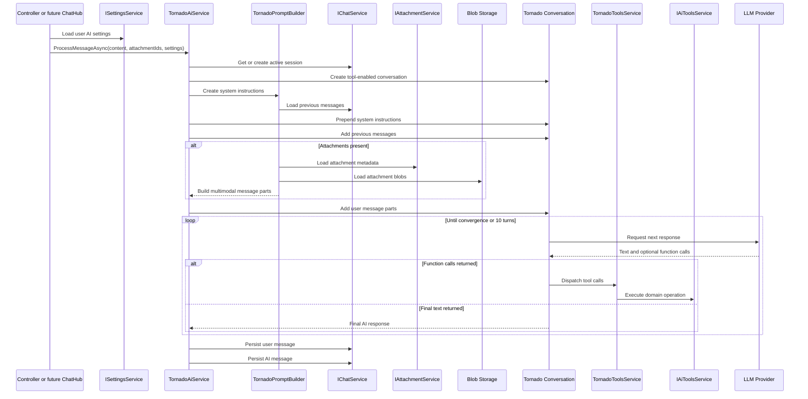
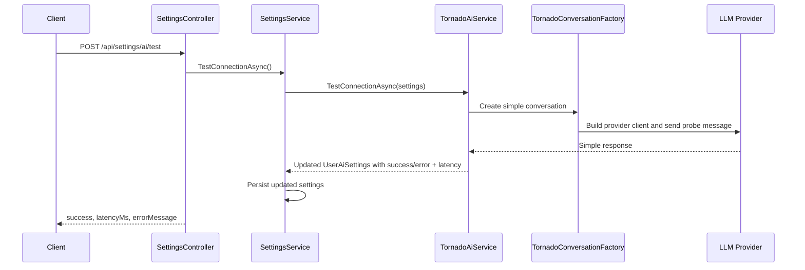
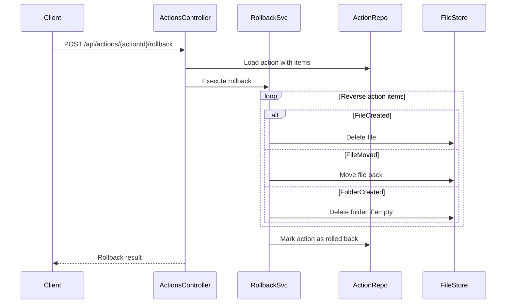
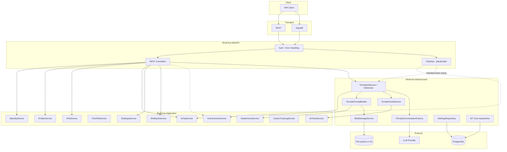

# API Architecture Overview

## Purpose

This document explains the API architecture as it exists on the current `66-aiservice` branch.

- [`docs/openapi.yaml`](C:\Users\Fey\Desktop\coding\pp\ppshu\docs\openapi.yaml) remains the source of truth for REST contracts.
- [`docs/asyncapi.yaml`](C:\Users\Fey\Desktop\coding\pp\ppshu\docs\asyncapi.yaml) remains the source of truth for the intended SignalR contract.
- This document focuses on runtime behavior, internal boundaries, and branch-specific mismatches between the public contract and the current implementation.

## System Overview

ShuKnow still exposes two transport styles:

- REST for authentication, folder and file operations, chat history reads, attachment upload, settings management, and rollback endpoints.
- SignalR for the intended long-running chat workflow.

What changed on this branch is the internal AI runtime:

- The old orchestration pipeline was removed.
- A new Tornado-based conversation layer was introduced in Infrastructure.
- The public SignalR contract was not updated yet, and `ChatHub` is still a stub.

Authentication remains shared across both transports:

- HTTP endpoints accept JWT from `Authorization: Bearer` or the HTTP-only cookie flow.
- SignalR connections still use the `access_token` query parameter and the same JWT validation pipeline.

## Current Runtime Flows

### 1. Tornado AI Message Processing Flow

This is the current internal AI flow implemented in code. It is not yet wired to the public `ChatHub`.

Key properties of this branch flow:

- It is conversation-based, not parser-based.
- It relies on model tool calls instead of prompt parsing into an intermediate classification object.
- It persists only the final user message and final AI message.
- It does not currently emit `OnMessageChunk`, `OnClassificationResult`, `OnFileCreated`, `OnFolderCreated`, or other hub notifications.

### 2. AI Connection Test Flow

The settings test path also changed on this branch.

Key properties:

- Latency is measured from a real conversation round-trip.
- Failed tests now persist `LastTestSuccess = false`, `LastTestLatencyMs = null`, and the error message.
- The optional base URL is validated before the provider client is constructed.

### 3. Rollback Flow

Rollback still follows the older action-log architecture:

Current gap:

- The new Tornado AI path does not currently create action records, so the rollback subsystem is intact but disconnected from new AI-triggered operations.

## Component Map

## Key Architectural Decisions

### The AI Runtime Switched from Prompt Parsing to Tool Calling

The branch removed the orchestration pipeline that depended on prompt preparation and classification parsing. The new path uses `LlmTornado` conversations and model tool calls instead.

Implications:

- The model can iterate through multiple tool turns before producing a final answer.
- Tool execution is now an explicit port (`IAiToolsService`) instead of an implicit parser output.
- The model response no longer has to conform to a parser-friendly text format.

### Attachments Remain a REST Concern but Become Multimodal Chat Parts

Attachments are still uploaded via REST and staged in the backend. The new AI path converts them into Tornado `ChatMessagePart` values:

- Images become image parts.
- Audio becomes audio parts when the MIME type is supported.
- Other content becomes document parts.

### Connection Testing Uses the Same Conversation Stack as Real Requests

`TestConnectionAsync()` now goes through the same provider-selection, decryption, and conversation setup logic as normal message processing. This reduces false positives from superficial connectivity checks.

### The Public SignalR Contract Is Ahead of the Current Implementation

`docs/asyncapi.yaml` still describes the intended chat workflow, including progress and streaming events. On this branch, [`ChatHub`](C:\Users\Fey\Desktop\coding\pp\ppshu\backend\ShuKnow.WebAPI\Hubs\ChatHub.cs) still emits placeholder events and does not call the new `IAiService`.

## Current Branch Gaps

| Area | Current state on `66-aiservice` | Impact |
|---|---|---|
| ChatHub wiring | `SendMessage()` and `CancelProcessing()` are TODO stubs | SignalR runtime does not yet use the new AI flow |
| AI tool execution port | `IAiToolsService` has no implementation or DI registration | `TornadoAiService` cannot be resolved successfully in production DI yet |
| Path-based content operations | `IFileService.GetByPathAsync()`, `IFolderService.GetByPathAsync()`, and `IFolderService.CreateByPathAsync()` are declared but unimplemented | Tool-driven folder/file operations are incomplete |
| Text-file abstraction | `ITextFileService` exists only as an interface | Text editing tools are not backed by a concrete service |
| Action tracking integration | New AI flow does not record actions | Rollback remains available for old action-based flows only |
| Streaming notifications | `IChatNotificationService` is no longer part of the active AI path | AsyncAPI is currently ahead of actual runtime behavior |

## Boundaries and Ownership

- OpenAPI and AsyncAPI still define the intended public contracts.
- The current branch implementation moved significant AI behavior into Infrastructure.
- For branch-accurate runtime behavior, prefer the code and this document over older orchestration-based descriptions.
