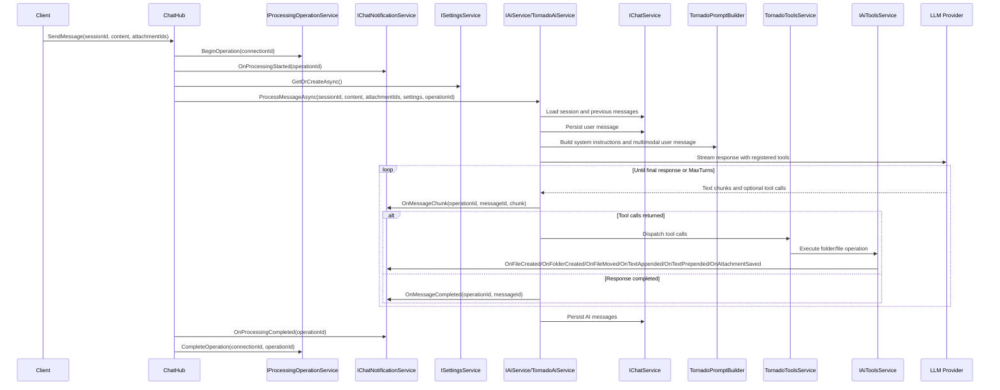

# API Architecture Overview

## Purpose

This document describes the current backend API state in `backend/ShuKnow.sln`.

- `docs/openapi.yaml` describes the REST contract.
- `docs/asyncapi.yaml` describes the SignalR `ChatHub` contract.
- Implemented behavior is verified against `backend/ShuKnow.*`; Actions/Rollback is currently declared but not implemented.

## Transport Layers

ShuKnow exposes two public transport layers:

- REST for authentication, folders, files, chat sessions, staged attachments, AI settings, health checks, and metrics.
- SignalR at `/hubs/chat` for long-running AI processing: sending messages, streaming model output, tool-driven file/folder events, and cancelling the current operation.

Shared authentication:

- REST accepts JWTs through `Authorization: Bearer` and the HTTP-only `token` cookie.
- SignalR uses the same JWT bearer pipeline. The current middleware reads the cookie; there is no explicit query-string `access_token` mapping in code.

## Runtime Flow: ChatHub AI Processing

```mermaid
sequenceDiagram
    participant Client
    participant Hub as ChatHub
    participant Ops as IProcessingOperationService
    participant Notify as IChatNotificationService
    participant Settings as ISettingsService
    participant AI as IAiService/TornadoAiService
    participant Chat as IChatService
    participant Prompt as TornadoPromptBuilder
    participant Tools as TornadoToolsService
    participant ToolPort as IAiToolsService
    participant LLM as LLM Provider

    Client->>Hub: SendMessage(sessionId, content, attachmentIds)
    Hub->>Ops: BeginOperation(connectionId)
    Hub->>Notify: OnProcessingStarted(operationId)
    Hub->>Settings: GetOrCreateAsync()
    Hub->>AI: ProcessMessageAsync(sessionId, content, attachmentIds, settings, operationId)
    AI->>Chat: Load session and previous messages
    AI->>Chat: Persist user message
    AI->>Prompt: Build system instructions and multimodal user message
    AI->>LLM: Stream response with registered tools

    loop Until final response or MaxTurns
        LLM-->>AI: Text chunks and optional tool calls
        AI->>Notify: OnMessageChunk(operationId, messageId, chunk)
        alt Tool calls returned
            AI->>Tools: Dispatch tool calls
            Tools->>ToolPort: Execute folder/file operation
            ToolPort->>Notify: OnFileCreated/OnFolderCreated/OnFileMoved/OnTextAppended/OnTextPrepended/OnAttachmentSaved
        else Response completed
            AI->>Notify: OnMessageCompleted(operationId, messageId)
        end
    end

    AI->>Chat: Persist AI messages
    Hub->>Notify: OnProcessingCompleted(operationId)
    Hub->>Ops: CompleteOperation(connectionId, operationId)
```

Important behavior:

- `SendMessageCommand.SessionId` is required; chat sessions are created through REST first.
- `Content` is required unless attachments are supplied.
- AI output is streamed as chunks. Each completed AI turn emits `OnMessageCompleted`.
- Tool calls mutate folders/files through application services and emit domain events to the current SignalR connection.
- Attachment IDs are staged through `POST /api/chat/attachments` and are marked consumed after successful AI processing.
- `CancelProcessing` cancels the active operation for the current connection. There is no separate cancellation event; cancellation stops processing and completes operation cleanup.

## REST API Status

| Area | Status |
|---|---|
| Auth | Register, login, and `me` are implemented. Login/register return the JWT and set the auth cookie. |
| Folders | Tree, list, create, get, update, delete subtree, move, reorder, children, and file upload/list under a folder are implemented. |
| Files | Metadata read/update/delete, content download/replace/text update, move, and reorder are implemented. |
| Chat | Session create/get/delete, cursor-paginated messages, and multipart attachment staging are implemented. |
| Settings | Get/update AI settings and provider connection test are implemented. |
| Health/Metrics | `/api/health` and `/metrics` are mapped outside controllers. |
| Actions | Endpoints exist but return `501 Not Implemented`. Application/repository services behind actions still throw `NotImplementedException`. |

## Runtime Gaps

- Actions/Rollback is not implemented despite existing DTOs and routes.
- `IActionQueryService`, `IActionTrackingService`, `IRollbackService`, and `ActionRepository` still throw `NotImplementedException`.
- AI tool operations emit live events and metrics, but they do not create action records, so rollback is not connected to the current AI workflow.
- Keep `docs/asyncapi.yaml` aligned with hub events rather than older classification-parser terminology.
