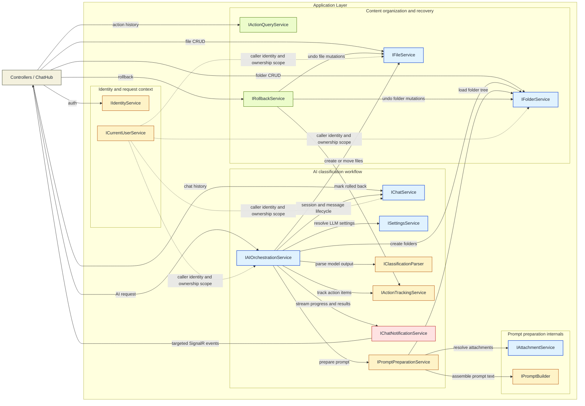
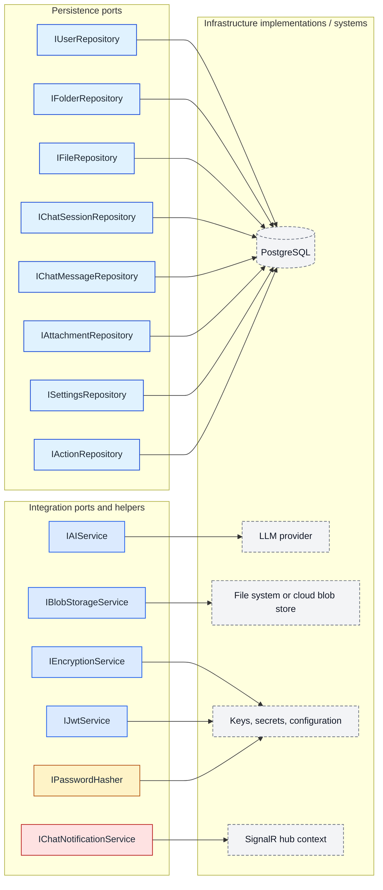

# ShuKnow MVP — Service Architecture

---

## 1. Application Layer: Service Interfaces

These are the primary units of business logic. Each service is defined as an interface in `ShuKnow.Application`, injected into controllers or the hub, and implemented within the same layer (with infrastructure dependencies injected through ports).

---

### 1.1 ICurrentUserService (Implemented)

**Purpose.** Provides the identity of the caller to every other service without coupling them to HTTP or SignalR transport details. Every service that enforces ownership (nearly all of them) depends on this instead of reading `HttpContext` directly.

**Methods**

| Method | Description |
|---|---|
| `UserId: Guid` | Returns the authenticated user's ID extracted from the JWT `sub` / `nameidentifier` claim. |
| `IsAuthenticated: bool` | Indicates whether the current request context carries a valid identity. |

---

### 1.2 IFolderService

**Purpose.** Manages the complete lifecycle of the virtual folder hierarchy. Enforces all folder-level invariants: name uniqueness within a parent scope, cycle prevention on move, protection of the system `Inbox` folder, and auto-creation of `Inbox` on first use.

**Methods**

| Method | Description |
|---|---|
| `GetTreeAsync()` → `List<FolderTreeNode>` | Returns the full recursive tree for the current user, including file counts per node. Used for sidebar rendering. |
| `GetFolderTreeForPromptAsync()` → `List<FolderSummary>` | Returns lightweight projections (id, name, description, parent) suitable for AI prompt construction. Avoids loading full entities. Used by `IPromptPreparationService`. |
| `ListAsync(parentId?)` → `List<Folder>` | Flat list of folders at a given level (root when `parentId` is null). Lightweight alternative to the full tree. |
| `GetByIdAsync(folderId)` → `Folder` | Single folder with metadata and a `path` breadcrumb array from root to this node. |
| `GetChildrenAsync(folderId)` → `List<Folder>` | Direct child folders. Supports lazy-loading of expanded tree nodes. |
| `CreateAsync(request)` → `Folder` | Creates a folder. Validates name uniqueness among siblings. Triggers `EnsureInboxExistsAsync` if this is the user's first folder. |
| `UpdateAsync(folderId, request)` → `Folder` | Renames and/or updates description. Validates name uniqueness among siblings. |
| `DeleteAsync(folderId, recursive)` | Deletes a folder. If `recursive=false` and the folder has children or files, rejects with 409. The Inbox folder is never deletable. |
| `MoveAsync(folderId, newParentId?)` → `Folder` | Moves a folder to a new parent (or root). Validates no cycle is created (a folder cannot become its own descendant) and name uniqueness in the target scope. |
| `ReorderAsync(folderId, position)` | Sets the `SortOrder` of the folder to the given 0-based position and re-indexes all siblings. |
| `EnsureInboxExistsAsync()` → `Folder` | Internal: creates the `Inbox` folder if the user has no folders yet. Called by `CreateAsync` and by the AI orchestration flow. |

**Dependencies**

| Dependency | Why |
|---|---|
| `IFolderRepository` | All persistence operations on folder entities. |
| `IFileRepository` | Needed for recursive delete (cascade files) and for file-count enrichment. |
| `ICurrentUserService` | Ownership scoping — every query and mutation is filtered to the current user. |

---

### 1.3 IFileService

**Purpose.** Manages file metadata CRUD, binary upload/download/replace, and file movement between folders. Validates name uniqueness within a folder, enforces size limits, and delegates binary storage to a blob abstraction.

**Methods**

| Method | Description |
|---|---|
| `GetByIdAsync(fileId)` → `File` | File metadata including owning folder name. |
| `ListByFolderAsync(folderId, page, pageSize)` → `(List<File> Files, int TotalCount)` | Offset-paginated file listing within a folder. |
| `UploadAsync(folderId, stream, fileName, contentType, description?)` → `File` | Stores the binary via `IBlobStorageService`, creates a `FileEntity` record. Validates name uniqueness and size limit. |
| `UpdateMetadataAsync(fileId, request)` → `File` | Updates name/description. Validates name uniqueness within the file's current folder. |
| `DeleteAsync(fileId)` | Deletes the metadata record and the binary blob. |
| `GetContentAsync(fileId, rangeStart?, rangeEnd?)` → `(Stream Content, string ContentType, long SizeBytes)` | Streams the binary content. Returns content type and supports HTTP Range for partial downloads. |
| `ReplaceContentAsync(fileId, stream, contentType)` → `File` | Replaces the binary blob in place. Metadata (name, description) unchanged; `sizeBytes` and `contentType` updated. |
| `MoveAsync(fileId, targetFolderId)` → `File` | Changes the file's `FolderId`. Validates name uniqueness in the target folder. |
| `DeleteByFolderAsync(folderId)` | Deletes all files in a folder. Used by recursive folder deletion. |

**Dependencies**

| Dependency | Why |
|---|---|
| `IFileRepository` | Metadata persistence. |
| `IFolderRepository` | Validate target folder existence on upload and move. |
| `IBlobStorageService` | Store and retrieve binary file content. |
| `ICurrentUserService` | Ownership scoping. |

---

### 1.4 IChatService

**Purpose.** Manages the single-active-session model, persists messages (user, AI, and cancellation), and serves message history with cursor pagination.

**Methods**

| Method | Description |
|---|---|
| `GetOrCreateActiveSessionAsync()` → `ChatSession` | Returns the user's active session. Creates one if none exists. Idempotent. |
| `DeleteSessionAsync()` | Closes/deletes the active session and its messages. The next `GetOrCreate` call starts fresh. |
| `GetMessagesAsync(cursor?, limit)` → `(List<ChatMessage> Messages, string? NextCursor)` | Cursor-paginated message history, newest first. The cursor is opaque (encodes `CreatedAt` + `Id` for keyset pagination). |
| `PersistUserMessageAsync(sessionId, content, attachments?)` → `ChatMessage` | Saves the user's message and links any staged attachments. Returns the persisted entity with a server-assigned ID and timestamp. |
| `PersistAiMessageAsync(sessionId, content)` → `ChatMessage` | Saves the final AI response text. Called by the orchestration service after streaming completes. |
| `PersistCancellationRecordAsync(sessionId)` → `ChatMessage` | Saves a system message indicating the AI response was cancelled. Preserves timeline integrity. |

**Dependencies**

| Dependency | Why |
|---|---|
| `IChatSessionRepository` | Session CRUD. |
| `IChatMessageRepository` | Message persistence and cursor-paginated queries. |
| `ICurrentUserService` | Ownership scoping. |

---

### 1.5 IAttachmentService

**Purpose.** Stages file uploads that will be referenced in a future `SendMessage` hub invocation. Attachments are a temporary holding area — they exist because SignalR's default 32 KB message limit makes it unsuitable for binary payloads, so files must arrive via REST before the chat message references them by ID.

**Methods**

| Method | Description |
|---|---|
| `UploadAsync(files)` → `List<ChatAttachment>` | Accepts one or more files, stores binaries via `IBlobStorageService`, creates `ChatAttachment` records with metadata. Returns IDs for later reference. |
| `GetByIdsAsync(attachmentIds)` → `List<ChatAttachment>` | Retrieves attachment entities with their storage keys. Used by the orchestration service to build the AI prompt. Validates all IDs belong to the current user and are not yet consumed. |
| `MarkConsumedAsync(attachmentIds)` | Marks attachments as consumed so they are no longer eligible for reuse or purging. Called after successful association with a chat message. |
| `PurgeExpiredAsync()` | Deletes attachments older than 1 hour that were never consumed. Intended to be called by a background job or hosted service. |

**Dependencies**

| Dependency | Why |
|---|---|
| `IAttachmentRepository` | Attachment metadata persistence. |
| `IBlobStorageService` | Binary content storage. |
| `ICurrentUserService` | Ownership validation. |

---

### 1.6 ISettingsService

**Purpose.** Manages per-user AI/LLM provider configuration (base URL and API key). Provides a connectivity test so users get fast feedback before their first real AI request.

**Methods**

| Method | Description |
|---|---|
| `GetAsync()` → `AiSettings?` | Returns current config. |
| `UpdateAsync(request)` → `AiSettings` | Saves/overwrites base URL and API key. Encrypts the API key before persistence. |
| `TestConnectionAsync()` → `AiConnectionTest` | Decrypts the stored API key, sends a minimal probe request to the configured LLM endpoint, and returns `success`, `latencyMs`, and `errorMessage`. Returns 422 if settings are not yet configured. |

**Dependencies**

| Dependency | Why |
|---|---|
| `ISettingsRepository` | Persistence for `UserSettings`. |
| `IEncryptionService` | Encrypt API key on write, decrypt on read (for test and for AI requests). |
| `IAIService` | Send the probe request during `TestConnectionAsync`. |
| `ICurrentUserService` | Ownership scoping. |

---

### 1.7 IAIOrchestrationService

**Purpose.** This is the central orchestrator for the AI classification pipeline — the most complex service in the system. It is invoked exclusively from `ChatHub`.

**Methods**

| Method | Description |
|---|---|
| `ProcessMessageAsync(content, context?, attachmentIds?, callerConnectionId, cancellationToken)` | Executes the full classification pipeline (described below). Void return — all output is emitted as events through `IChatNotificationService`. The `CancellationToken` is monitored at every async boundary so that `CancelProcessing` can interrupt the flow cleanly. |

**Internal pipeline (single method, multiple stages):**

1. **Session resolution.** Load or create the active chat session via `IChatService`.
2. **User message persistence.** Save the user's message and link attachments via `IChatService`.
3. **Emit `OnProcessingStarted`.** Generate an `operationId` (GUID) that correlates all subsequent events in this run.
4. **Settings retrieval.** Load and decrypt the user's AI config via `ISettingsService`. Fail with `LLM_CONNECTION_FAILED` if not configured.
5. **Prompt construction.** Delegate to `IPromptPreparationService.PrepareAsync()`, which internally:
   - Loads the user's folder tree (via `IFolderService.GetFolderTreeForPromptAsync()`) to give the AI awareness of existing categories.
   - Resolves attachment content (via `IAttachmentService`) to provide the material being classified.
   - Assembles the final prompt text (via `IPromptBuilder`).
6. **LLM streaming call.** Call `IAIService.StreamCompletionAsync()` with the prompt and the user's decrypted credentials. For each token chunk received, emit `OnMessageChunk`. Accumulate the full response text.
7. **Classification parsing.** Pass the full response to `IClassificationParser` to extract structured decisions (file name → target folder, is-new-folder flag). Emit `OnClassificationResult`.
8. **Action record creation.** Create an action record via `IActionTrackingService.BeginActionAsync()` to begin recording mutations.
9. **Decision execution loop.** For each classification decision:
   - If the target folder doesn't exist, create it via `IFolderService`, emit `OnFolderCreated`, record via `IActionTrackingService.RecordFolderCreatedAsync()`.
   - Create the file in the target folder (from attachment content) via `IFileService`, emit `OnFileCreated`, record via `IActionTrackingService.RecordFileCreatedAsync()`.
   - Or if the decision is a move of an existing file, move it via `IFileService`, emit `OnFileMoved`, record via `IActionTrackingService.RecordFileMovedAsync()` (recording the source folder for rollback).
10. **AI message persistence.** Save the AI's full response text via `IChatService`. Emit `OnMessageCompleted`.
11. **Finalize.** Emit `OnProcessingCompleted` with the `actionId`, summary, and counts.

**Error handling:** Any exception after `OnProcessingStarted` emits `OnProcessingFailed` with an appropriate error code (`LLM_CONNECTION_FAILED`, `LLM_RATE_LIMITED`, `LLM_INVALID_RESPONSE`, `CLASSIFICATION_PARSE_ERROR`, `FILE_OPERATION_FAILED`, `INTERNAL_ERROR`). Partial mutations that already occurred are left in place (the user can rollback via the action if one was created).

**Cancellation handling:** When the token is cancelled, the service aborts the LLM HTTP request, discards any partial result state, persists a cancellation record in the chat session, and emits `OnProcessingCancelled`.

**Dependencies (8 total)**

| Dependency | Why |
|---|---|
| `IChatService` | Session resolution, message persistence. |
| `IPromptPreparationService` | Consolidates prompt construction: folder tree loading, attachment resolution, and prompt assembly. |
| `ISettingsService` | Load decrypted LLM credentials. |
| `IFolderService` | Create folders during decision execution. |
| `IFileService` | Create/move files during decision execution. |
| `IAIService` | Stream LLM completion. |
| `IActionTrackingService` | Begin action, record action items (folder created, file created, file moved). |
| `IClassificationParser` | Parse LLM text into structured decisions. |
| `IChatNotificationService` | Emit all real-time events to the caller. |
| `ICurrentUserService` | Ownership context. |

---

### 1.8 IActionQueryService

**Purpose.** Provides read-only access to AI action history. Separated from `IRollbackService` because reading action history is a query concern with its own pagination, while rollback is a command with complex side effects.

**Methods**

| Method | Description |
|---|---|
| `ListAsync(page, pageSize)` → `(List<Action> Actions, int TotalCount)` | Offset-paginated list of actions, newest first. Each item includes summary, item count, and `canRollback` flag. |
| `GetByIdAsync(actionId)` → `(Action Action, List<ActionItem> Items)` | Full detail of a single action including all `ActionItem` children (files created, files moved, folders created). |

**Dependencies**

| Dependency | Why |
|---|---|
| `IActionRepository` | Query action and action-item data. |
| `ICurrentUserService` | Ownership scoping. |

---

### 1.9 IRollbackService

**Purpose.** Reverses a recorded AI action by iterating its action items in reverse order and undoing each mutation.

**Methods**

| Method | Description |
|---|---|
| `RollbackAsync(actionId)` → `RollbackResult` | Loads the action, validates it is eligible for rollback (not already rolled back, files not modified since), reverses each item in reverse order, marks the action as rolled back, and returns results. |
| `RollbackLastAsync()` → `RollbackResult` | Finds the most recent action that is eligible for rollback and delegates to `RollbackAsync`. Returns 404 if none found. |

**Dependencies**

| Dependency | Why |
|---|---|
| `IActionRepository` | Load action with items for reversal. |
| `IActionTrackingService` | Mark the action as rolled back after successful reversal. |
| `IFileService` | Delete and move files. |
| `IFolderService` | Delete folders. |
| `ICurrentUserService` | Ownership validation. |

---

### 1.10 IPromptPreparationService

**Purpose.** Consolidates the entire prompt preparation pipeline into a single service. Internally depends on `IFolderService` (for folder tree via `GetFolderTreeForPromptAsync`), `IAttachmentService` (for staged file resolution), and `IPromptBuilder` (for text assembly). This reduces three dependencies from the orchestrator to one.

**Methods**

| Method | Description |
|---|---|
| `PrepareAsync(userMessage, attachments?, contextSession?)` → `PreparedPrompt` | Loads the folder tree, resolves attachments, assembles the full LLM prompt, and returns a `PreparedPrompt` containing the prompt text and a list of consumed attachment IDs. |

**Dependencies**

| Dependency | Why |
|---|---|
| `IFolderService` | Load folder tree for prompt context via `GetFolderTreeForPromptAsync()`. |
| `IAttachmentService` | Resolve staged attachments and their content. |
| `IPromptBuilder` | Assemble the final prompt text from components. |

---

### 1.11 IPromptBuilder

**Purpose.** Constructs the LLM prompt from contextual inputs. Used internally by `IPromptPreparationService` — not consumed directly by the orchestrator.

**Methods**

| Method | Description |
|---|---|
| `BuildClassificationPrompt(folderTree, userMessage, attachmentDescriptions, context?)` → `string` | Assembles a structured prompt that includes: (1) the user's existing folder hierarchy with descriptions, (2) the user's message, (3) metadata/content summaries for each attachment, (4) optional context hint, and (5) instructions for the AI to produce a parseable classification response. |

---

### 1.12 IActionTrackingService

**Purpose.** Manages the lifecycle of action tracking during AI orchestration. Encapsulates `IActionRepository` write operations so that the orchestrator and rollback service do not manage entity state transitions directly.

**Methods**

| Method | Description |
|---|---|
| `BeginActionAsync(sessionId, summary)` → `Guid` | Creates a new action record for the given chat session. Returns the action ID. |
| `RecordFolderCreatedAsync(actionId, folderId, folderName, parentFolderId?)` | Records that a folder was created as part of the action. |
| `RecordFileCreatedAsync(actionId, fileId, folderId, fileName)` | Records that a file was created as part of the action. |
| `RecordFileMovedAsync(actionId, fileId, sourceFolderId, targetFolderId)` | Records that a file was moved as part of the action. |
| `MarkRolledBackAsync(actionId)` | Marks an existing action as rolled back. Used by `IRollbackService` after successful reversal. |

**Dependencies**

| Dependency | Why |
|---|---|
| `IActionRepository` | Persistence of action and action-item entities. |
| `ICurrentUserService` | Ownership context for action creation. |

---

### 1.13 IClassificationParser

**Purpose.** Parses the LLM's textual response into a structured list of classification decisions. The LLM is instructed (via the prompt) to use specific tools; this service extracts and validates tool calls.

**Methods**

| Method | Description |
|---|---|
| `Parse(llmResponseText)` → `List<ClassificationDecision>` | Extracts classification decisions from the response |

---

### 1.14 IChatNotificationService

**Purpose.** Abstracts the transport mechanism for sending real-time events from the Application layer to the client. The interface is defined in Application; the implementation lives in WebAPI and uses `IHubContext<ChatHub>`. This boundary prevents SignalR types from leaking into the Application layer.

**Methods**

| Method | Description |
|---|---|
| `SendProcessingStartedAsync(connectionId, event)` | Notifies that AI processing has begun. |
| `SendMessageChunkAsync(connectionId, event)` | Streams a token chunk to the client. |
| `SendMessageCompletedAsync(connectionId, message)` | Sends the final persisted AI message. |
| `SendClassificationResultAsync(connectionId, event)` | Sends the classification plan. |
| `SendFileCreatedAsync(connectionId, file)` | Notifies that a file was created. |
| `SendFileMovedAsync(connectionId, event)` | Notifies that a file was moved. |
| `SendFolderCreatedAsync(connectionId, folder)` | Notifies that a folder was created. |
| `SendProcessingCompletedAsync(connectionId, event)` | Notifies that all operations are done. |
| `SendProcessingFailedAsync(connectionId, event)` | Notifies of a failure. |
| `SendProcessingCancelledAsync(connectionId, event)` | Confirms cancellation. |

All methods accept a `connectionId` (string) to target the specific SignalR connection.

**Dependencies (implementation)**

| Dependency | Why |
|---|---|
| `IHubContext<ChatHub>` | Send messages to specific SignalR connections. |

---

## 2. Application Layer: Port Interfaces (Infrastructure Contracts)

These interfaces are defined in `ShuKnow.Application` and implemented in `ShuKnow.Infrastructure`. They define what the application needs from persistence and external systems without specifying how.

---

### 2.1 IUserRepository

| Method | Description |
|---|---|
| `GetByIdAsync(userId)` → `User?` | Lookup by primary key. |
| `AddAsync(user)` | Persist a new user. |

---

### 2.2 IFolderRepository

| Method | Description |
|---|---|
| `GetByIdAsync(folderId, userId)` → `Folder?` | Single folder, ownership-scoped. |
| `GetTreeAsync(userId)` → `List<Folder>` | All folders for a user, loaded flat (the service builds the tree). |
| `GetChildrenAsync(parentId, userId)` → `List<Folder>` | Direct children of a folder. |
| `GetRootFoldersAsync(userId)` → `List<Folder>` | Root-level folders. |
| `GetSiblingsAsync(parentId?, userId)` → `List<Folder>` | All siblings at the same level (for reorder and uniqueness checks). |
| `GetAncestorIdsAsync(folderId)` → `List<Guid>` | Ancestor chain (for cycle detection on move). |
| `ExistsByNameInParentAsync(name, parentId?, userId, excludeId?)` → `bool` | Name uniqueness within a parent scope. |
| `AddAsync(folder)` | Persist a new folder. |
| `UpdateAsync(folder)` | Update an existing folder. |
| `DeleteAsync(folderId)` | Delete a single folder. |
| `DeleteSubtreeAsync(folderId)` | Delete a folder and all descendants recursively. |
| `CountByUserAsync(userId)` → `int` | Used to determine if Inbox auto-creation is needed. |

---

### 2.3 IFileRepository

| Method | Description |
|---|---|
| `GetByIdAsync(fileId, userId)` → `File?` | Single file, ownership-scoped. |
| `ListByFolderAsync(folderId, userId, page, pageSize)` → `(List<File>, int totalCount)` | Paginated file listing within a folder. |
| `ExistsByNameInFolderAsync(name, folderId, userId, excludeId?)` → `bool` | Name uniqueness within a folder. |
| `CountByFolderAsync(folderId)` → `int` | File count for folder tree enrichment. |
| `AddAsync(file)` | Persist a new file entity. |
| `UpdateAsync(file)` | Update metadata. |
| `DeleteAsync(fileId)` | Delete a file entity. |
| `DeleteByFolderAsync(folderId)` | Delete all files in a folder (for recursive folder delete). |
| `GetByFolderAsync(folderId)` → `List<File>` | All files in a folder (for recursive folder delete — need storage keys to delete blobs). |

---

### 2.4 IChatSessionRepository

| Method | Description |
|---|---|
| `GetActiveAsync(userId)` → `ChatSession?` | Returns the active session for the user, or null. |
| `AddAsync(session)` | Persist a new session. |
| `DeleteAsync(sessionId)` | Delete a session. |

---

### 2.5 IChatMessageRepository

| Method | Description |
|---|---|
| `AddAsync(message)` | Persist a message. |
| `GetPageAsync(sessionId, cursor?, limit)` → `(List<ChatMessage>, string? nextCursor)` | Cursor-paginated query, newest first. Cursor encodes `(CreatedAt, Id)`. |
| `DeleteBySessionAsync(sessionId)` | Delete all messages for a session. |

---

### 2.6 IActionRepository

| Method | Description |
|---|---|
| `GetByIdWithItemsAsync(actionId, userId)` → `Action?` | Load action with all child items. |
| `ListAsync(userId, page, pageSize)` → `(List<Action>, int totalCount)` | Paginated action list, newest first. |
| `GetLastEligibleAsync(userId)` → `Action?` | Most recent action where `IsRolledBack == false`. |
| `AddAsync(action)` | Persist a new action (with items via EF navigation). |
| `AddItemAsync(actionId, item)` | Append an action item during orchestration. |
| `MarkRolledBackAsync(actionId)` | Set the `IsRolledBack` flag. |

---

### 2.7 ISettingsRepository

| Method | Description |
|---|---|
| `GetByUserAsync(userId)` → `UserSettings?` | Load settings for a user. |
| `UpsertAsync(settings)` | Insert or update settings. |

---

### 2.8 IAttachmentRepository

**Purpose.** Attachment staging entity persistence.

| Method | Description |
|---|---|
| `GetByIdsAsync(ids, userId)` → `List<Attachment>` | Retrieve multiple attachments by ID, ownership-scoped. |
| `AddRangeAsync(attachments)` | Persist multiple attachments. |
| `MarkConsumedAsync(ids)` | Update status to consumed. |
| `GetExpiredUnconsumedAsync(olderThan)` → `List<Attachment>` | For the purge job. |
| `DeleteRangeAsync(ids)` | Delete attachment records. |

---

### 2.9 IAIService

**Purpose.** Low-level communication with the LLM provider. This is an infrastructure adapter that knows how to make HTTP requests to OpenAI-compatible APIs.

| Method | Description |
|---|---|
| `StreamCompletionAsync(prompt, baseUrl, apiKey, cancellationToken)` → `IAsyncEnumerable<string>` | Sends a completion request and yields token chunks as they arrive from the SSE stream. |
| `TestConnectionAsync(baseUrl, apiKey)` → `(bool success, int? latencyMs, string? error)` | Sends a minimal request (e.g., list models) to verify connectivity and credentials. |

**Dependencies**

| Dependency | Why |
|---|---|
| `IHttpClientFactory` | Create HTTP clients for LLM API calls. |

---

### 2.10 IBlobStorageService

**Purpose.** Binary file storage abstraction. Decouples the application from the physical storage mechanism (local disk for MVP, cloud blob storage later).

| Method | Description |
|---|---|
| `SaveAsync(stream, contentType)` → `string storageKey` | Stores the binary and returns an opaque key. |
| `GetAsync(storageKey)` → `Stream` | Retrieves the full binary content. |
| `GetRangeAsync(storageKey, offset, length)` → `Stream` | Retrieves a byte range (for HTTP Range support). |
| `DeleteAsync(storageKey)` | Removes the binary content. |
| `GetSizeAsync(storageKey)` → `long` | Returns the stored content size (for Range/Content-Length). |

---

### 2.11 IEncryptionService

**Purpose.** Encrypts and decrypts sensitive data at rest, specifically LLM API keys.

| Method | Description |
|---|---|
| `Encrypt(plainText)` → `string` | Returns the encrypted ciphertext (e.g., AES-256-GCM, base64-encoded). |
| `Decrypt(cipherText)` → `string` | Returns the original plaintext. |

**Dependencies.** Encryption key (from `IOptions<EncryptionSettings>` or a key vault).

---

## 3. Dependency Flow

The architecture is easier to understand as two complementary views: how application services coordinate at runtime, and where the infrastructure ports terminate.

### 3.1 Runtime service interaction

### 3.2 Port and infrastructure mapping

