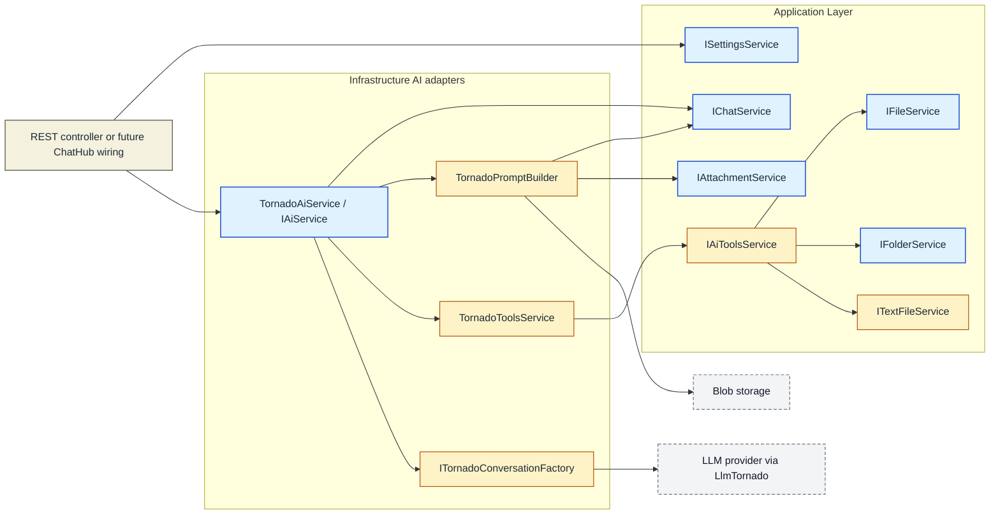
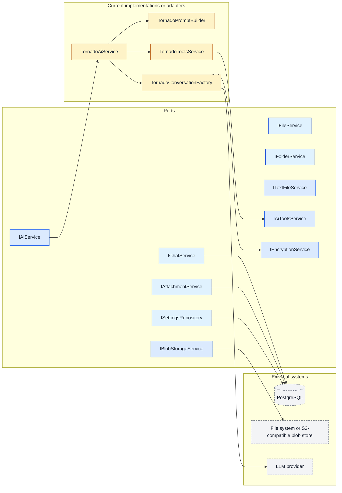

# ShuKnow MVP — Service Architecture

## Scope

This document reflects the current `66-aiservice` branch relative to `main`.

- `docs/openapi.yaml` and `docs/asyncapi.yaml` still describe the external REST and SignalR contracts.
- This document describes the current service graph and the implementation gaps that now exist on this branch.
- For implemented behavior, the code under `backend/ShuKnow.*` is the source of truth.

## 1. Application-Layer Service Interfaces

The table below focuses on the interfaces that changed or whose runtime role changed on this branch.

| Interface | Status on this branch | Notes |
|---|---|---|
| `ICurrentUserService` | Implemented | Still the ownership boundary for application services. |
| `IIdentityService` | Implemented | No branch-specific changes. |
| `ICurrentConnectionService` | Registered in WebAPI | Still available for SignalR-targeted notifications, but the new AI path does not currently consume it. |
| `IFolderService` | Partially implemented | Added path-based methods `GetByPathAsync()` and `CreateByPathAsync()`. The current `FolderService` still throws `NotImplementedException` for several methods, including the new path-based ones. |
| `IFileService` | Partially implemented | Added `GetByPathAsync()`. The current `FileService` still throws `NotImplementedException` for that method. |
| `ITextFileService` | Added, not wired | New application port for text-file creation and text prepend/append operations. No implementation or DI registration exists yet. |
| `IAttachmentService` | Implemented | Now used directly by `TornadoPromptBuilder` to turn staged attachments into multimodal message parts. |
| `IChatService` | Changed and partially implemented | Added `GetMessagesAsync(ct)` for full active-session history and collapsed message persistence to `PersistMessageAsync()`. |
| `ISettingsService` | Implemented | `TestConnectionAsync()` now persists the `UserAiSettings` instance returned by `IAiService.TestConnectionAsync()`. |
| `IAiService` | Replaced contract, implemented in Infrastructure | The old streaming-only interface was removed. The new contract owns whole-message processing and connection testing. |
| `IAiToolsService` | Added, not wired | New port for AI-triggered file-system-like actions (`create_folder`, `create_text_file`, `save_attachment`, `append_text`, `prepend_text`, `move_file`). No implementation or DI registration exists yet. |
| `IActionQueryService` | Implemented | No branch-specific changes. |
| `IActionTrackingService` | Implemented | No branch-specific changes, but the new AI path does not currently use it. |
| `IRollbackService` | Implemented | No branch-specific changes. |
| `IChatNotificationService` | Implemented in WebAPI | Still available, but the current AI path does not emit notification events through it. |

## 2. Key Service Changes

### 2.1 `IChatService`

The chat service now has an explicit-session read/write API:

| Method | Current role |
|---|---|
| `CreateSessionAsync()` | Create a new chat session for the current user. |
| `GetSessionAsync(sessionId)` | Return a specific session for the current user. |
| `DeleteSessionAsync(sessionId)` | Delete a specific session and its messages. |
| `GetMessagesAsync(sessionId, cursor, limit)` | Cursor-paginated read for the public chat-history API. |
| `GetMessagesAsync(sessionId, ct)` | Return the in-memory message collection for a specific session. Used by `TornadoPromptBuilder` to hydrate conversation history. |
| `PersistMessageAsync(message)` | Unified persistence entry point for user and AI messages. |

Implementation notes:

- `ChatService` no longer exposes separate `PersistUserMessageAsync`, `PersistAiMessageAsync`, or `PersistCancellationRecordAsync` methods.
- The current implementation persists through `IChatMessageRepository`, but the comment `// TODO: add index increment` remains in place.
- `ChatSession.Messages` is now an `IReadOnlyCollection<ChatMessage>` used as the source for the non-paginated history path.

### 2.2 `IAiService`

`IAiService` was redesigned from a low-level streaming adapter into a higher-level AI workflow boundary:

| Method | Current role |
|---|---|
| `ProcessMessageAsync(content, attachmentIds, settings)` | Build a conversation, load prior messages, resolve attachments, execute tool calls, and persist the final user and AI messages. |
| `TestConnectionAsync(settings)` | Run a minimal conversation round-trip, measure latency, and mutate the supplied `UserAiSettings` with the latest test result. |

This interface is now implemented by [`TornadoAiService`](C:\Users\Fey\Desktop\coding\pp\ppshu\backend\ShuKnow.Infrastructure\Services\TornadoAiService.cs), not by the removed `AiService`.

### 2.3 `IAiToolsService`

This is a new application port introduced for function/tool execution from the LLM conversation:

| Method | Expected behavior |
|---|---|
| `CreateFolderAsync(folderPath, description, emoji)` | Create a folder by path. |
| `CreateTextFileAsync(filePath, content)` | Create a text file by path. |
| `SaveAttachment(attachmentId, filePath)` | Persist a staged attachment into a file path. |
| `AppendTextAsync(filePath, text)` | Append text to an existing file. |
| `PrependTextAsync(filePath, text)` | Prepend text to an existing file. |
| `MoveFileAsync(sourcePath, destinationPath)` | Move a file between paths. |

Current branch state:

- [`TornadoToolsService`](C:\Users\Fey\Desktop\coding\pp\ppshu\backend\ShuKnow.Infrastructure\Services\TornadoToolsService.cs) registers these methods as LLM tools.
- No concrete `IAiToolsService` implementation exists in the branch.
- No DI registration for `IAiToolsService` exists, so resolving `TornadoAiService` in the application runtime will currently fail until this port is implemented and registered.

### 2.4 Removed Services

The following interfaces and implementations were removed on this branch:

- `IAIOrchestrationService`
- `IPromptPreparationService`
- `IPromptBuilder`
- `IClassificationParser`
- `AiOrchestrationService`
- `PromptPreparationService`
- `PromptBuilder`
- `ClassificationParser`
- `AiService`

Their responsibilities were replaced by infrastructure-side Tornado components:

- [`TornadoAiService`](C:\Users\Fey\Desktop\coding\pp\ppshu\backend\ShuKnow.Infrastructure\Services\TornadoAiService.cs)
- [`TornadoPromptBuilder`](C:\Users\Fey\Desktop\coding\pp\ppshu\backend\ShuKnow.Infrastructure\Services\TornadoPromptBuilder.cs)
- [`TornadoToolsService`](C:\Users\Fey\Desktop\coding\pp\ppshu\backend\ShuKnow.Infrastructure\Services\TornadoToolsService.cs)
- [`ITornadoConversationFactory`](C:\Users\Fey\Desktop\coding\pp\ppshu\backend\ShuKnow.Infrastructure\Services\ITornadoConversationFactory.cs)

## 3. Infrastructure Adapters Behind the New AI Path

### 3.1 `TornadoAiService`

Responsibilities:

1. Resolve the active chat session.
2. Create a Tornado conversation with registered tools.
3. Prepend system instructions.
4. Add prior chat history from `IChatService`.
5. Expand attachments into `ChatMessagePart` instances.
6. Run the LLM conversation until it converges or reaches `MaxTurns = 10`.
7. Dispatch tool calls through `TornadoToolsService`.
8. Persist the final user message and final AI message through `IChatService`.

Notable behavior:

- The final user message is persisted after successful convergence, not before tool execution starts.
- Conversation errors return `Result.Error("Error while processing message")`.
- Non-converging tool loops return `Result.Error("Agent did not converge after 10 iterations")`.

### 3.2 `TornadoPromptBuilder`

Responsibilities:

- Build the system instruction string.
- Load previous chat messages and map them to Tornado chat messages.
- Load attachment metadata and blob contents.
- Convert attachments into text, image, audio, or document message parts.

Current branch gap:

- `CreateSystemInstructions()` still returns a placeholder Russian instruction string and does not yet inject folder-tree context.

### 3.3 `ITornadoConversationFactory` and `ITornadoConversation`

These infrastructure abstractions isolate the `LlmTornado` SDK:

- `ITornadoConversationFactory` creates either a tool-enabled conversation or a simple conversation for connection testing.
- `ITornadoConversation` hides the concrete Tornado `Conversation` type behind a testable interface.
- `TornadoConversationFactory` decrypts the API key, maps `AiProvider` to `LlmTornado` providers, parses the optional base URL, and builds the conversation request.

### 3.4 Supporting Utilities

- [`TornadoMappers`](C:\Users\Fey\Desktop\coding\pp\ppshu\backend\ShuKnow.Infrastructure\Extensions\TornadoMappers.cs) maps provider enums, chat roles, and audio MIME types into Tornado SDK types.
- [`LatencyMeasureUtil`](C:\Users\Fey\Desktop\coding\pp\ppshu\backend\ShuKnow.Infrastructure\Misc\LatencyMeasureUtil.cs) measures successful connection-test latency.
- [`UserAiSettingsExtensions.ParseBaseUrl()`](C:\Users\Fey\Desktop\coding\pp\ppshu\backend\ShuKnow.Domain\Extensions\UserAiSettingsExtensions.cs) validates optional absolute base URLs before the conversation factory uses them.

## 4. Dependency Flow

### 4.1 Runtime AI interaction on this branch

### 4.2 Port and implementation mapping

## 5. Current Branch Gaps

These are the main documentation-relevant gaps introduced by the branch:

1. [`ChatHub`](C:\Users\Fey\Desktop\coding\pp\ppshu\backend\ShuKnow.WebAPI\Hubs\ChatHub.cs) still contains placeholder `SendMessage()` and `CancelProcessing()` implementations. The AsyncAPI contract remains aspirational; the new Tornado AI path is not wired into SignalR yet.
2. `IAiToolsService` is required by `TornadoToolsService`, but no implementation or DI registration exists yet.
3. `ITextFileService` is declared but not implemented or registered.
4. `IFolderService.GetByPathAsync()`, `IFolderService.CreateByPathAsync()`, and `IFileService.GetByPathAsync()` are declared but currently throw `NotImplementedException`.
5. The new AI path does not currently use `IActionTrackingService`, `IActionQueryService`, `IRollbackService`, or `IChatNotificationService`. Those services still exist, but they are no longer part of the active AI flow on this branch.
