# Настройка AI провайдеров в ShuKnow

Актуально на 24 апреля 2026 года. Политика компаний предоставляющих бесплатные ключи может быть изменена.

Этот гайд описывает, как получить API ключ, где найти точный ID модели и какие значения вставлять в окно **Настройки API ключа** в ShuKnow.

В ShuKnow важны три поля:

1. **Провайдер** — OpenAI, OpenRouter, Gemini или Anthropic.
2. **ID модели** — точное техническое имя модели у провайдера.
3. **API ключ** — секретный ключ доступа.

Для OpenAI-compatible сервисов также может понадобиться **Base URL**.

> Никогда не вставляйте в поле **ID модели** красивое маркетинговое название вроде `Gemini Pro` или `Claude Sonnet`. Нужен именно model ID: например `gemini-3-pro-preview`, `gpt-5.4`, `deepseek-v4-flash` или `openai/gpt-oss-120b:free`.

---

## OpenRouter

OpenRouter — агрегатор моделей. Один API ключ даёт доступ к OpenAI, Google, Anthropic, DeepSeek, Qwen, Mistral, NVIDIA и другим провайдерам. Через OpenRouter удобно искать бесплатные модели: у них обычно есть суффикс `:free`.

### 1. Откройте OpenRouter

Перейдите на страницу ключей:

[https://openrouter.ai/keys](https://openrouter.ai/keys)

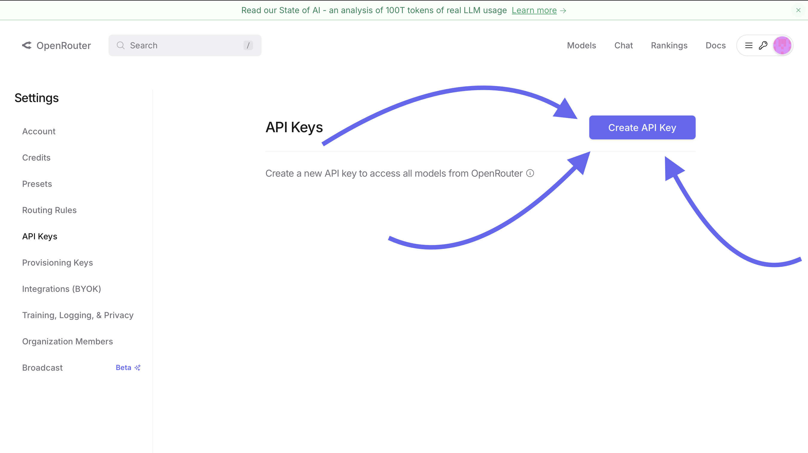

### 2. Создайте API ключ

Нажмите **Create API Key**.

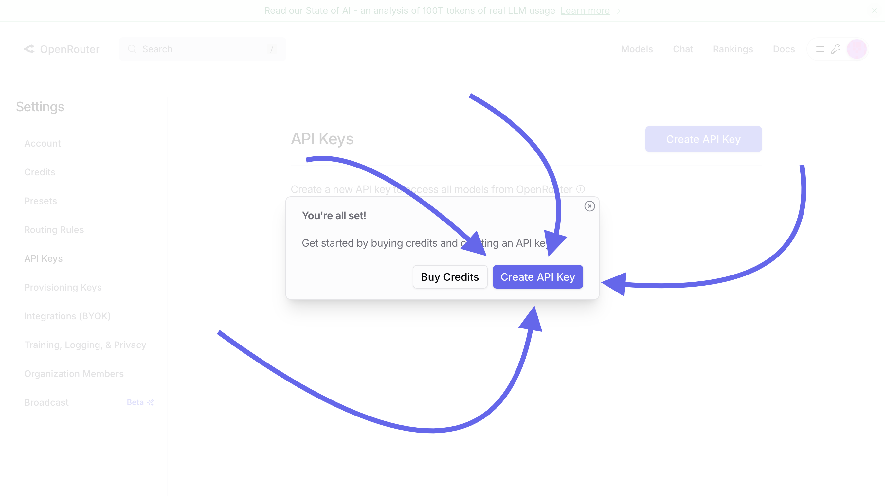

### 3. Заполните форму создания ключа

Рекомендуемые значения:

- **Name**: любое имя, например `ShuKnow`.
- **Credit limit**: можно оставить пустым.
- **Expiration**: `No expiration`, если нужен постоянный ключ.

После создания сразу скопируйте ключ вида `sk-or-v1-...`. Он показывается только один раз.

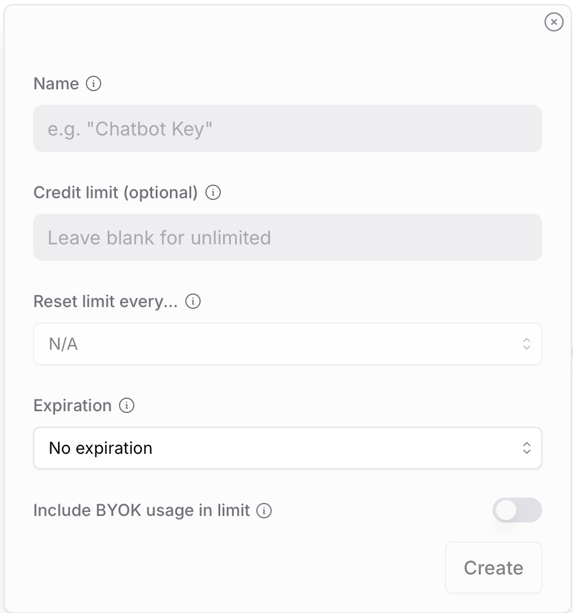

### 4. Найдите ID модели

Перейдите в каталог моделей:

[https://openrouter.ai/models](https://openrouter.ai/models)

В поиске можно ввести `free`, чтобы увидеть бесплатные модели. Скопируйте точный ID модели из карточки/страницы модели. Для бесплатных моделей ищите суффикс `:free`.

Актуальные примеры ID:

- `nvidia/nemotron-3-super:free`
- `inclusionai/ling-2.6-flash:free`
- `tencent/hy3-preview:free`
- `openai/gpt-oss-120b:free`

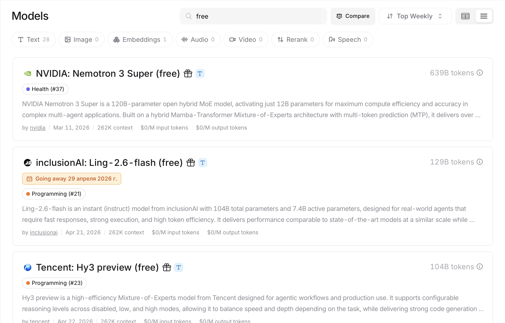

### 5. Вставьте значения в ShuKnow

В ShuKnow выберите:

- **Провайдер**: `OpenRouter`
- **Base URL**: можно оставить пустым
- **ID модели**: точный ID из OpenRouter, например `nvidia/nemotron-3-super:free`
- **API ключ**: `sk-or-v1-...`

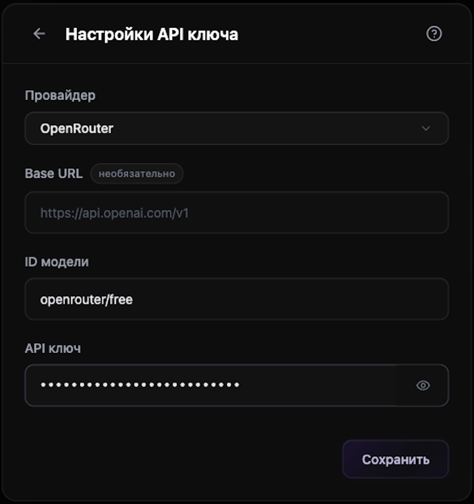

---

## Google Gemini

Gemini API даёт доступ к моделям Google через Google AI Studio. У Gemini обычно есть бесплатная квота с ограничениями, но лимиты и доступность меняются.

### 1. Откройте Google AI Studio

Перейдите на страницу API ключей:

[https://aistudio.google.com/app/apikey](https://aistudio.google.com/app/apikey)

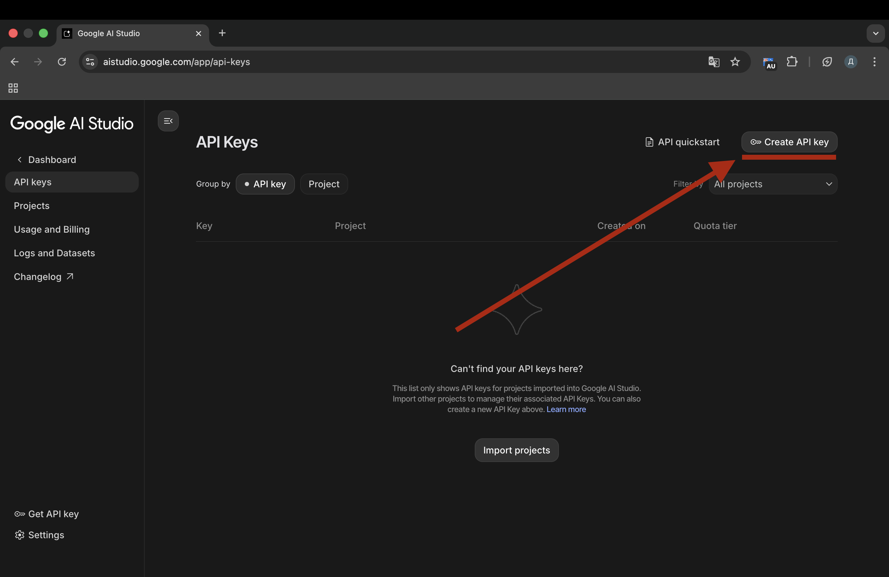

### 2. Создайте API ключ

Нажмите **Create API key**. В появившемся окне выберите создание ключа в новом или существующем проекте.

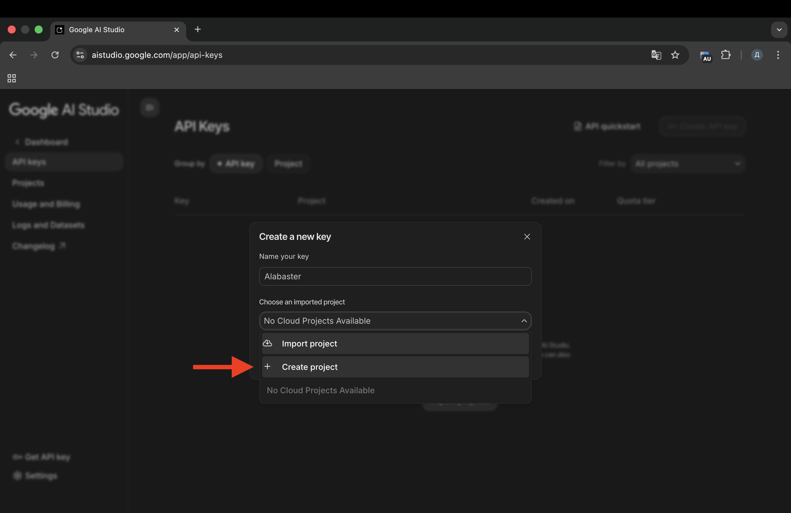

Скопируйте ключ вида `AIza...`.

### 3. Найдите ID модели

Модель нужно указывать по полю **Model code** в документации Gemini API или в Google AI Studio.

Актуальные примеры ID:

- `gemini-3-pro-preview`
- `gemini-3-flash-preview`
- `gemini-3-pro-image-preview` — для image/text сценариев, если они поддерживаются вашим приложением
- `gemini-flash-latest` — latest-алиас, удобный для экспериментов, но лучше использовать стабильный или preview ID для предсказуемости

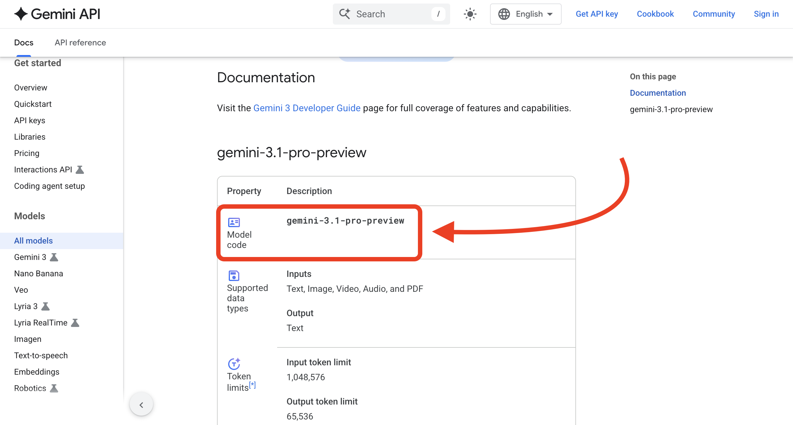

### 4. Вставьте значения в ShuKnow

В ShuKnow выберите:

- **Провайдер**: `Gemini`
- **Base URL**: можно оставить пустым
- **ID модели**: например `gemini-3-pro-preview` или `gemini-3-flash-preview`
- **API ключ**: `AIza...`

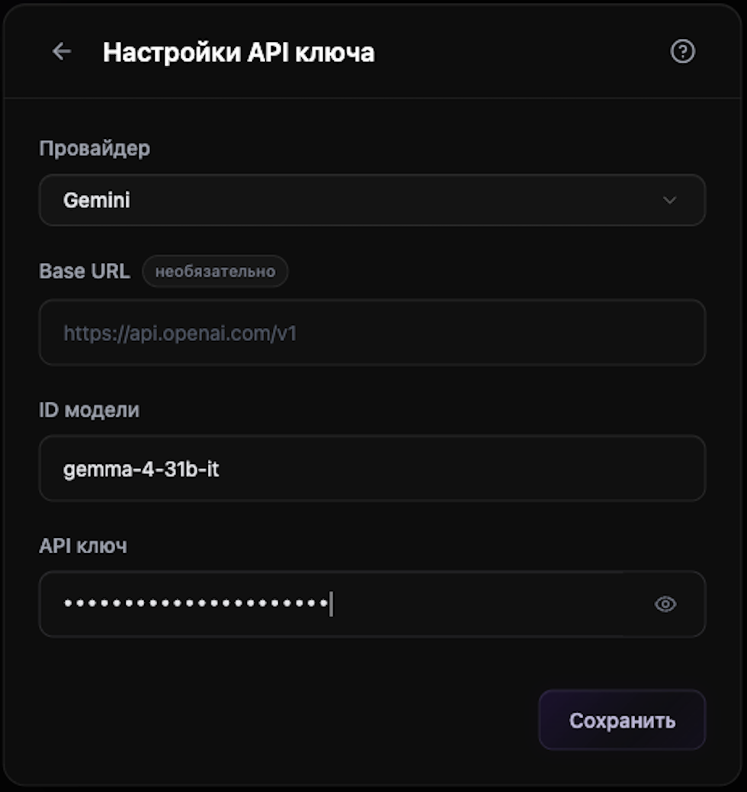

---

## OpenAI Compatible

Режим **OpenAI** в ShuKnow используется не только для официального OpenAI API. Он также подходит для сервисов с OpenAI-compatible API: DeepSeek, Z.AI, Qwen, локальные OpenAI-compatible серверы и другие.

Для этого режима обычно нужны:

1. **API ключ**.
2. **ID модели**.
3. **Base URL**, если сервис не является официальным OpenAI.

### Base URL

| Сервис | Base URL |
| --- | --- |
| OpenAI | `https://api.openai.com/v1` |
| DeepSeek | `https://api.deepseek.com` |
| DeepSeek Anthropic-compatible endpoint | `https://api.deepseek.com/anthropic` |
| Z.AI | `https://api.z.ai/api/paas/v4/` |

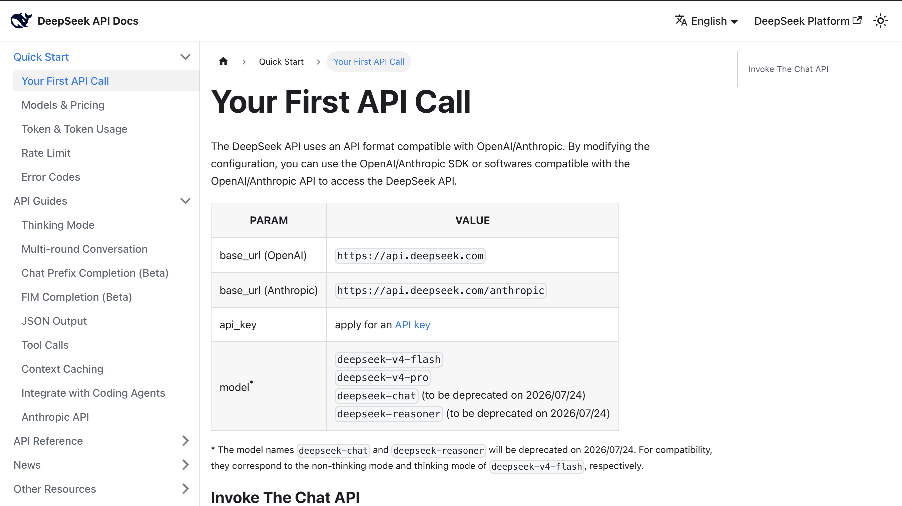

### OpenAI

Официальная страница моделей:

[https://developers.openai.com/api/docs/models](https://developers.openai.com/api/docs/models)

Актуальные примеры ID для API:

- `gpt-5.4` — флагманская модель для сложных задач, кода и agentic workflows
- `gpt-5.4-pro` — более мощный вариант для максимального качества
- `gpt-5.4-mini` — более дешёвый и быстрый вариант
- `gpt-5.4-nano` — самый дешёвый вариант GPT-5.4 класса для простых массовых задач

OpenAI уже анонсировала GPT-5.5 для ChatGPT и Codex, но на момент обновления гайда указала, что API-доступ появится позднее. Поэтому для поля **ID модели** в ShuKnow используйте модели из актуальной страницы API docs, пока `gpt-5.5` не появится в API каталоге.

Для OpenAI в ShuKnow:

- **Провайдер**: `OpenAI`
- **Base URL**: `https://api.openai.com/v1` или пусто, если backend сам подставляет стандартный URL
- **ID модели**: например `gpt-5.4`
- **API ключ**: `sk-...`

### DeepSeek

#### 1. Получите API ключ

Перейдите в DeepSeek Platform:

[https://platform.deepseek.com/api_keys](https://platform.deepseek.com/api_keys)

Создайте ключ в разделе **API Keys**.

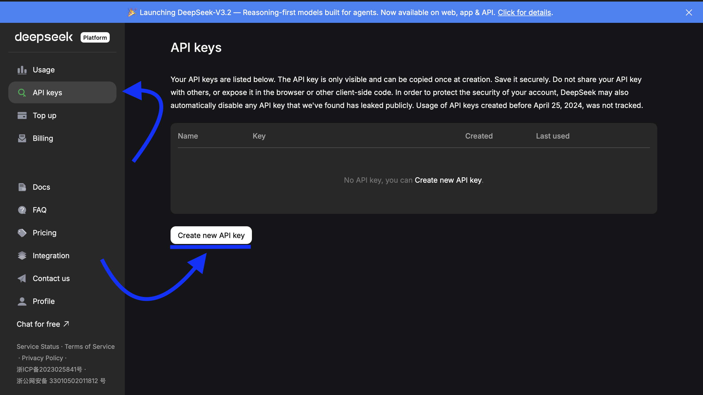

#### 2. Найдите ID модели

ID модели указан в документации DeepSeek в таблице параметров API.

Актуальные примеры ID:

- `deepseek-v4-flash`
- `deepseek-v4-pro`
- `deepseek-chat` — совместимый alias, если он доступен в вашем аккаунте
- `deepseek-reasoner` — reasoning alias, если он доступен в вашем аккаунте

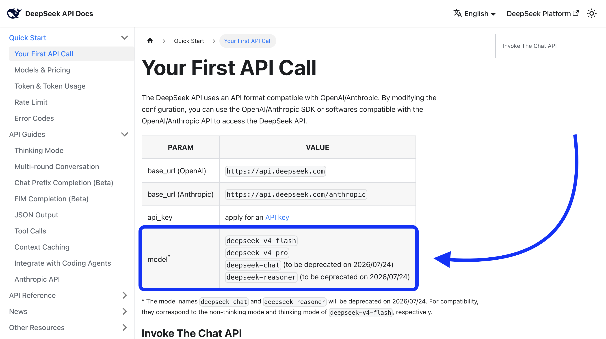

#### 3. Вставьте значения в ShuKnow

В ShuKnow выберите:

- **Провайдер**: `OpenAI`
- **Base URL**: `https://api.deepseek.com`
- **ID модели**: например `deepseek-v4-flash`
- **API ключ**: `sk-...`

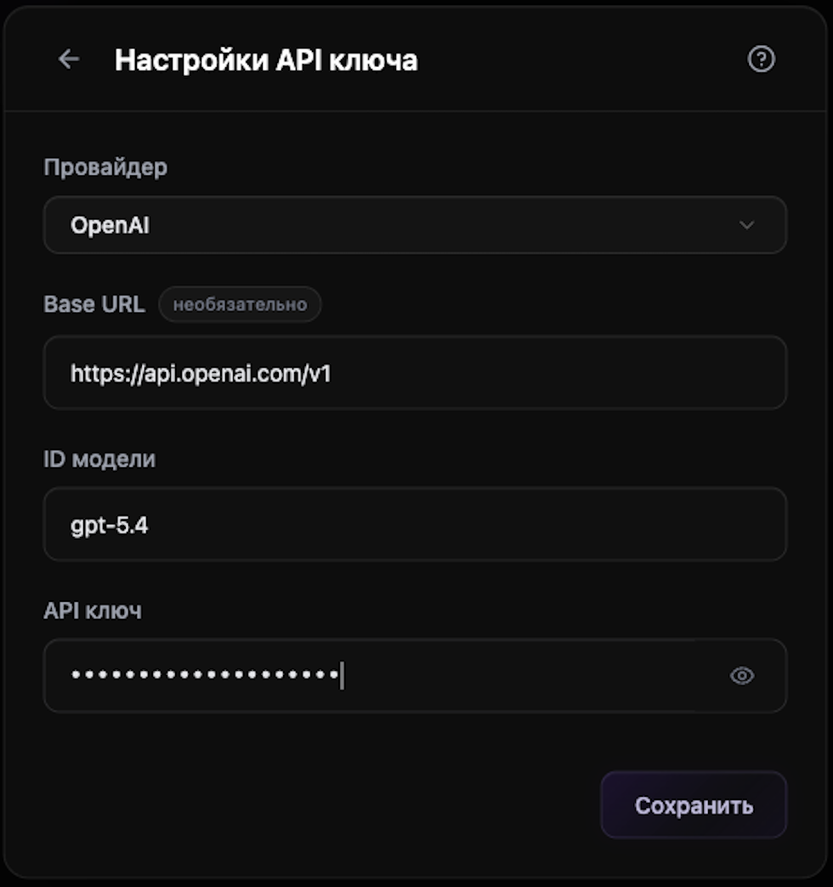

---

## Anthropic

У Anthropic нет бесплатных API ключей. Если нужен бесплатный доступ к Claude-подобным моделям, удобнее смотреть OpenRouter и фильтр `free`. Если у вас уже есть платный ключ Anthropic, его можно подключить напрямую.

### 1. Получите ключ

Ключи создаются в Anthropic Console:

[https://console.anthropic.com/settings/keys](https://console.anthropic.com/settings/keys)

Ключи обычно имеют вид `sk-ant-...`.

### 2. Найдите ID модели

Актуальные примеры ID в Anthropic API:

- `claude-opus-4-1-20250805`
- `claude-opus-4-20250514`
- `claude-sonnet-4-20250514`

Проверяйте список моделей в документации:

[https://docs.anthropic.com/en/docs/about-claude/models/overview](https://docs.anthropic.com/en/docs/about-claude/models/overview)

### 3. Вставьте значения в ShuKnow

В ShuKnow выберите:

- **Провайдер**: `Anthropic`
- **Base URL**: можно оставить пустым
- **ID модели**: например `claude-sonnet-4-20250514`
- **API ключ**: `sk-ant-...`

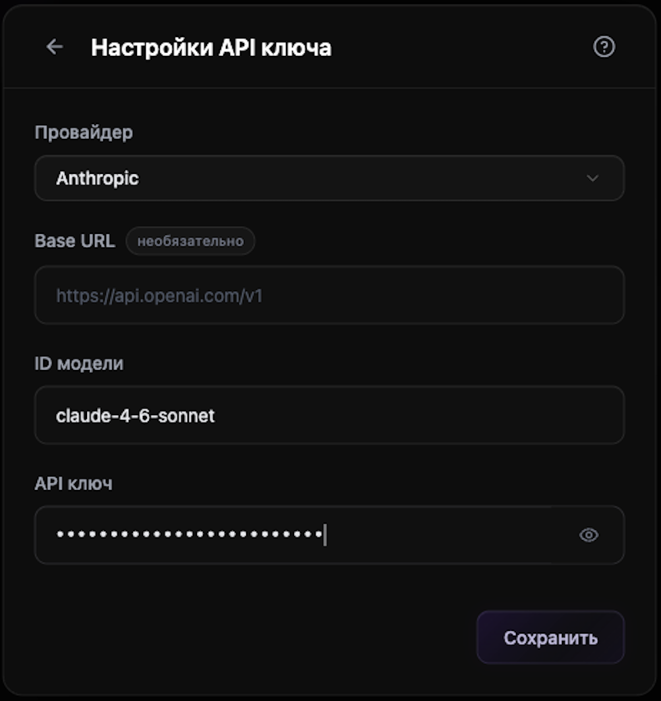

---

## Быстрая шпаргалка

| Провайдер в ShuKnow | Что вставлять в API ключ | Где брать ID модели | Примеры свежих ID |
| --- | --- | --- | --- |
| OpenRouter | `sk-or-v1-...` | OpenRouter Models | `nvidia/nemotron-3-super:free`, `openai/gpt-oss-120b:free` |
| Gemini | `AIza...` | Gemini API Models / AI Studio | `gemini-3-pro-preview`, `gemini-3-flash-preview` |
| OpenAI | `sk-...` или ключ OpenAI-compatible сервиса | Документация выбранного сервиса | `gpt-5.4`, `gpt-5.4-mini`, `deepseek-v4-flash` |
| Anthropic | `sk-ant-...` | Anthropic Models | `claude-opus-4-1-20250805`, `claude-sonnet-4-20250514` |

## Что делать, если не работает

- Проверьте, что **ID модели** скопирован точно, без пробелов и лишних символов.
- Для OpenRouter бесплатные модели часто имеют суффикс `:free`.
- Для DeepSeek и других OpenAI-compatible сервисов проверьте **Base URL**.
- Если модель preview или free исчезла из каталога, выберите другую актуальную модель у того же провайдера.
- Не публикуйте API ключи в чатах, репозиториях и скриншотах.
